# AWS Cloud Practitioner

Repositório de preparação para a certificação AWS Cloud Practitioner.

## Conceitos

### AWS
- Visão geral da infraestrutura global da AWS
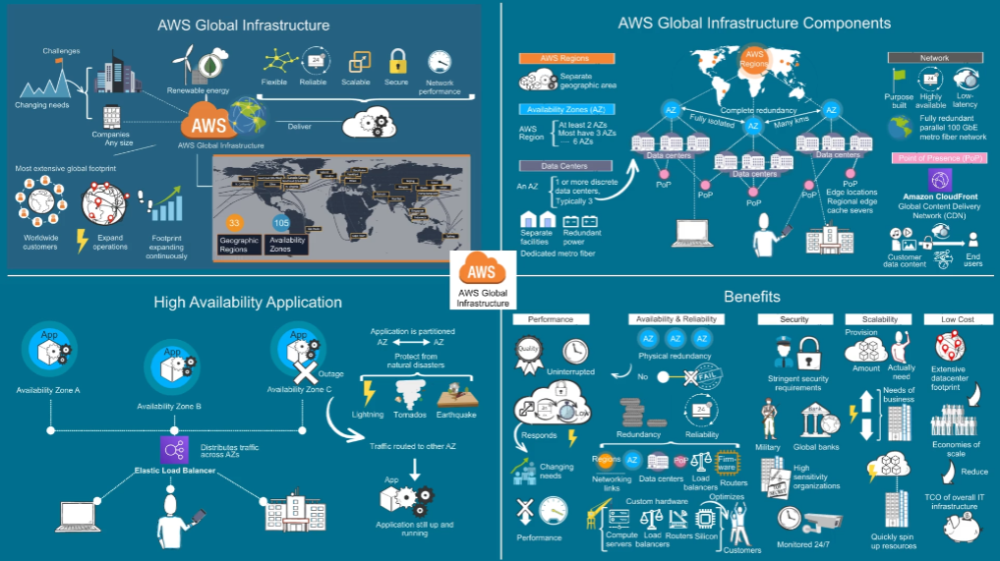
- Benefícios da infraestrutura global da AWS
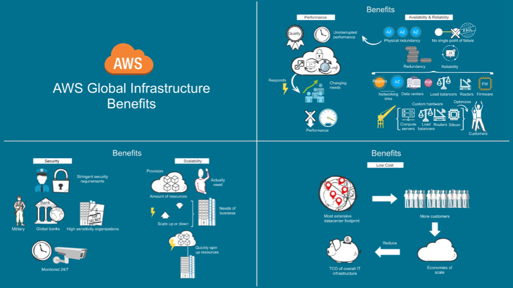

### Amazon EC2
- Visão geral do Amazon EC2
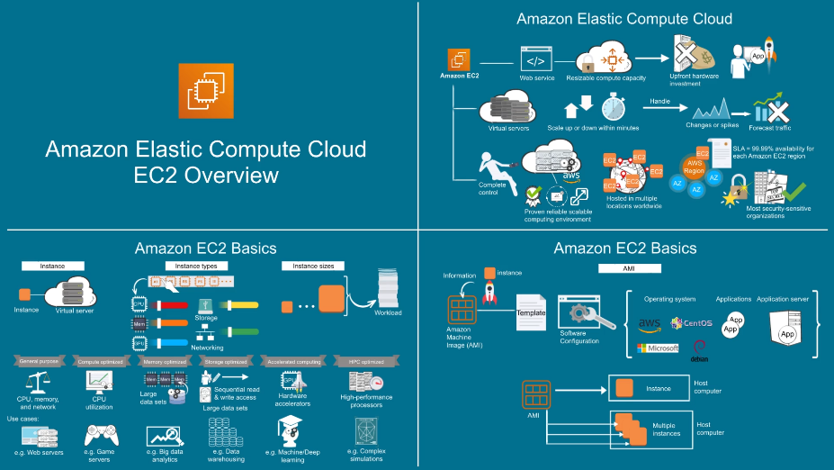
- Armazenamento e rede no Amazon EC2
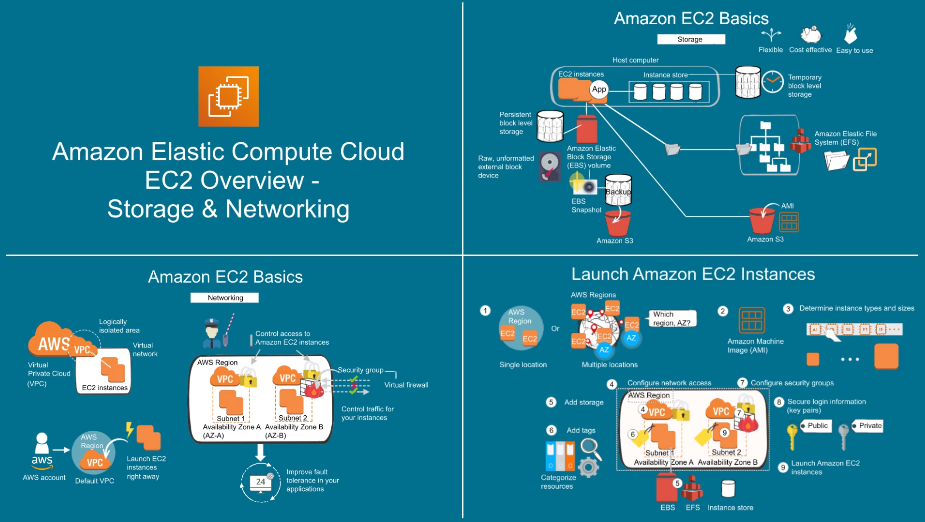
- Visão geral do Amazon EBS

- Recursos do Amazon EBS
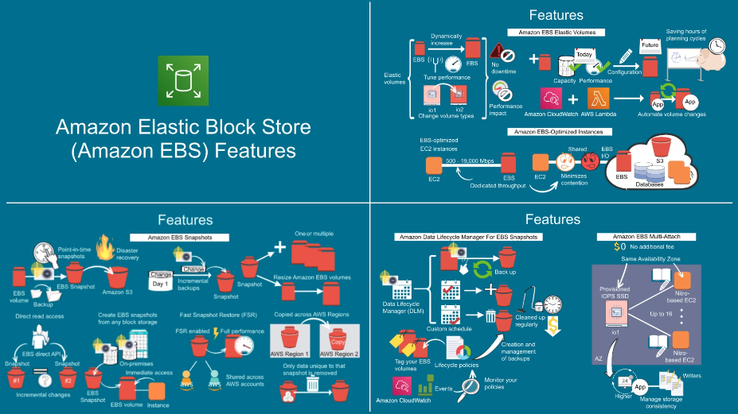
- Benefícios do Amazon EBS
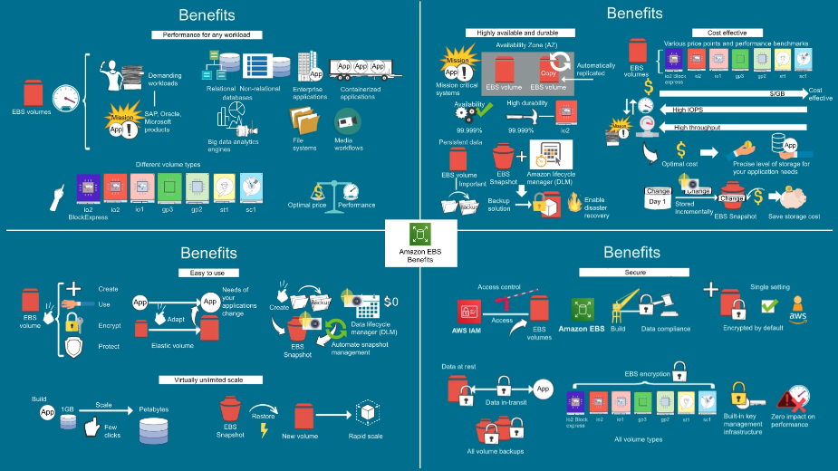
- Tipos de volume do Amazon EBS
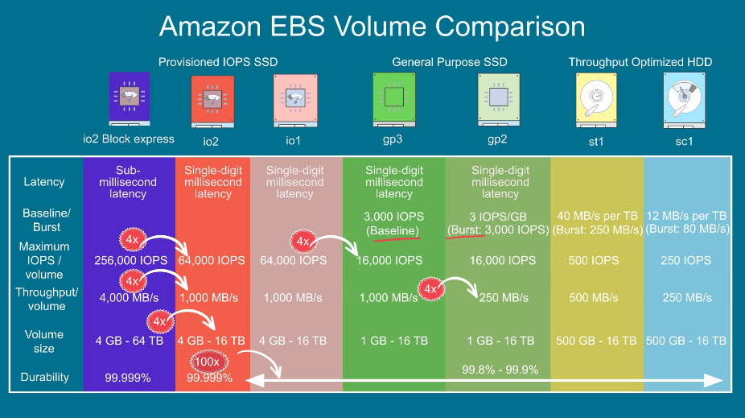

### AWS Well-Architected
- Visão geral do AWS Well-Architected
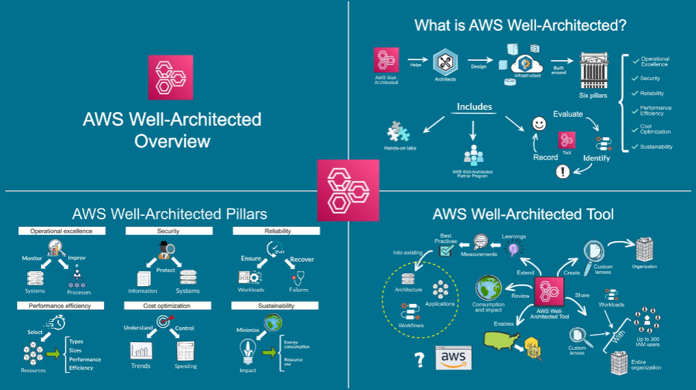

### Amazon S3
- Visão geral do Amazon S3
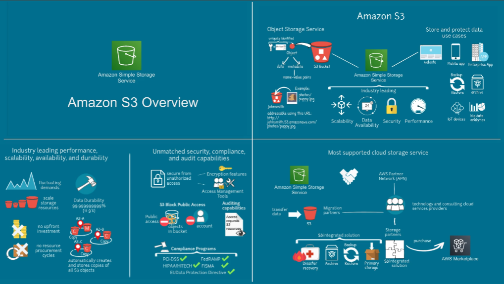
- Mais recursos do Amazon S3
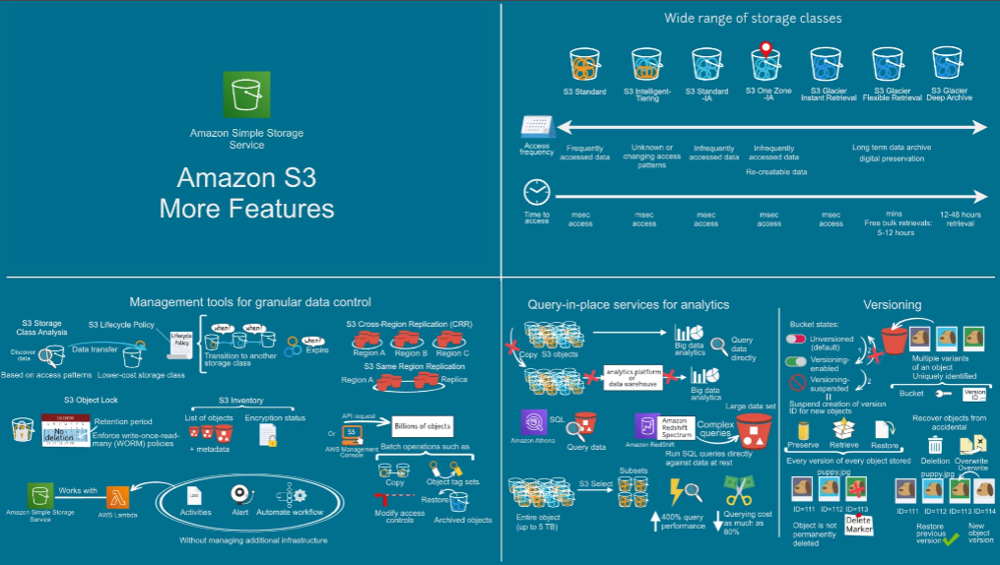
- Gerenciamento de acesso ao Amazon S3
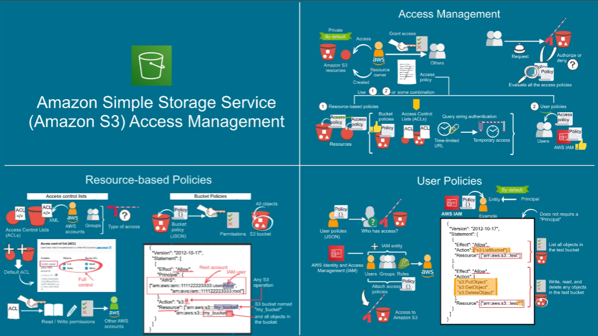

### AWS Systems Manager
- Visão geral do AWS Systems Manager
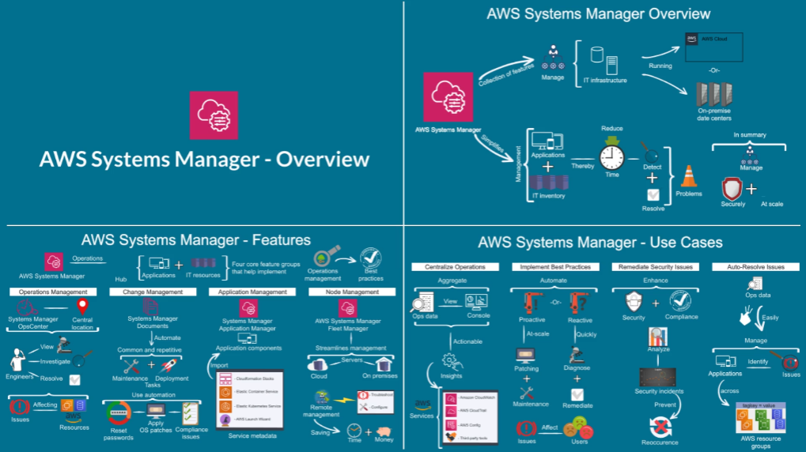

### Amazon Route 53
- Visão geral de DNS
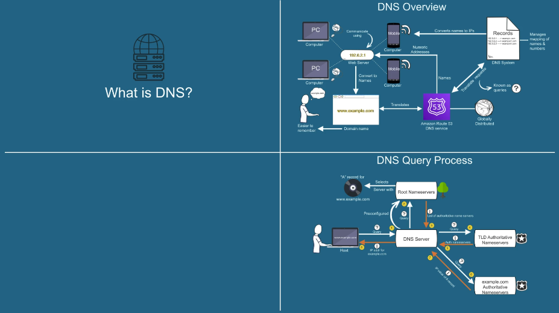

### Outros
- Visão Geral de Suporte, Recursos e Documentação da AWS

