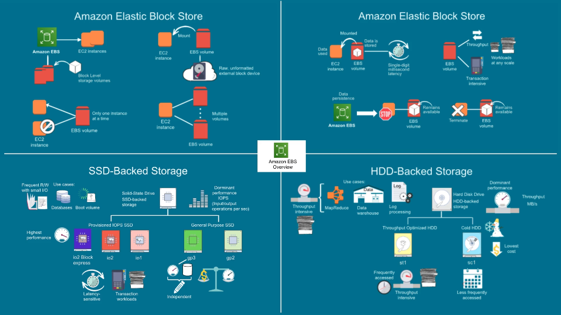
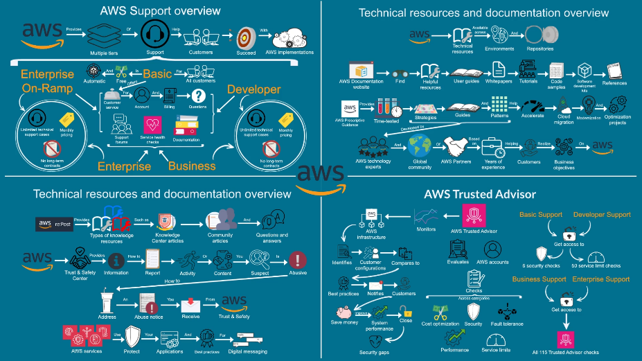

# AWS Cloud Practitioner

Repositório de preparação para a certificação AWS Cloud Practitioner.

## Conceitos

### AWS
- Visão geral da infraestrutura global da AWS

- Benefícios da infraestrutura global da AWS

### Amazon EC2
- Visão geral do Amazon EC2

- Armazenamento e rede no Amazon EC2

- Visão geral do Amazon EBS

- Recursos do Amazon EBS

- Benefícios do Amazon EBS

- Tipos de volume do Amazon EBS

### Amazon VPC
- Visão geral do Amazon VPC

- Conectividade com a internet no Amazon VPC

- Conceitos do Amazon VPC

- Segurança no Amazon VPC

- Conexões de emparelhamento no Amazon VPC

### AWS Well-Architected
- Visão geral do AWS Well-Architected

### Amazon S3
- Visão geral do Amazon S3

- Mais recursos do Amazon S3

- Gerenciamento de acesso ao Amazon S3

### AWS Systems Manager
- Visão geral do AWS Systems Manager

### Amazon Relational Database Service (RDS)

- Visão geral do Amazon RDS

- Disponibilidade e durabilidade do Amazon RDS

- Diminuição da carga administrativa com Amazon RDS

- Gerenciabilidade e eficiência de custos do Amazon RDS

- Escalabilidade do Amazon RDS

- Segurança no Amazon RDS

### Amazon Route 53
- Visão geral de DNS

### Cloud Economics
- Visão geral de preços da AWS

### Outros
- Visão Geral de Suporte, Recursos e Documentação da AWS

- Visão geral do AWS Cloud Adoption Framework

