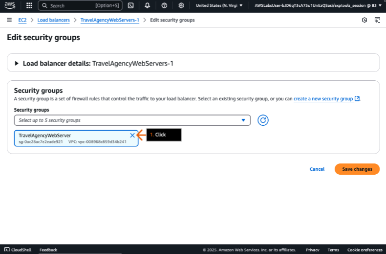

## Aplicativos web de alta disponibilidade
### Aumente a confiabilidade do site criando uma arquitetura altamente disponível que abrange várias Zonas de Disponibilidade com balanceamento de carga e health check.

- Objetivos do laboratório
    - Configure um grupo do Auto Scaling para usar um Application Load Balancer. 
    - Configure o health check do load balancer para um grupo do Auto Scaling. 
    - Adicione uma segunda zona de disponibilidade ao grupo do Auto Scaling.

    &nbsp;

    **Etapa 1**
    1. Revise os objetivos do laboratório na seção Conceito.
    2. Clique em Iniciar laboratório ou Abra o Console da AWS para começar.
    3. Siga as instruções do laboratório cuidadosamente e use as setas para navegar entre as etapas.

    Os serviços da AWS não utilizados neste laboratório estão desativados no ambiente do laboratório. Além disso, as capacidades dos serviços utilizados neste laboratório são limitadas ao que o laboratório requer.

    **Conceito**

    Neste laboratório prático, você irá:
    - Configurar um grupo de Auto Scaling para usar um Application Load Balancer.
    - Configurar o health checks do load balancer para o grupo Auto Scaling.
    - Adicionar uma segunda zona de disponibilidade ao grupo de Auto Scaling.

    

    &nbsp;

    **Etapa 2**
    1. Na caixa de pesquisa da barra de navegação superior, digite: ec2
    2. Nos resultados da pesquisa, em Serviços, clique em EC2.
    3. Vá para a próxima etapa.

    **Conceito**

    O Amazon Elastic Compute Cloud (Amazon EC2) fornece recursos robustos para hospedar aplicativos da web. Você pode usar o Amazon EC2 para lançar e gerenciar servidores virtuais para desenvolver e implantar aplicativos mais rapidamente sem investimentos iniciais em hardware.

    

    &nbsp;

    **Etapa 3**
    1. No painel de navegação esquerdo, clique em Auto Scaling Groups.
    2. Na seção Auto Scaling groups, escolha a caixa de seleção para selecionar TravelAgencyWebServers.
    3. Abaixo dessa seção, na guia Details, revise os detalhes de capacidade atuais.
    4. Vá para a próxima etapa.

    **Conceito**

    Você pode usar um grupo do Amazon EC2 Auto Scaling para dimensionar automaticamente sua capacidade do EC2 para cima ou para baixo com base em condições definidas, o que ajuda a manter o desempenho durante picos de demanda e minimizar os custos durante períodos de baixa utilização.
    
    

    &nbsp;
    
    **Etapa 4**
    1. Na seção Network, revise para ver se o grupo de Auto Scaling está configurado com uma única subnet em uma Availability Zone.

        > A distribuição de Availability Zone é uma estratégia para substituir instâncias com falha, equilibrando as substituições entre as AZs.

    2. Vá para a próxima etapa.

    **Conceito**

    Você define quais subnets, de uma ou mais Availability Zones (AZs), estão vinculadas ao Auto Scaling group. Isso define onde seus recursos do Amazon EC2, vinculados ao Auto Scaling group, podem residir.

    

    &nbsp;
    
    **Etapa 5**
    1. Role para cima e clique na guia Instance management.
    2. Revise para ver se há atualmente uma instância EC2 no grupo Auto Scaling.
    3. Clique na guia Integrations.
    4. Vá para a próxima etapa.

    **Conceito**

    Um grupo de Auto Scaling começa lançando instâncias suficientes para atender à capacidade desejada especificada. Ele mantém esse número de instâncias realizando health checks periódicas nas instâncias do grupo.

    

    &nbsp;

    **Etapa 6**
    1. Na seção Balanceamento de carga, clique em Editar. 
    2. Vá para a próxima etapa.

    

    &nbsp;

    **Etapa 7**
    1. Clique em Adicionar um novo load balancer.
    2. Vá para a próxima etapa.

    **Conceito**

    Um load balancer serve como um único ponto de contato para todo o tráfego da web de entrada direcionado a um grupo do Auto Scaling. Quando usado com grupos do Auto Scaling, o load balancer lida automaticamente com o registro e desregistro de instâncias EC2. À medida que as instâncias são iniciadas, elas são registradas automaticamente no load balancer e, quando encerradas, são desregistradas automaticamente.

    

    &nbsp;

    **Etapa 8**
    1. Em Tipo de load balancer, selecione Application Load Balancer.
    2. Em Esquema de load balancer, escolha Voltado para a internet.
    3. Vá para a próxima etapa.

    **Conceito**

    Um Application Load Balancer é um tipo de serviço Elastic Load Balancing que distribui o tráfego de entrada por vários destinos, como instâncias EC2, contêineres e endereços IP. Esse tipo de balanceador de carga opera na camada de aplicação (camada 7) do modelo de Interconexão de Sistemas Abertos (OSI) e funciona como um único ponto de contato para aplicativos de clientes.

    

    &nbsp;

    **Etapa 9**
    1. Para Availability Zones e subnets, escolha as caixas de seleção para selecionar cada Availability Zone exibida.

        > Todas as AZs devem ser selecionadas.

    2. Em cada lista suspensa exibida, escolha a subnet pública disponível.
    3. Em Listeners and routing, para Default routing (forward to), escolha Create a target group.
    4. Para New target group name, mantenha o nome padrão.
    5. Para criar o Application Load Balancer, clique em Update.
    6. Vá para a próxima etapa.

    **Conceito**

    Um balanceador de carga recebe solicitações de clientes e as distribui entre os alvos em um grupo de alvos. (Em termos da AWS, um cliente refere-se a qualquer aplicativo, ferramenta ou dispositivo que faz solicitações aos serviços e recursos da AWS.) Depois de habilitar uma Availability Zone, o balanceador de carga começa a rotear solicitações para os alvos registrados nessa Availability Zone.

    

    &nbsp;

    **Etapa 10**
    1. No painel de navegação à esquerda, clique em Security Groups.
    2. Na seção Security Groups, clique em Criar Security Group.
    3. Vá para a próxima etapa.

    **Conceito**

    Para personalizar o fluxo de tráfego entre o load balancer e os servidores web, você pode criar novos security groups que definem o tráfego que é permitido para o load balancer e o tráfego que é permitido para os servidores web por trás do load balancer.

    

    &nbsp;
    
    **Etapa 11**
    1. Na seção Basic details, para Security group name, digite: TravelAgencyLoadBalancer
    2. Para Description, digite uma descrição de sua preferência, como Allow access to the travel agency load balancer from the internet.
    3. Para VPC, escolha o nome da VPC que termina com lab/TravelAgencyVpc.
    4. Na seção Inbound rules, clique em Add rule. 
    5. Vá para a próxima etapa.

    **Conceito**

    Os Security groups são atribuídos a uma nuvem privada virtual (VPC). Isso significa que o security groups só pode ser atribuído aos recursos dentro da VPC.

    

    &nbsp;

    **Etapa 12**
    1. Para Type, escolha HTTP.
    2. Para permitir todo o tráfego de entrada, em Source, na caixa de pesquisa Custom, escolha 0.0.0.0/0.
    3. Vá para a próxima etapa.

    **Conceito**

    Para um balanceador de carga de acesso público, para aceitar tráfego de qualquer endereço, especifique 0.0.0.0/0 como a origem. Ao especificar um grupo de segurança como um destino de saída, você pode restringir o tráfego a ser enviado somente para instâncias associadas ao grupo de segurança especificado.

    

    &nbsp;
    
    **Etapa 13**
    1. Na seção Outbound rules, para Type, escolha HTTP.
    2. Para Destination, ao lado de Custom, escolha o grupo de segurança TravelAgencyWebServer.
    3. Para remover o destino 0.0.0.0/0, clique no X (não mostrado).
    4. Clique em Create security group.
    5. Vá para a próxima etapa.

    

    &nbsp;
    
    **Etapa 14**
    1. No painel de navegação esquerdo, clique em Security Groups.
    2. Na seção Security Groups, escolha a caixa de seleção para selecionar o grupo de segurança TravelAgencyWebServer.
    3. Na lista suspensa Actions, escolha Edit inbound rules.
    4. Vá para a próxima etapa.

    **Conceito**

    Para aumentar a segurança, você pode editar o Security Groups (usado pelas instâncias EC2 por trás do Application Load Balancer) para permitir somente tráfego de entrada do balanceador de carga.

    

    &nbsp;

    **Etapa 15**
    1. Na seção Regras de entrada, para remover a regra existente, clique em Excluir.

        > Você deve excluir a regra existente para modificar o tipo de regra.

    2. Para adicionar uma nova regra, clique em Adicionar regra.
    3. Vá para a próxima etapa.

    **Conceito**

    Ao remover a origem 0.0.0.0/0 e substituí-la por um security group, você pode controlar quais recursos têm permissão para enviar tráfego às instâncias sem precisar inserir intervalos de endereços. Apenas o tráfego das instâncias associadas ao security group é permitido.

    

    &nbsp;

    **Etapa 16**
    1. Para Type, escolha HTTP.
    2. Para Source, ao lado de Custom, escolha o grupo de segurança TravelAgencyLoadBalancer.
    3. Clique em Save rules.
    4. Vá para a próxima etapa.

    

    &nbsp;

    **Etapa 17**
    1. No painel de navegação à esquerda, clique em Load Balancers.
    2. Na seção Load Balancers, clique em TravelAgencyWebServers-1.
    3. Vá para a próxima etapa.

    **Conceito**

    Os security groups customizados ficam ativos somente depois que você os atribui a uma instância. Uma instância pode ter vários security groups..
    
    

    &nbsp;

    **Etapa 18**
    1. Clique na guia Segurança.
    2. Clique em Editar.
    3. Vá para a próxima etapa.

    

    &nbsp;

    **Etapa 19**
    1. Para Security groups, para desmarcar o grupo de segurança TravelAgencywebServer, clique no X.
    2. Vá para a próxima etapa.

    

    &nbsp;

    **Etapa 20**
    1. Escolha TravelAgencyLoadBalancer.
    2. Clique em Salvar alterações.
    3. Vá para a próxima etapa.

    

    &nbsp;

    **Etapa 21**
    1. No alerta de sucesso, revise a mensagem.
    2. Para o Application Load Balancer, em Nome DNS, clique no ícone de cópia para copiar o nome fornecido.
    3. Vá para a próxima etapa.

    **Conceito**

    Para testar o acesso ao aplicativo por meio do load balancer — obtendo um feedback rápido e visualizando o aplicativo —, você pode copiar o DNS name em uma guia (ou janela) do navegador.

    

    &nbsp;

    **Etapa 22**
    1. Na barra de endereços de uma nova aba (ou janela) do navegador, cole o nome DNS que você acabou de copiar e, em seguida, adicione http:// no início e pressione Enter (não mostrado).

        > Se você receber um alerta de erro, verifique se a URL começa com http:// (não https://). A página é hospedada apenas com HTTP.  
        > Se você não vir seu aplicativo, verifique as regras no grupo de segurança que você associou ao balanceador de carga.

    2. Revise a página HTML resultante, que deve ser semelhante ao que é exibido no exemplo de captura de tela.

        > O aplicativo web da agência de viagens agora está atrás de um Application Load Balancer.

    3. Vá para a próxima etapa.

    

    &nbsp;

    **Etapa 23**
    1. Na mesma guia do navegador, no final do endereço que você acabou de editar, digite: /health e pressione Enter.

    2. Observe a mensagem curta que carrega, informando que a instância está íntegra (healthy).

        > Mantenha essa guia do navegador aberta para health checks adicionais posteriormente.

    3. Vá para a próxima etapa.

    **Conceito**

    O health check do load balancer padrão valida somente o caminho-raiz de um servidor HTTP. Em geral, as aplicações implementarão um health check de aplicações muito mais robusto para validar a configuração do servidor e o acesso externo. Você pode conferir manualmente se os health checks estão ativos no seu load balancer.

    

    &nbsp;

    **Etapa 24**
    1. Retorne ao console Amazon EC2 na outra aba do navegador
    2. No painel de navegação esquerdo, clique em Target Groups.
    3. Na seção Target groups, marque a caixa de seleção para selecionar TravelAgencyWebServers-1.
    4. Abaixo dessa seção, clique na aba Health checks.
    5. Na seção Health check settings, clique em Edit.
    6. Vá para a próxima etapa.

    **Conceito**

    Você pode modificar as configurações de health check do load balancer para atender aos seus requisitos de desempenho.

    

    &nbsp;

    **Etapa 25**
    1. Em Caminho de health check, digite: /health
    2. Clique para expandir Configurações avançadas de health check .
    3. Vá para a próxima etapa.

    **Conceito**

    Após seu destino ser registrado, ele deve passar por um health check para ser considerado íntegro (healthy). Após a conclusão de cada health check, o nó do load balancer fecha a conexão que estava estabelecida para o health check.

    

    &nbsp;

    **Etapa 26**
    1. Para Unhealthy threshold, digite: 2
    2. Para Timeout, digite: 2
    3. Para Interval, digite: 5
    4. Clique em Save changes.

        > As configurações padrão permitem que 150 segundos passem (intervalos de 30 segundos * 5 verificações não saudáveis) antes de marcar uma instância como não saudável. Os novos valores que você acabou de inserir farão com que as instâncias não saudáveis sejam marcadas como não saudáveis após 10 segundos (2 verificações com falha, com 5 segundos de intervalo).

    5. Vá para a próxima etapa.

    

    &nbsp;

    **Etapa 27**
    1. No painel de navegação à esquerda, clique em Auto Scaling Groups.
    2. Na seção Auto Scaling groups, escolha a caixa de seleção para selecionar TravelAgencyWebServers.

        > Se a caixa de seleção já estiver marcada, a janela inferior pode estar vazia. Nesse caso, desmarque a caixa de seleção e marque-a novamente.

    3. Na guia Details, role para baixo até Network.
    4. Clique em Edit.
    5. Vá para a próxima etapa.

    **Conceito**

    Depois de criar um load balancer voltado para a internet, agora você pode executar suas aplicações em uma sub-rede privada. Você pode adicionar ou remover sub-redes associadas ao grupo do Auto Scaling.

    

    &nbsp;

    **Etapa 28**
    1. Para Zonas de Disponibilidade e sub-redes, escolha ou mantenha a sub-rede lab/TravelAgencyVpc/PublicSubnet1.

        > Se qualquer outra sub-rede estiver selecionada, clique no X para removê-las.

    2. Clique em Atualizar.
    3. Vá para a próxima etapa.

    **Conceito**

    Se você adicionar ou remover uma sub-rede, estará definindo onde os recursos do grupo do Auto Scaling podem residir.

    

    &nbsp;

    **Etapa 29**
    1. No painel de navegação à esquerda, clique em Instances.
    2. Na seção Instances, escolha a caixa de seleção para selecionar a instância TravelAgencyWebServers.
    3. Revise o Instance ID.
    4. Clique na guia Networking.
    5. Em Subnet ID, revise para ver se a instância está no subnet, lab/TravelAgencyVpc/PublicSubnet1.
    6. Na seção Instances, na lista suspensa Instance state, escolha Terminate (delete) instance.
    7. Na caixa pop-up (não mostrada), clique em Terminate (delete) (não mostrada).

        > A terminação da instância reduz o número de instâncias abaixo do mínimo para o grupo de Auto Scaling e invoca o lançamento de uma nova instância no subnet público.

    8. Vá para a próxima etapa.

    

    &nbsp;

    **Etapa 30**
    1. Após alguns minutos, na seção Instances, clique no ícone de atualizar.

        > A lista de instâncias agora deve incluir a instância recém-criada.

    2. Escolha a caixa de seleção para selecionar a nova instância.
    3. Em Instance ID, revise o ID exclusivo da nova instância. 
    4. Clique na aba Networking.
    5. Em Subnet ID, revise para ver se a nova instância está no subnet, lab/TravelAgencyVpc/PublicSubnet1.
    6. Vá para a próxima etapa.

    **Conceito**

    Se você encerrar uma instância dentro de um grupo do Auto Scaling, o que resulta na redução do número de instâncias em execução abaixo do requisito mínimo de Auto Scaling, uma nova instância será iniciada automaticamente.

    

    &nbsp;

    **Etapa 31**
    1. No painel de navegação esquerdo, clique em Auto Scaling Groups.
    2. Na seção Auto Scaling groups, marque a caixa de seleção para selecionar TravelAgencyWebServers.

        > Se a caixa de seleção já estiver marcada, a janela inferior pode estar vazia. Se estiver, desmarque a caixa de seleção e marque-a novamente.

    3. Clique na aba Activity.
    4. Role para baixo até Activity history.
    5. Vá para a próxima etapa.

    

    &nbsp;

    **Etapa 32**
    1. Na seção Histórico de atividades, verifique se a instância antiga foi encerrada.
    2. Analise para ver se o grupo do Auto Scaling respondeu criando uma nova instância.
    3. Vá para a próxima etapa.

    **Conceito**

    A seção Activity history fornece uma visão detalhada das atividades de escalonamento por meio de entradas que contêm informações como descrição, hora de início, hora de término, código de status e, o mais importante, a causa dos eventos de escalonamento.

    

    &nbsp;

    **Etapa 33**
    1. Retorne à página de verificação de integridade na outra aba do navegador.
    2. Clique no ícone de atualização do navegador.
    3. Revise a mensagem.

        > Se você receber um alerta de erro, aguarde um pouco mais e clique no ícone de atualização novamente.  
        > Na mensagem, observe que o valor do ID da instância mudou para a nova instância.

    4. Vá para a próxima etapa.

    

    &nbsp;

    **Etapa 34**
    1. Retorne à página Auto Scaling groups na outra aba do navegador.
    2. Revise se o grupo TravelAgencyWebServers ainda está selecionado.
    3. Na guia Detalhes, role até Network e clique em Edit.
    4. Vá para a próxima etapa.

    **Conceito**

    Para aproveitar a segurança e a confiabilidade da redundância geográfica, espalhe seu grupo do Auto Scaling por várias Availability Zones dentro de uma região da AWS. Anexe um balanceador de carga para distribuir o tráfego de entrada entre essas AZs.

    

    &nbsp;

    **Etapa 35**
    1. Para Availability Zones and subnets, escolha a subnet, lab/TravelAgencyVpc/PublicSubnet2.

        > Tanto lab/TravelAgencyVpc/PublicSubnet1 quanto lab/TravelAgencyVpc/PublicSubnet2 devem estar agora selecionados.

    2. Clique em Update.
    3. Vá para a próxima etapa.

    **Conceito**

    Quando uma Availability Zone fica indisponível ou instável, o EC2 Auto Scaling pode lançar novas instâncias com base em uma estratégia de distribuição de Availability Zone escolhida. "Balanced best effort" tenta lançar em uma AZ diferente saudável, enquanto "Balanced only" continua tentando lançar na AZ instável.

    

    &nbsp;

    **Etapa 36**
    1. No alerta de sucesso, revise a mensagem.
    2. Na guia Detalhes, na seção Visão geral da capacidade do TravelAgencyWebServers, clique em Editar.
    3. Vá para a próxima etapa.

    **Conceito**

    A capacidade de auto scaling refere-se à capacidade de ajustar automaticamente os recursos de computação dentro de limites definidos.

    

    &nbsp;

    **Etapa 37**
    1. Na caixa pop-up, em Capacidade desejada, digite: 2
    2. Para a capacidade máxima desejada, digite: 2
    3. Clique em Atualizar.
    4. Vá para a próxima etapa.

    **Conceito**

    Ao alterar a capacidade desejada manualmente, você pode testar o comportamento do seu grupo do Auto Scaling. O aumento da capacidade desejada, sem ultrapassar a capacidade máxima, lançará novas instâncias para atender ao valor da capacidade desejada.

    

    &nbsp;

    **Etapa 38**
    1. No alerta de sucesso, revise a mensagem.
    2. Clique na guia Atividade.
    3. Role para baixo até Histórico de atividades.
    4. Vá para a próxima etapa.

    

    &nbsp;

    **Etapa 39**
    1. Revise para ver se uma nova instância está sendo lançada.
    2. Em Descrição, revise o novo ID da instância.
    3. Vá para a próxima etapa.

    **Conceito**

    O balanceador de carga pode usar o esvaziamento de conexão para concluir as solicitações em andamento feitas para instâncias que estão sendo desregistradas ou instáveis.

    

    &nbsp;

    **Etapa 40**
    1. No painel de navegação esquerdo, clique em Instances.
    2. Na seção Instances, escolha a caixa de seleção para selecionar a instância que corresponde ao novo ID de instância que você examinou na etapa anterior.
    3. Clique na aba Networking.
    4. Em Subnet ID, revise para ver se a nova instância está no subnet, lab/TravelAgencyVpc/PublicSubnet2.
    5. Vá para a próxima etapa.

    **Conceito**

    Quando o auto scaling lança uma nova instância, você pode verificar o ID de subnet para confirmar se sua instância foi implantada no subnet correto.

    

    &nbsp;

    **Etapa 41**
    1. Retorne à página de verificação de integridade na outra aba do navegador.
    2. Clique no ícone de atualização do navegador.
    3. Revise a mensagem.

        > Você pode precisar clicar no ícone de atualização várias vezes.  
        > Na mensagem, observe que o valor do ID da instância mudou para a instância mais recente.

    4. Vá para a próxima etapa.

    

- DIY
    - Configure o grupo existente do Auto Scaling para incluir uma nova instância do EC2 em uma terceira zona de disponibilidade.

    > Dica: Depois de adicionar a terceira Zona de Disponibilidade, você também deve aumentar a capacidade desejada.

## Saiba mais

