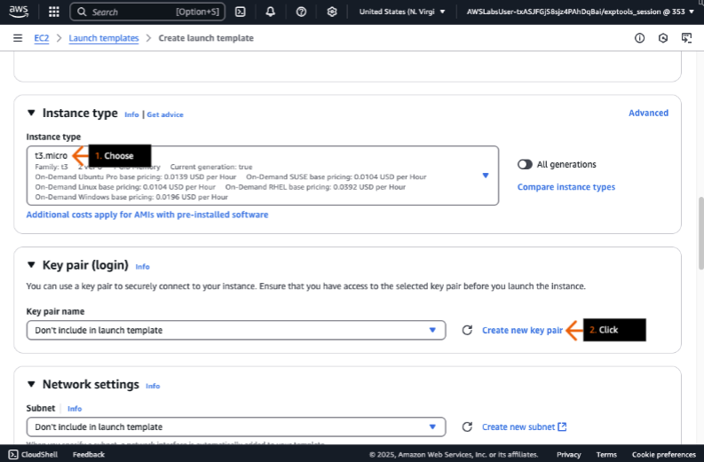
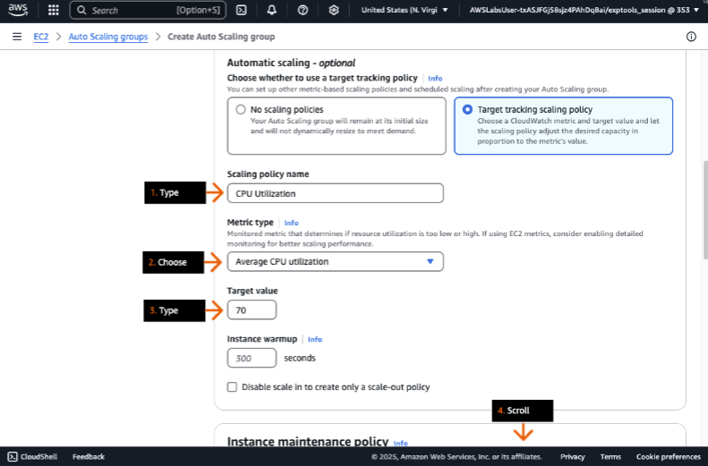

## Aplicações de recuperação automática e com escalabilidade
### Crie e configure um grupo do Amazon EC2 Auto Scaling que siga as atividades de scaling programadas para adicionar e remover instâncias do EC2.

- Objetivos do laboratório
    - Crie um grupo do Amazon EC2 Auto Scaling.
    - Atribua instâncias do EC2 ao grupo do Auto Scaling.

    &nbsp;

    **Etapa 1**
    1. Revise os objetivos do laboratório na seção Conceito.
    2. Clique em Iniciar laboratório ou Abrir console da AWS para começar.
    3. Siga as instruções do laboratório cuidadosamente e use as setas para navegar entre as etapas.

    Os serviços da AWS não utilizados neste laboratório estão desabilitados no ambiente do laboratório. Além disso, as capacidades dos serviços utilizados neste laboratório são limitadas ao que o laboratório requer.

    **Conceito**

    Neste laboratório prático, você vai:
    - Criar um grupo do Amazon EC2 Auto Scaling.
    - Atribuir instâncias do EC2 ao grupo do Auto Scaling.

    

    &nbsp;

    **Etapa 2**
    1. Na caixa de pesquisa da barra de navegação superior, digite: ec2
    2. Nos resultados da pesquisa, em Serviços, clique em EC2.
    3. Vá para a próxima etapa.

    **Conceito**

    O Amazon Elastic Compute Cloud (Amazon EC2) é um serviço da web que fornece capacidade de computação segura e redimensionável na AWS Cloud.

    

    &nbsp;

    **Etapa 3**
    1. No painel de navegação à esquerda, clique em Instances.
    2. Na seção Instances, revise o número de instâncias em execução.
    3. Para a instância Game Server, em Instance ID, clique no ID fornecido.
    4. Vá para a próxima etapa.
    
    

    &nbsp;
    
    **Etapa 4**
    1. Em Public IPv4 address, clique no ícone de cópia para copiar o endereço fornecido.
    2. Vá para a próxima etapa.

    **Conceito**

    Os endereços IPv4 públicos permitem que as instâncias se comuniquem com os serviços da internet e permitem o tráfego de entrada da internet pública.

    

    &nbsp;
    
    **Etapa 5**
    1. Na barra de endereço de uma nova aba (ou janela) do navegador, digite: http://
    2. No final de http://, cole o endereço IP público do servidor web que você acabou de copiar e pressione Enter.
    3. Vá para a próxima etapa.

    

    &nbsp;

    **Etapa 6**
    1. Retorne ao console do Amazon EC2 na outra guia do navegador.
    2. No painel de navegação esquerdo, clique em Instances.
    3. Na seção Instance, escolha a caixa de seleção para selecionar a instância Game Server.
    4. Clique em Actions para expandir a lista suspensa.
    5. Escolha Image and templates.
    6. Escolha Create image.
    7. Vá para a próxima etapa.

    **Conceito**

    Você pode capturar o conteúdo de uma instância e seu volume em uma imagem de máquina da Amazon (AMI). Uma AMI é um modelo usado para iniciar novas instâncias com configurações idênticas.

    

    &nbsp;

    **Etapa 7**
    1. Para Image name, digite: GameServer
    2. Para Image description, digite: Game server image
    3. Vá para a próxima etapa.

    **Conceito**

    Por padrão, o Amazon EC2 desliga a instância, faz snapshots de todos os volumes anexados, cria e registra a AMI e, em seguida, reinicia a instância. Você pode ativar a opção "Sem reinicialização" se não quiser que sua instância seja reiniciada.

    

    &nbsp;

    **Etapa 8**
    1. Na parte inferior da página, para Tags, mantenha a escolha padrão de Tag image and snapshots together.
    2. Clique em Create image.
    3. Vá para a próxima etapa.

    **Conceito**

    Por padrão, uma AMI que você cria está disponível somente na Região AWS de criação. Para usar a mesma AMI em outra região, copie a AMI para essa outra região.

    

    &nbsp;

    **Etapa 9**
    1. No painel de navegação esquerdo, em Images, clique em AMIs.
    2. Na seção AMIs, em Status, revise para ver se a AMI do GameServer está Available.

        > A AMI pode levar até 5 minutos para ser criada.  
        > Você pode precisar clicar periodicamente no ícone de atualização da seção.

    3. No painel de navegação esquerdo, clique em Launch Templates.
    4. Vá para a próxima etapa.

    **Conceito**

    Um modelo de lançamento é um recurso do Amazon EC2 que fornece um conjunto de parâmetros de instância que os clientes podem usar para lançar configurações de instância.

    

    &nbsp;

    **Etapa 10**
    1. Na página inicial de modelos de lançamento do EC2, clique em Create launch template.
    2. Vá para a próxima etapa.

    **Conceito**

    Você pode usar modelos de execução para armazenar parâmetros de execução de modo que não precise especificá-los cada vez que uma instância é executada. Por exemplo, um modelo de execução pode conter o ID da AMI, o tipo de instância e as configurações de rede geralmente usadas para executar instâncias.

    

    &nbsp;
    
    **Etapa 11**
    1. Para Launch template name, digite: GameServerTemplate
    2. Para Template version description, digite: Game server template
    3. Para Auto Scaling guidance, marque a caixa de seleção para selecionar Provide guidance to help me....
    4. Vá para a próxima etapa.

    **Conceito**

    Você pode criar até 5 mil modelos de execução por região e 10 mil versões por modelo de execução.

    

    &nbsp;

    **Etapa 12**
    1. Na seção Application and OS Images, clique na aba My AMIs.
    2. Escolha Owned by me.
    3. Para Amazon Machine Image (AMI), na lista suspensa, escolha GameServer.
    4. Vá para a próxima etapa.

    **Conceito**

    Ao selecionar uma AMI para um modelo de lançamento, você tem a opção de AMIs que possui, AMIs compartilhadas com sua conta de outras contas ou AMIs de início rápido que contêm sistemas operacionais comumente usados.

    

    &nbsp;
    
    **Etapa 13**
    1. Para Tipo de instância, escolha t3.micro.
    2. Para Nome do par de chaves, clique em Criar novo par de chaves.
    3. Vá para a próxima etapa.

    **Conceito**

    Uma chave é uma credencial de segurança essencial necessária para fazer login em instâncias do EC2. Para instâncias Linux, a chave permite o login SSH, enquanto para instâncias do Windows, ela é usada para obter a senha de administrador para o login RDP.

    

    &nbsp;
    
    **Etapa 14**
    1. Na caixa pop-up, para Key pair name, digite: GameServerKeyPair
    2. Para Key pair type, escolha RSA.
    3. Para Private key file format, escolha .pem.
    4. Clique em Create key pair.
    5. Depois de ser solicitado a fazer o download, salve o arquivo GameServeKeyPair em seu dispositivo (não mostrado).
    6. Vá para a próxima etapa.

    **Conceito**

    A chave do par consiste em duas partes: uma chave pública e uma chave privada. O Amazon EC2 armazena apenas a chave pública, enquanto os usuários baixam e armazenam a chave privada com segurança quando o par de chaves é criado. Por motivos de segurança, recomendamos que você mantenha o arquivo de chave privada seguro e não o faça upload para drives na nuvem.

    

    &nbsp;

    **Etapa 15**
    1. Para Firewall (security groups), escolha Select existing security group.
    2. Para Security groups, escolha WebServerSecurityGroup.
    3. Vá para a próxima etapa.

    **Conceito**

    Ao especificar um security group dentro de uma configuração de lançamento, você está ajudando a garantir que todas as instâncias criadas pela configuração de lançamento tenham restrições de acesso idênticas.

    

    &nbsp;

    **Etapa 16**
    1. Na parte inferior da página, revise a seção Summary.
    2. Clique em Create launch template.
    3. Vá para a próxima etapa.

    

    &nbsp;

    **Etapa 17**
    1. No alerta de sucesso, revise a mensagem.
    2. Na parte inferior da página, clique em View launch templates.
    3. Vá para a próxima etapa.

    **Conceito**

    Este modelo de lançamento pode ser usado para configurar a autoescala e a correção da sua arquitetura. Quando um servidor cai, essas informações são usadas para criar uma nova instância.
    
    

    &nbsp;

    **Etapa 18**
    1. No painel de navegação esquerdo, clique em Auto Scaling Groups.

        > Você pode precisar clicar no ícone do menu (três linhas) no painel lateral esquerdo para expandir o painel de navegação.

    2. Na página inicial do Amazon EC2 Auto Scaling, clique em Create Auto Scaling group.
    3. Vá para a próxima etapa.

    **Conceito**

    Usando o AWS Auto Scaling, você pode criar planos de escalabilidade que automatizam a forma como grupos de diferentes recursos respondem às mudanças na demanda. Você pode otimizar o equilíbrio entre disponibilidade e custos. O AWS Auto Scaling cria automaticamente todas as políticas de escalabilidade e define metas para você com base em suas preferências.

    

    &nbsp;

    **Etapa 19**
    1. Na etapa Choose launch template or configuration, para Auto Scaling group name, digite: RegularCustomerGameServer                
    2. Para Launch template, escolha GameServerTemplate.
    3. Role até a parte inferior da página e clique em Next (não mostrado).
    4. Vá para a próxima etapa.

    **Conceito**

    Como mencionado, um modelo de inicialização contém detalhes críticos de configuração, incluindo o ID da AMI, o tipo de instância, o par de chaves, os grupos de segurança e outros parâmetros necessários para a inicialização de instâncias, o que o toma essencial para grupos de Auto Scaling.

    

    &nbsp;

    **Etapa 20**
    1. Na etapa Choose instance launch options, para VPC, escolha o nome da VPC que termina com auto-healing-and-scaling/GameServerVPC.
    2. Para Availability Zones and subnets, escolha os dois nomes de subnet que contêm game-server-netSubnet.
    3. Role até a parte inferior da página e clique em Next (não mostrado).
    4. Vá para a próxima etapa.

    **Conceito**

    A implantação de aplicativos em várias sub-redes de Zonas de Disponibilidade (AZ) melhora a confiabilidade do sistema. Ao distribuir recursos por diferentes AZs, você pode manter a continuidade do serviço e proteger seus aplicativos de possíveis interrupções que possam afetar uma única zona.

    

    &nbsp;

    **Etapa 21**
    1. Na etapa Integrate with other services, para Load balancing, escolha No load balancer.

        > Mantenha a configuração padrão para VPC Lattice integration options.

    2. Vá para a próxima etapa.

    

    &nbsp;

    **Etapa 22**
    1. Na parte inferior da página, para health check grace period, digite: 240
    2. Clique em Next.
    3. Vá para a próxima etapa.

    **Conceito**

    O Amazon EC2 Auto Scaling pode determinar o status de integridade de uma instância usando um ou mais dos seguintes:
    - Verificações de status fornecidas pelo Amazon EC2 para identificar problemas de hardware e software que podem prejudicar uma instância.
    - Verificações de integridade fornecidas por um balanceador de carga, que podem incluir verificações de integridade personalizadas.

    

    &nbsp;

    **Etapa 23**
    1. Na etapa Configure group size and scaling, para Desired capacity, digite: 2
    2. Para Min desired capacity, digite: 2
    3. Para Max desired capacity, digite: 4
    4. Para Automatic scaling, escolha Target tracking scaling policy.
    5. Vá para a próxima etapa.

    **Conceito**

    O tamanho de um grupo do Auto Scaling é determinado pelo número de instâncias definido como a capacidade desejada. Esse valor representa um número de instâncias que o AWS Auto Scaling tenta manter no grupo. A capacidade desejada deve estar dentro de limites específicos — ela precisa ser maior ou igual ao tamanho mínimo do grupo e menor ou igual ao tamanho máximo do grupo.

    

    &nbsp;

    **Etapa 24**
    1. Para Scaling policy name, digite: CPU Utilization
    2. Para Metric type, escolha Average CPU utilization.
    3. Para Target value, digite: 70
    4. Role para baixo até a parte inferior da página e clique em Next (não mostrado).
    5. Vá para a próxima etapa.

    **Conceito**

    Com políticas de escalabilidade de rastreamento de destino, você seleciona uma métrica de escalabilidade (por exemplo, utilização de CPU) e define um valor de destino. O Amazon EC2 Auto Scaling cria e gerencia os alarmes do Amazon CloudWatch que invocam a política de escalabilidade. Ele calcula o ajuste de escalabilidade com base na métrica e no valor de destino.

    

    &nbsp;

    **Etapa 25**
    1. Na etapa Adicionar notificações, clique em Pular para a revisão.
    2. Vá para a próxima etapa.

    **Conceito**

    Você pode ser notificado quando o Amazon EC2 Auto Scaling estiver iniciando ou encerrando as instâncias do EC2 em seu grupo do Auto Scaling. Você pode gerenciar notificações usando o Amazon Simple Notification Service (Amazon SNS).

    

    &nbsp;

    **Etapa 26**
    1. Na etapa Review, revise suas configurações.
    2. Na parte inferior da página, clique em Create Auto Scaling group.
    3. Vá para a próxima etapa.

    

    &nbsp;

    **Etapa 27**
    1. Em Status, revise o status do grupo Auto Scaling.

        > Você não precisa esperar que o status mude.

    2. Clique em RegularCustomerGameServer.
    3. Vá para a próxima etapa.

    **Conceito**

    Depois de criar uma política de escalabilidade, o Amazon EC2 Auto Scaling começa a avaliar a política em relação às métricas que você selecionou.

    

    &nbsp;

    **Etapa 28**
    1. Clique na guia Activity.
    2. Na seção Activity history, revise para ver se duas instâncias foram criadas para atender a "capacidade desejada e real".
    3. Clique na guia Automatic scaling.
    4. Vá para a próxima etapa.

    **Conceito**

    Você pode ver o histórico do seu grupo do Auto Scaling. Se condições adicionais forem adicionadas ao grupo, você pode ver qual condição fez o sistema escalar.

    

    &nbsp;

    **Etapa 29**
    1. Na seção Scheduled actions, clique em Create scheduled action.
    2. Vá para a próxima etapa.
    
    **Conceito**

    O dimensionamento programado ajuda você a configurar seu próprio cronograma de dimensionamento de acordo com alterações de carga previsíveis. Por exemplo, o tráfego para o seu aplicativo da web começa a aumentar todas as semanas com base em um fator previsível. Você pode configurar seu sistema para se preparar para esse evento.

    

    &nbsp;

    **Etapa 30**
    1. Na caixa pop-up, em Nome, digite: SecondWaveOfRegulars
    2. Para Capacidade desejada, digite: 3
    3. Para Min, digite: 3
    4. Para Max, digite: 4
    5. Em Recorrência, escolha Toda semana. 
    6. Em Hora de início específica, escolha uma data futura e digite 20:00 na próxima caixa de texto.
    7. Clique em Criar.
    8. Vá para a próxima etapa.

    **Conceito**

    Por padrão, os horários que você define estão no Tempo Universal Coordenado (UTC). Você pode alterar o fuso horário para corresponder ao seu fuso horário local ou a um fuso horário de outra parte da sua rede.

    

    &nbsp;

    **Etapa 31**
    1. Na seção Ações agendadas, revise a nova ação agendada.
    2. Vá para a próxima etapa.

    

    &nbsp;

    **Etapa 32**
    1. Retorne à seção Instances no console do Amazon EC2.
    2. Revise as duas novas instâncias que estão sendo criadas pelo grupo Auto Scaling.

        > Se as instâncias não forem exibidas, clique no botão de atualização.

    3. Vá para a próxima etapa.

    

    &nbsp;

    **Etapa 33**
    1. Navegue até o console do Amazon CloudWatch.

        > Lembre-se, na barra de navegação superior, você pode usar a caixa de pesquisa de Serviços (ou clicar em Serviços) para navegar até um console de serviço diferente.

    2. No painel de navegação esquerdo, clique em Todos os alarmes.
    3. Na seção Alarmes, clique no nome do alarme que começa com TargetTracking-RegularCustomerGameServer-AlarmHigh-.
    4. Vá para a próxima etapa.

    **Conceito**

    Quando uma política de rastreamento de destino é criada em um grupo do Auto Scaling, os alarmes do CloudWatch são criados automaticamente. Para cada política de rastreamento de destino, dois alarmes são criados, um que invoca a expansão quando os dados de métrica excedem o destino e outro que invoca a redução quando os dados de métrica caem abaixo do destino.

    

    &nbsp;

    **Etapa 34**
    1. Em CPU Utilization, revise a linha vermelha In alarm no eixo de 70 por cento.

        > Este parâmetro foi definido quando você criou a política de escalonamento de CPU Utilization no grupo Auto Scaling.

    2. Revise a linha azul CPU Utilization.

        > Esta linha representa a utilização média atual da CPU.  
        > Se você não vir a linha, os dados podem não ter sido populados ainda.

    3. Vá para a próxima etapa.

    **Conceito**

    Para monitorar a utilização da CPU, o CloudWatch tem métricas por instância habilitadas que ajudam a identificar instâncias específicas do EC2 que apresentam alta utilização da CPU.

    

    &nbsp;

    **Etapa 35**
    1. Na parte inferior da página, clique na aba Actions.
    2. Para a ação Auto Scaling, revise a descrição.
    3. Vá para a próxima etapa.

    **Conceito**

    Quando o limite de alarme é atingido, ele envia uma notificação para o grupo Auto Scaling, que então executa a ação de escalonamento apropriada com base na política do grupo.

    

- DIY
    - Configure uma política de auto scaling para reduzir para 0 recursos à 1h da manhã todos os dias.

    > Dica: 
        > - A ação de auto scaling deve começar à 1h todos os dias.
        > - Não deve haver um horário de término definido para a ação.
        > - A ação deve ser executada diariamente.
        > - A ação deve reduzir o número de instâncias para 0.

## Saiba mais

