## Banco de dados na prática
### Melhore a eficiência operacional, a disponibilidade e a eficiência do desempenho dos bancos de dados usando várias Zonas de Disponibilidade e uma réplica de leitura.

- Objetivos do laboratório
    - Saiba mais sobre as ofertas de banco de dados da AWS.
    - Executar uma instância do Amazon RDS.
    - Configure uma implantação Multi-AZ.
    - Configure backups do Amazon RDS.

    &nbsp;

    **Etapa 1**
    1. Analise os objetivos do laboratório prático na seção Conceito.
    2. Clique em Start Lab ou Open AWS Console para começar.
    3. Siga as instruções do laboratório cuidadosamente e use as setas para navegar entre as etapas.

    Os serviços da AWS que não são usados no ambiente de laboratório estão desativados. Além disso, os recursos dos serviços usados neste laboratório são limitados ao que ele exige.

    **Conceito**

    Neste laboratório prático, você vai:
    - Saiba mais sobre as ofertas de banco de dados da AWS.
    - Executar uma instância do Amazon RDS.
    - Configure uma implantação Multi-AZ.
    - Configure backups do Amazon RDS.

    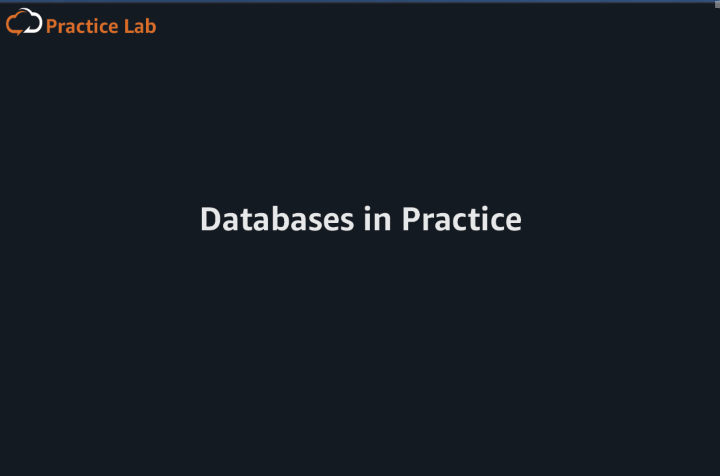

    &nbsp;

    **Etapa 2**
    1. Na caixa de pesquisa da barra de navegação superior, digite: ec2
    2. Nos resultados da pesquisa, em Serviços, clique em EC2.
    3. Vá para a próxima etapa.

    **Conceito**

    O Amazon Elastic Compute Cloud (EC2) é um serviço web que fornece capacidade de computação segura e escalável na nuvem da AWS.

    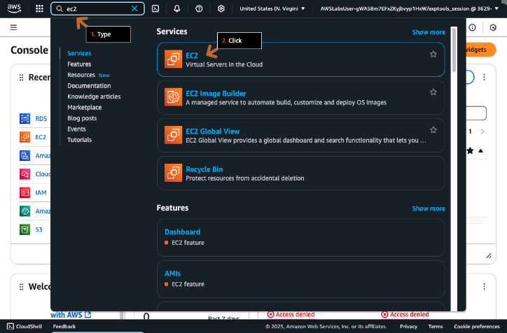

    &nbsp;

    **Etapa 3**
    1. No painel de navegação esquerdo, clique em Catálogo AMI.
    2. Vá para a próxima etapa.

    **Conceito**

    Uma Amazon Machine Image (AMI) é uma imagem que fornece o software necessário para configurar e inicializar uma instância do EC2. As AMIs também podem incluir pacotes de software, como servidores de banco de dados, oferecendo uma opção de banco de dados hospedado, além das opções gerenciadas fornecidas por outros serviços da AWS.

    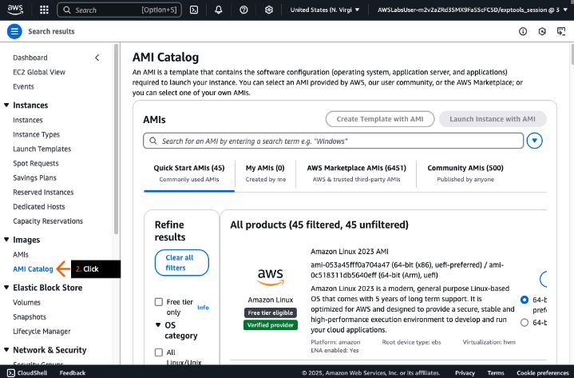

    &nbsp;
    
    **Etapa 4**
    1. Na caixa de pesquisa de AMIs, digite: sql e pressione Enter.
    2. Na guia Quick Start AMIs, revise as AMIs disponíveis no Amazon EC2.

        > Dependendo de suas necessidades, você pode encontrar AMIs fornecidas diretamente pela AWS, por meio de terceiros confiáveis no AWS Marketplace ou por meio da comunidade da AWS.

    3. Vá para a próxima etapa.

    **Conceito**

    Ao hospedar um banco de dados em uma instância do EC2, a AWS lida com a infraestrutura física, o hardware e a instalação do sistema operacional, mas você permanece responsável pelo gerenciamento da instância, pelo gerenciamento do banco de dados, pela otimização de consultas e pelos dados do cliente. Soluções gerenciadas, como o Amazon Relational Database Service (Amazon RDS), visam remover essas tarefas, com a desvantagem de opções de personalização.

    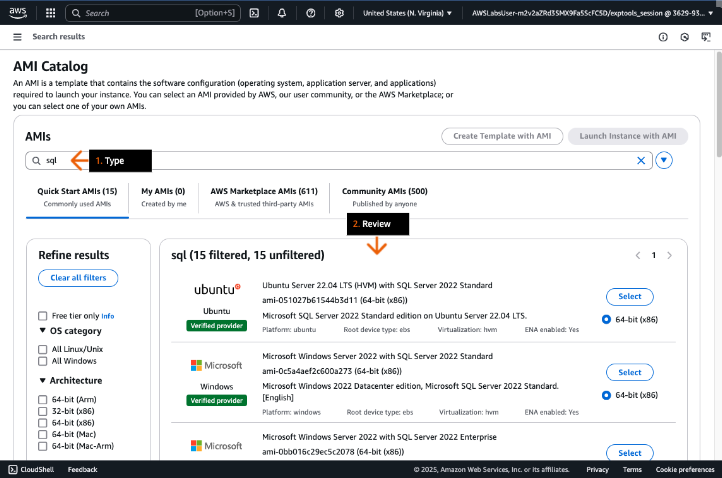

    &nbsp;
    
    **Etapa 5**
    1. Na caixa de pesquisa da barra de navegação superior, digite: database
    2. Nos resultados da pesquisa, clique em Mostrar mais. 
    3. Vá para a próxima etapa.

    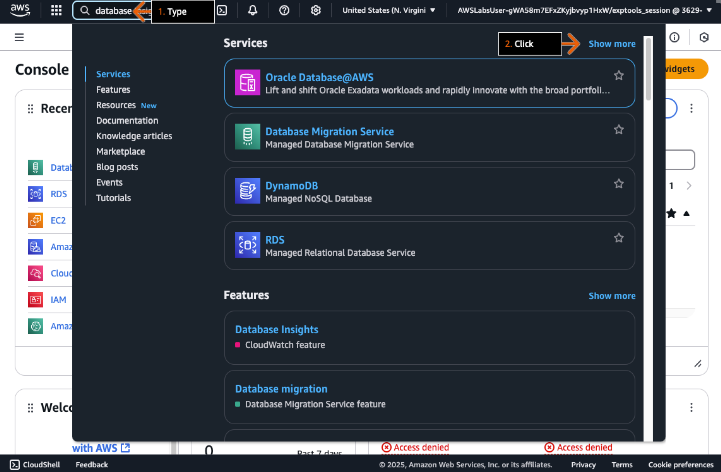

    &nbsp;

    **Etapa 6**
    1. Examine a lista de opções de banco de dados disponíveis.
    2. Clique em Aurora e RDS.
    3. Vá para a próxima etapa.

    **Conceito**

    A AWS fornece um portfólio abrangente de serviços de banco de dados para diferentes casos de uso. Bancos de dados relacionais, como o Amazon RDS, fornecem gerenciamento de dados estruturado e baseado em SQL, ideal para aplicativos que exigem consultas e transações complexas. Bancos de dados não relacionais, como o Amazon DynamoDB, oferecem armazenamento flexível e sem esquema, adequado para dados que mudam rapidamente e aplicativos de grande escala. Bancos de dados de memória, como o Amazon MemoryDB, oferecem acesso ultrarrápido aos dados armazenando dados na memória e otimizando o desempenho de aplicativos em tempo real.

    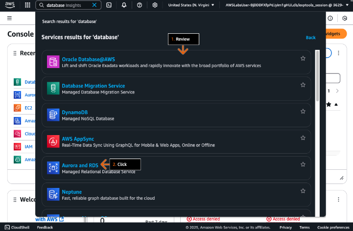

    &nbsp;

    **Etapa 7**
    1. No painel de navegação esquerdo, clique em Bancos de dados.
    2. Na seção Bancos de dados, clique em Criar banco de dados.
    3. Vá para a próxima etapa.

    **Conceito**

    O Amazon RDS é um serviço web que ajuda você a configurar, operar e escalar bancos de dados relacionais na nuvem. Além de fornecer recursos redimensionáveis e eficazes em termos de custo, o serviço pode automatizar tarefas administrativas demoradas, como o provisionamento de hardware, a configuração de banco de dados, a aplicação de patches e a execução de backups.

    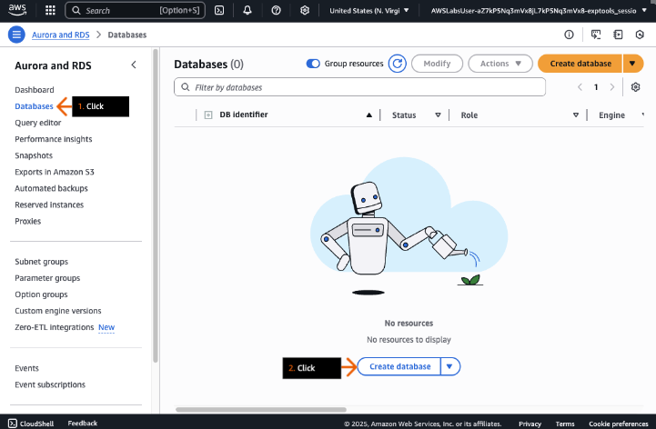

    &nbsp;

    **Etapa 8**
    1. Em "Escolher um método de criação de banco de dados", escolha "Criação padrão".
    2. Em "Tipo de mecanismo", escolha "MariaDB".
    3. Vá para a próxima etapa.

    **Conceito**

    O Amazon RDS oferece vários mecanismos diferentes de banco de dados (DB) de código aberto e comercial.

    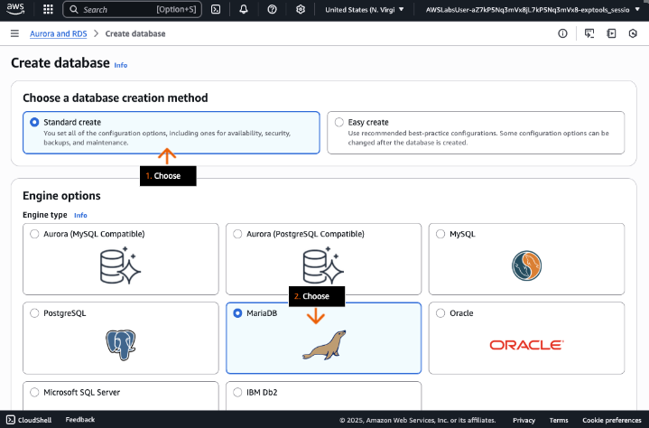

    &nbsp;

    **Etapa 9**
    1. Para a versão Engine, mantenha a versão padrão do MariaDB fornecida.

        > A versão padrão em seu laboratório prático pode ser diferente da exibida no exemplo da captura de tela.

    2. Em Modelos, selecione Dev/Teste.
    3. Em Identificador de instância do banco de dados, digite: my-database
    4. Vá para a próxima etapa.

    **Conceito**

    As versões do motor vêm em dois tipos: versões principais e versões secundárias. As versões principais são suportadas por pelo menos 3 anos após sua oferta inicial pelo Amazon RDS. Normalmente, as versões secundárias são suportadas por pelo menos 1 ano após a oferta inicial. Essas versões são descontinuadas periodicamente quando atingem o fim da vida útil da comunidade ou quando não recebem mais correções de software ou atualizações de segurança.

    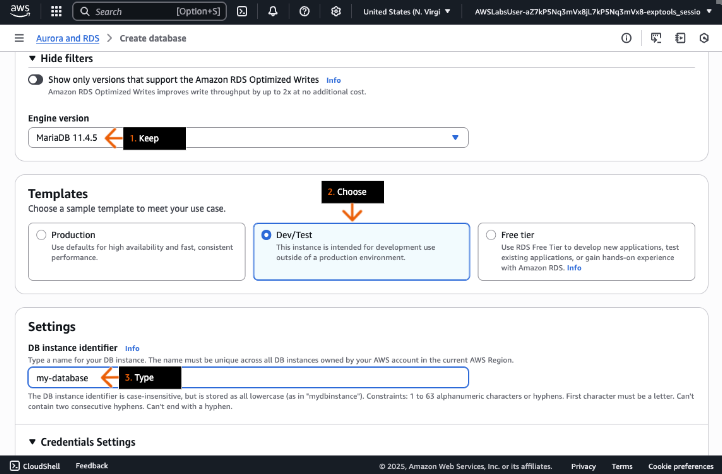

    &nbsp;

    **Etapa 10**
    1. Em Configurações de credenciais, para Nome de usuário principal, mantenha a opção padrão de administrador.
    2. Em Gerenciamento de credenciais, selecione Autogerenciada
    3. Em Senha mestre, digite: ILoveLearning!123
    4. Em Confirmar senha mestra, digite a senha novamente.
    5. Vá para a próxima etapa.

    **Conceito**

    Para cargas de trabalho de produção, recomendamos o uso do AWS Secrets Manager para gerenciamento de credenciais. Com o Secrets Manager, você pode armazenar e gerenciar vários tipos de segredos, incluindo credenciais de banco de dados, senhas, chaves de API de terceiros e texto arbitrário.

    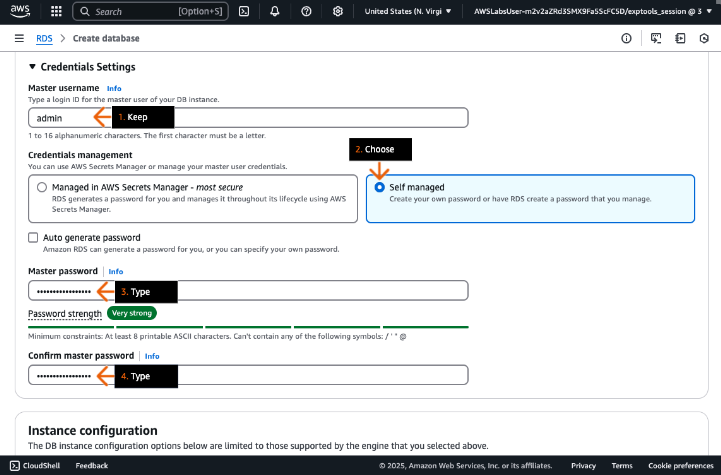

    &nbsp;
    
    **Etapa 11**
    1. Na seção Configuração da instância, para classe de instância de banco de dados, escolha Burstable classes.
    2. Abaixo disso, na lista do menu suspenso, escolha db.t3.xlarge.

        > Somente classes t3 db são suportadas neste laboratório prático. 

    3. Em Tipo de armazenamento, escolha SSD de uso geral (gp3).
    4. Para Armazenamento alocado, digite: 20
    5. Vá para a próxima etapa.

    **Conceito**

    O Amazon RDS disponibiliza uma seleção de tipos de instância otimizados para atender a diferentes casos de uso de banco de dados relacional. Os tipos de instância consistem em várias combinações de CPU, memória, armazenamento e capacidade de rede e oferecem flexibilidade de escolha da composição adequada de recursos para os bancos de dados.

    

    &nbsp;

    **Etapa 12**
    1. Clique para expandir Configuração adicional de armazenamento.
    2. Verifique para confirmar se a opção padrão, Ativar escalonamento automático de armazenamento, está selecionada.
    3. Para Limite máximo de armazenamento, revise para confirmar se o limite padrão, 1000 GiB, está selecionado.
    4. Em Implantação Multi-AZ, selecione Create a standby instance (Criar uma instância em espera).
    5. Vá para a próxima etapa.

    **Conceito**

    Uma instância em espera é uma cópia mantida de forma síncrona da instância de banco de dados principal do RDS que é automaticamente provisionada e mantida pelo Amazon RDS em uma zona de disponibilidade (AZ) diferente. Essa réplica serve como suporte de alta disponibilidade e failover para a instância primária do RDS.

    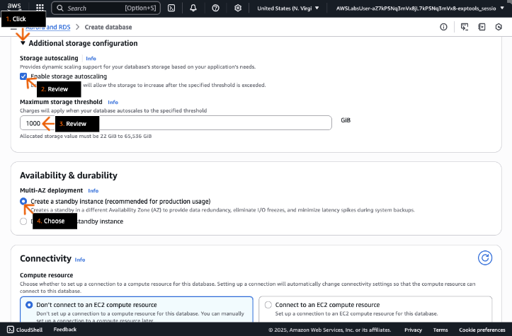

    &nbsp;
    
    **Etapa 13**
    1. Para Nuvem privada virtual (VPC), mantenha a opção padrão "VPC padrão".
    2. Para Grupo de sub-rede de banco de dados, mantenha a configuração padrão.
    3. Para Acesso público, mantenha a opção padrão "Não".
    4. Para Grupo de segurança de VPC (firewall), mantenha a opção padrão "Escolher existente".
    5. Role para baixo até a seção Monitoramento.
    6. Vá para a próxima etapa.

    **Conceito**

    O Amazon RDS ajuda você a controlar o acesso à rede ao seu banco de dados. Você também pode executar suas instâncias de banco de dados do RDS em uma nuvem privada virtual (VPC). Dessa forma, você pode isolar suas instâncias de banco de dados e conectar-se à sua infraestrutura de TI existente por meio de uma VPN IPsec criptografada padrão do setor.

    

    &nbsp;
    
    **Etapa 14**
    1. Mantenha a opção padrão Database Insights - Padrão.
    2. Desmarque a caixa de seleção para desmarcar Habilitar Insights de Desempenho.
    3. Clique para expandir Configurações adicionais de monitoramento.
    4. Desmarque a caixa de seleção para desmarcar Habilitar Monitoramento Avançado.

        > Se o Insights de Desempenho ou o Monitoramento Avançado estiverem habilitados, você receberá um erro de permissões ao tentar criar o banco de dados.

    5. Role para baixo até a seção Configuração adicional.
    6. Vá para a próxima etapa.

    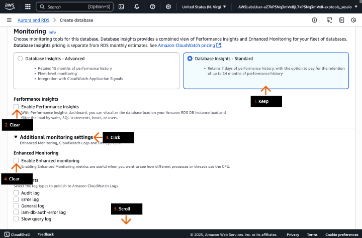

    &nbsp;

    **Etapa 15**
    1. Clique para expandir a seção Configuração adicional.
    2. Em Nome inicial do banco de dados, digite: my_database
    3. Em Grupo de parâmetros do banco de dados e Grupo de opções, revise as opções padrão.
    4. Em Backup, revise as opções padrão.
    5. Vá para a próxima etapa.

    **Conceito**

    Para que a AWS provisione com sucesso uma instância de banco de dados do RDS para você, você deve primeiro especificar um nome de banco de dados inicial. Se você não especificar um banco de dados inicial, sua instância ainda poderá ser provisionada, mas talvez não funcione corretamente.

    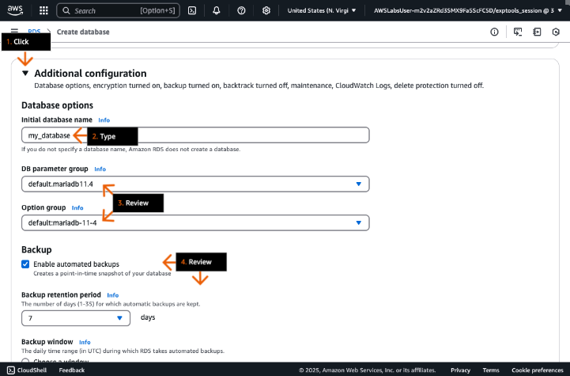

    &nbsp;

    **Etapa 16**
    1. Em Criptografia, revise as opções de criptografia padrão.
    2. Desmarque a opção Habilitar atualização automática de versão secundária.
    3. Na janela Manutenção, revise a opção padrão Sem preferência.
    4. Role a página até o final e clique em Criar banco de dados (não mostrado).
    5. Vá para a próxima etapa.
    
    **Conceito**

    O Amazon RDS fornece recursos de criptografia em repouso para proteger dados armazenados em instâncias de banco de dados. Quando a criptografia está ativada, os dados armazenados em repouso, a E/S de disco e os instantâneos são todos criptografados usando criptografia AES de 256 bits.

    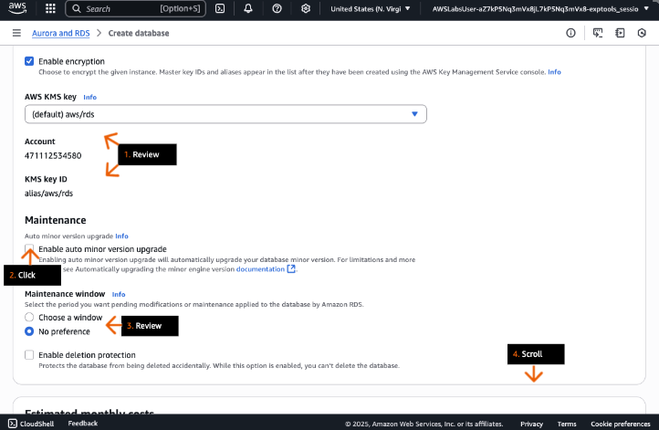

    &nbsp;

    **Etapa 17**

    > Se alguma caixa pop-up aparecer (oferecendo complementos), feche-a.  
    > A instância de banco de dados RDS leva de 5 a 10 minutos para ser criada.  
    > Depois que o banco de dados é criado, o status mostra Modificando.

    1. Aguarde de 5 a 10 minutos adicionais após a criação do banco de dados e clique no ícone Atualizar bancos de dados.
    2. Em Status, revise para confirmar se o status está Disponível. 

        > Se o status não tiver sido alterado para Disponível, continue clicando no ícone de atualização a cada poucos minutos até que isso aconteça.

    3. Clique em my-database.
    4. Vá para a próxima etapa.

    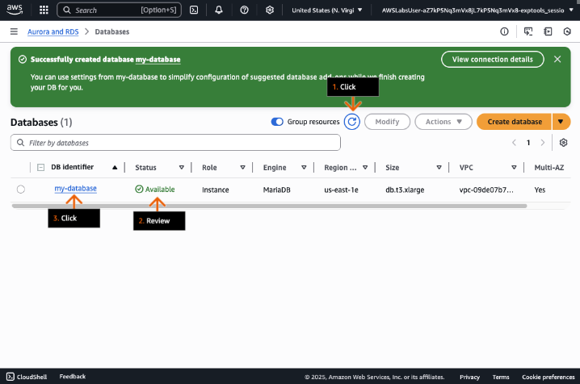

    &nbsp;

    **Etapa 18**
    1. Na seção Resumo, em Identificador de banco de dados, revise o identificador.
    2. Clique em Ações para expandir a lista suspensa.
    3. Analise as diferentes opções.

        > Você deve retornar a essas opções, como Criar réplica de leitura, na próxima seção DIY desta solução.

    4. Vá para a próxima etapa.

    **Conceito**

    Uma réplica de leitura do Amazon RDS é uma cópia somente para leitura de uma instância de banco de dados de origem que usa replicação assíncrona para transmitir alterações no banco de dados. Você pode criar uma ou mais réplicas de uma determinada instância de banco de dados de origem e fornecer tráfego de leitura de aplicativos de alto volume para suas réplicas, aumentando assim a taxa de transferência agregada de leitura.

    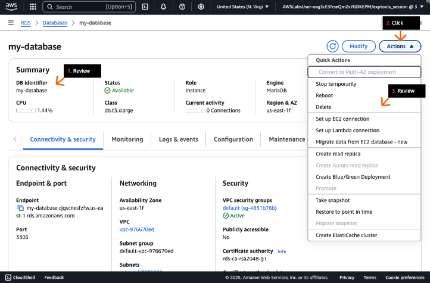

    &nbsp;

    **Etapa 19**
    1. Na caixa de pesquisa da barra de navegação superior, digite: dms
    2. Nos resultados da pesquisa, em Serviços, clique em Serviço de migração de banco de dados.
    3. Vá para a próxima etapa.

    **Conceito**

    O AWS Database Migration Service (AWS DMS) é um serviço web que ajuda você a migrar dados entre diferentes datastores. O serviço oferece migrações de banco de dados seguras e fáceis de usar, mantendo os bancos de dados de origem totalmente operacionais durante o processo de migração para minimizar o tempo de inatividade do aplicativo.

    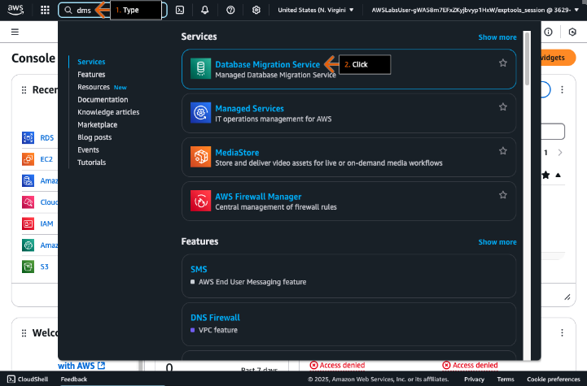

    &nbsp;

    **Etapa 20**
    1. No painel de navegação esquerdo, clique para expandir "Descobrir e avaliar".
    2. Clique em "Recomendações".
    3. Clique no link "Informações" para obter informações adicionais.
    4. Revise as informações exibidas no painel lateral.
    5. No painel de navegação esquerdo, clique em "Primeiros passos".
    6. Vá para a próxima etapa.

    **Conceito**

    O AWS DMS pode lidar com migrações entre datastores usando os mesmos mecanismos de banco de dados ou diferentes. O serviço oferece suporte a uma ampla variedade de tipos de banco de dados, incluindo bancos de dados relacionais, data warehouses e bancos de dados NoSQL.

    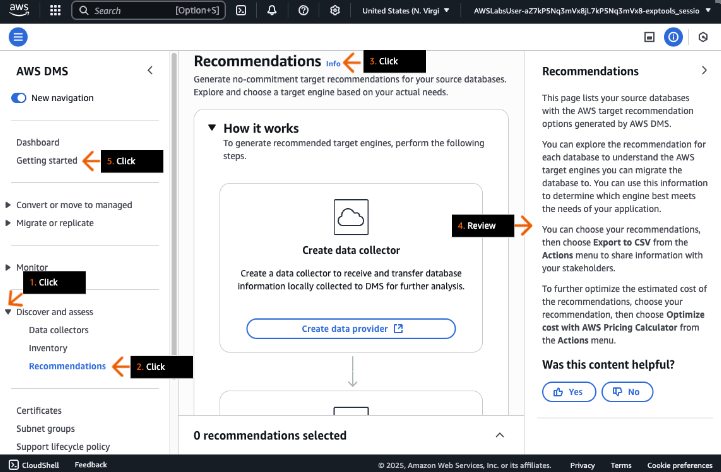

    &nbsp;

    **Etapa 21**
    1. Em Escolha um ponto de partida..., escolha Descobrir e avaliar.
    2. Abaixo disso, revise a descrição.
    3. Repita o procedimento para as opções Converter e Migrar.
    4. Vá para a próxima etapa.

    

- DIY
    - Crie uma réplica de leitura do seu banco de dados principal usando uma instância db.t3.xlarge.

    > Dica: você pode usar qualquer nome para o identificador da instância de banco de dados da réplica de leitura.

## Saiba mais
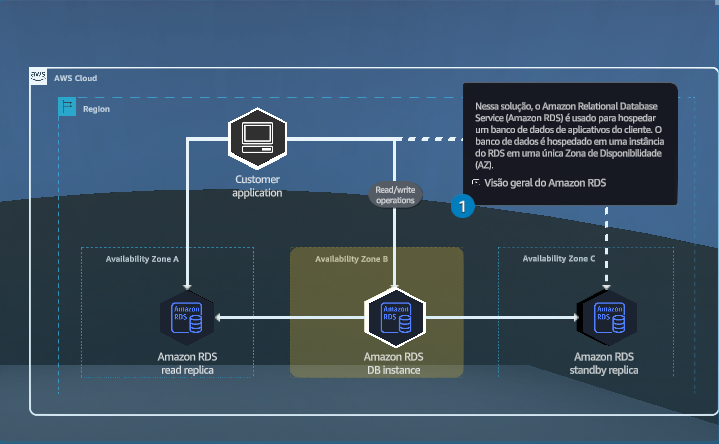
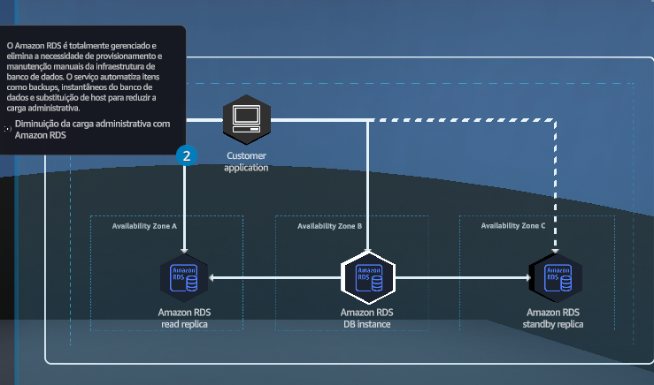
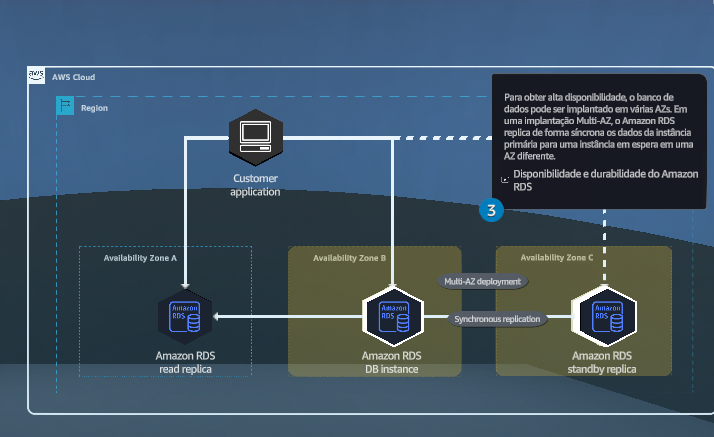
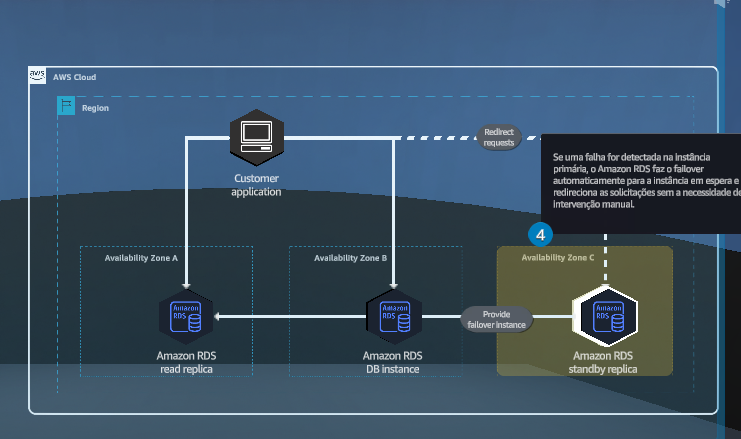
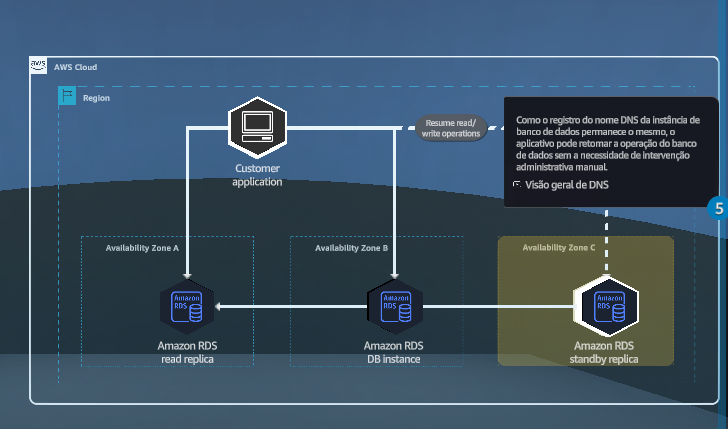
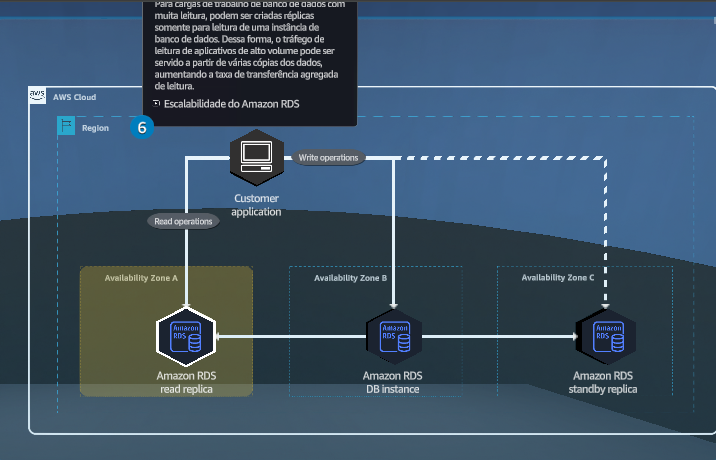