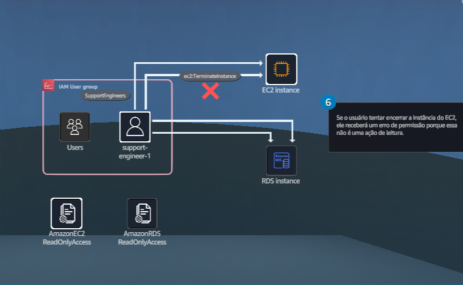

## Conceitos básicos de segurança
### Use o IAM para conceder permissões de acesso aos engenheiros usando configurações de grupo e o princípio do menor privilégio.

- Objetivos do laboratório
    - Crie um grupo e usuários do IAM.
    - Anexe uma política gerenciada pela AWS ao grupo de usuários.

    &nbsp;

    **Etapa 1**
    1. Analise os objetivos do laboratório prático na seção Conceito.
    2. Clique em Start Lab ou Open AWS Console para começar.
    3. Siga as instruções do laboratório cuidadosamente e use as setas para navegar entre as etapas.

    Os serviços da AWS que não são usados no ambiente de laboratório estão desativados. Além disso, os recursos dos serviços usados neste laboratório são limitados ao que ele exige.

    **Conceito**

    Neste laboratório prático, você vai:
    - Crie um grupo e usuários do IAM.
    - Anexe uma política gerenciada pela AWS ao grupo de usuários.

    

    &nbsp;

    **Etapa 2**
    1. Na caixa de pesquisa da barra de navegação superior, digite: iam
    2. Nos resultados da pesquisa, em Serviços, clique em IAM.
    3. Vá para a próxima etapa.

    **Conceito**

    Você pode utilizar o AWS Identity and Access Management (IAM) para gerenciar o acesso seguro aos serviços e recursos da AWS. O IAM é um recurso da sua conta na AWS, oferecido sem custo adicional. Você é cobrado apenas pelos outros serviços da AWS que seus usuários utilizarem.

    

    &nbsp;

    **Etapa 3**
    1. No painel de navegação esquerdo, clique em Grupos de usuários.
    2. Na seção Grupos de usuários, clique em Criar grupo.
    3. Vá para a próxima etapa.

    **Conceito**

    Vários usuários geralmente precisarão de um conjunto similar de permissões. Um grupo do IAM pode ser usado para definir permissões para vários usuários. Quando os usuários do IAM são adicionados a um grupo, eles herdam todas as permissões associadas ao grupo.

    

    &nbsp;
    
    **Etapa 4**
    1. Em Nome do grupo de usuários, digite: SupportEngineers

        > O nome do grupo diferencia maiúsculas de minúsculas e deve ser inserido exatamente como mostrado.

    2. Vá para a próxima etapa.

    **Conceito**

    Um grupo de usuários pode conter vários usuários, e um usuário pode pertencer a vários grupos de usuários. Os grupos de usuários não podem ser aninhados; eles podem conter apenas usuários, não outros grupos de usuários.

    

    &nbsp;
    
    **Etapa 5**
    1. Na caixa de pesquisa Anexar políticas de permissões, digite: AmazonEC2ReadOnlyAccess e pressione Enter.
    2. Escolha a caixa de seleção para selecionar AmazonEC2ReadOnlyAccess.
    3. Em Descrição, revise a descrição da política.
    4. Clique em Criar grupo de usuários.

        > Se você receber um erro, confirme se o nome do grupo na etapa anterior está escrito corretamente e se a maiúscula está correta. Você deve usar SupportEngineers, exatamente, para o nome do grupo.

    5. Vá para a próxima etapa.

    **Conceito**

    Na AWS, uma política é um objeto que, quando associado a uma identidade ou a um recurso, define suas permissões. A AWS avalia as políticas sempre que uma entidade principal do IAM (usuário ou função) faz uma solicitação.

    

    &nbsp;

    **Etapa 6**
    1. No painel de navegação à esquerda, clique em Usuários.
    2. Na seção Usuários, clique em Criar usuário.
    3. Vá para a próxima etapa.

    **Conceito**

    Um usuário do IAM é uma entidade criada na AWS que representa um usuário humano ou uma carga de trabalho que interage com os serviços da AWS. A entidade consiste em um nome e credenciais que ajudam a controlar com segurança o acesso aos recursos da AWS.

    

    &nbsp;

    **Etapa 7**
    1. Na etapa Especificar detalhes do usuário, em Nome de usuário, digite: support-engineer-1

        > O nome de usuário **diferencia maiúsculas de minúsculas** e deve ser inserido **exatamente** como mostrado.

    2. Marque a caixa de seleção para selecionar Fornecer acesso de usuário ao Console de Gerenciamento da AWS.
    3. Em Senha do console, escolha Senha personalizada.
    4. Na caixa de texto abaixo, digite: supportPassword!123

        > Todas as senhas devem conter pelo menos oito caracteres, com uma combinação de letras maiúsculas, minúsculas, números e símbolos. Seu usuário do IAM não poderá fazer login se esses requisitos não forem atendidos.

    5. Desmarque a caixa de seleção para desmarcar a opção: Os usuários devem criar uma nova senha no próximo login.
    6. Clique em Avançar.
    7. Vá para a próxima etapa.

    **Conceito**

    Ao conceder a um usuário do IAM acesso ao AWS Management Console, recomendamos conceder a ele a quantidade mínima de permissões necessárias para realizar as tarefas necessárias. Essa melhor prática é conhecida como a principal do menor privilégio.

    

    &nbsp;

    **Etapa 8**
    1. Na etapa Definir permissões, em Opções de permissões, escolha Adicionar usuário ao grupo.
    2. Na seção Grupos de usuários, marque a caixa de seleção para selecionar SupportEngineers.
    3. Clique em Avançar.
    4. Vá para a próxima etapa.

    **Conceito**

    Ao adicionar um usuário a um grupo, o usuário herda as permissões atribuídas ao grupo. Além disso, as permissões podem ser anexadas diretamente a um usuário do IAM.

    

    &nbsp;

    **Etapa 9**
    1. Na etapa Analisar e criar, na seção Tags, clique em Adicionar nova tag.
    2. Para Chave, digite: job-title
    3. Em Valor, digite: Support Engineer
    4. Clique em Criar usuário.
    5. Vá para a próxima etapa.

    **Conceito**

    As tags na AWS, que consistem em uma chave e um valor opcional, servem como rótulos de metadados que podem ser atribuídos aos recursos da AWS. As tags ajudam você a gerenciar, identificar, organizar, pesquisar e filtrar recursos.

    

    &nbsp;

    **Etapa 10**
    1. Na etapa Recuperar senha, em URL de login do console, clique no ícone de cópia para copiar o URL fornecido e, em seguida, cole-o no editor de texto de sua escolha em seu dispositivo.

        > Você também pode baixar o arquivo.csv que contém o link de login e as credenciais do console clicando em Baixar arquivo.csv.

    2. Clique em Retornar à lista de usuários.
    3. Na caixa pop-up (não exibida), clique em Continuar.
    4. Vá para a próxima etapa.

    

    &nbsp;
    
    **Etapa 11**
    1. Clique no usuário support-engineer-1.
    2. Vá para a próxima etapa.

    

    &nbsp;

    **Etapa 12**
    1. Clique na guia Credenciais de segurança.
    2. Consulte a seção Autenticação multifator (MFA).

        > Ao usar a MFA, os usuários têm um dispositivo que gera uma resposta a um desafio de autenticação. Se a senha ou as chaves de acesso de um usuário estiverem comprometidas, os recursos da sua conta ainda estarão seguros devido ao requisito adicional de autenticação.

    3. Revise a seção Chaves de acesso.

        > As chaves de acesso são credenciais de longo prazo para um usuário do IAM ou do usuário raiz da conta AWS. Você pode usar chaves de acesso para assinar solicitações programáticas na AWS CLI ou na API da AWS (diretamente ou usando o AWS SDK). As chaves de acesso consistem em duas partes: uma ID da chave de acesso e uma chave de acesso secreta. Você deve usar o ID da chave de acesso e a chave de acesso secreta juntos para autenticar suas solicitações.

    4. Vá para a próxima etapa.

    

    &nbsp;

    **Etapa 13**
    1. Em uma nova barra de endereço da janela de navegação anônima ou privada, cole o link de login do console que você acabou de copiar e pressione Enter (não exibido).

        > Ao usar uma janela de navegação anônima ou privada para esta etapa, você pode permanecer conectado com suas credenciais originais na janela anterior do navegador.

    2. Para Nome do usuário do IAM, digite: support-engineer-1 
    3. Em Senha, digite: supportPassword!123
    4. Clique em Fazer login.
    5. Vá para a próxima etapa.

    **Conceito**

    Como administrador, você pode entrar como seu usuário recém-criado para revisar seu nível de acesso. Altere regularmente suas próprias senhas e chaves de acesso e garanta que todos os usuários do IAM em sua conta também alterem as deles regularmente. Se você permitir que os usuários alterarem as próprias senhas, crie uma política de senha personalizada que exija que eles criem senhas fortes.

    

    &nbsp;
    
    **Etapa 14**
    1. Na caixa de pesquisa da barra de navegação superior, digite: ec2
    2. Nos resultados da pesquisa, em Serviços, clique em EC2.
    3. Vá para a próxima etapa.

    **Conceito**

    O Amazon Elastic Compute Cloud (Amazon EC2) é um serviço da web que fornece capacidade computacional redimensionável na nuvem. O serviço foi desenvolvido para ajudar a otimizar a computação em escala web para desenvolvedores.

    

    &nbsp;

    **Etapa 15**
    1. Na barra de navegação superior, clique no seletor de regiões para expandir a lista suspensa.
    2. Escolha ou mantenha US East (Norte da Virgínia) us-east-1.
    3. Vá para a próxima etapa.

    

    &nbsp;

    **Etapa 16**
    1. No Painel do EC2, na seção Recursos, clique em Instâncias (em execução).
    2. Vá para a próxima etapa.

    **Conceito**

    O painel do Amazon EC2 exibe métricas sobre o número de recursos.

    

    &nbsp;

    **Etapa 17**
    1. Na seção Instâncias, escolha a caixa de seleção para selecionar a instância do WebServer.
    2. Na parte superior da seção, clique em Estado da instância para expandir a lista suspensa.
    3. Escolha Encerrar (excluir) instância.
    4. Vá para a próxima etapa.

    

    &nbsp;

    **Etapa 18**
    1. Na caixa pop-up, clique em Encerrar.
    2. Vá para a próxima etapa.

    **Conceito**

    Você pode excluir sua instância quando não precisar mais dela. Isso é chamado de encerramento de sua instância. Assim que o estado de uma instância muda para encerramento ou encerrado, você deixa de incorrer em cobranças por essa instância.

    

    &nbsp;

    **Etapa 19**
    1. No alerta de erro, revise a mensagem Falha ao encerrar, informando que você não pode excluir uma instância devido às permissões do usuário.
    2. Vá para a próxima etapa.

    **Conceito**

    Os usuários só podem realizar ações permitidas pelas políticas do IAM atribuídas. Como o acesso de um diretor do IAM é negado por padrão, ele deve ter permissão explícita para realizar uma ação. Caso contrário, eles terão o acesso implicitamente negado.

    

- DIY
    - Conceda ao grupo SupportEngineers acesso somente de leitura ao Amazon RDS.

## Saiba mais

