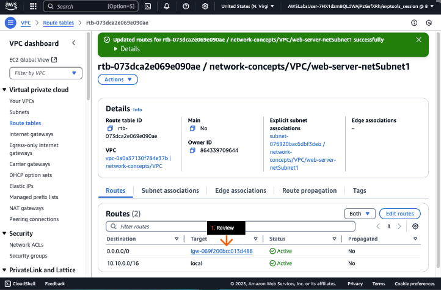
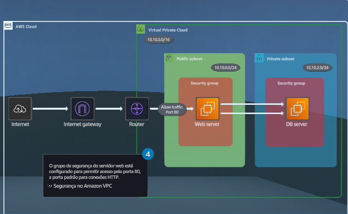

## Conceitos de rede
### Examine e altere as configurações da rede VPC para corrigir um problema de conexão.

- Objetivos do laboratório
    - Explore os componentes que compõem uma nuvem privada virtual (VPC).
    - Configure uma tabela de rotas anexada a uma sub-rede dentro de uma VPC.
    - Configure um gateway de Internet dentro de uma VPC.
    - Configure regras de entrada em um security group para controlar o acesso.

    &nbsp;

    **Etapa 1**
    1. Analise os objetivos do laboratório prático na seção Conceito.
    2. Clique em Start Lab ou Open AWS Console para começar.
    3. Siga as instruções do laboratório cuidadosamente e use as setas para navegar entre as etapas.

    Os serviços da AWS que não são usados no ambiente de laboratório estão desativados. Além disso, os recursos dos serviços usados neste laboratório são limitados ao que ele exige.

    **Conceito**

    Neste laboratório prático, você vai:
    - Explorar os componentes que compõem uma virtual private cloud (VPC).
    - Configurar uma tabela de rotas anexada a uma sub-rede dentro de uma VPC.
    - Configurar uma tabela de rotas para direcionar o tráfego destinado à internet para o internet gateway.
    - Configurar regras de entrada em um security group para controlar o acesso.

    

    &nbsp;

    **Etapa 2**
    1. Na barra de navegação superior, revise o seletor de região para confirmar se a região está definida como N. Virginia (us-east-1).
    2. Na caixa de pesquisa Serviços, digite: ec2            
    3. Nos resultados da pesquisa, em Serviços, clique em EC2.
    4. Vá para a próxima etapa.

    

    &nbsp;

    **Etapa 3**
    1. No painel de navegação à esquerda, clique em Instâncias.
    2. Na seção Instâncias, marque a caixa de seleção para selecionar a instância do Web Server.
    3. Na guia de Detalhes, em Endereço IPv4 público, clique no ícone de cópia para copiar o endereço fornecido.

        > Os endereços IP públicos em seu laboratório prático não corresponderão ao que é exibido nos exemplos de captura de tela.

    4. Vá para a próxima etapa.

    **Conceito**

    Um endereço IP público é um endereço IPv4 que pode ser acessado pela internet. Você pode usar endereços públicos para comunicação entre suas instâncias e a internet.

    

    &nbsp;
    
    **Etapa 4**
    1. Em uma nova barra de endereço da guia (ou janela) do navegador, cole o endereço IP que você acabou de copiar e pressione Enter.

        > Após cerca de um minuto, uma mensagem de tempo limite do site deve aparecer.

    2. Para resolver esse problema, retorne à guia do navegador do console Amazon EC2 (não mostrada).
    3. Vá para a próxima etapa.

    

    &nbsp;
    
    **Etapa 5**
    1. Verifique para confirmar se a instância do Web Server ainda está selecionada.
    2. Clique na guia Redes.
    3. Examine os endereços IPv4 Público e Privado. 
    4. Vá para a próxima etapa.

    **Conceito**

    Usando o Amazon Virtual Private Cloud (Amazon VPC), você pode lançar recursos da AWS em uma rede virtual que você definiu. Essa rede virtual é semelhante a uma rede tradicional que você operaria no seu data center, com as vantagens de usar a infraestrutura dimensionável da AWS.

    

    &nbsp;

    **Etapa 6**
    1. Em ID da sub-rede, clique na ID fornecida.

        > O ID da sub-rede abre o console do Amazon VPC em uma nova guia (ou janela) do navegador.

    2. Vá para a próxima etapa.

    **Conceito**

    Uma sub-rede é um intervalo de endereços IP em sua VPC. Você pode lançar recursos da AWS em uma sub-rede específica. Cada sub-rede deve residir dentro de uma Zona de Disponibilidade e não pode se estender em várias zonas.

    

    &nbsp;

    **Etapa 7**
    1. Na seção Sub-redes, escolha a caixa de seleção para selecionar o nome da sub-rede que começa com _network-concepts_.
    2. Clique na guia Tabela de rota.
    3. Ao lado da tabela de rotas, clique no nome do link que contém _web-server-netSubnet1_.
    4. Vá para a próxima etapa.

    **Conceito**

    Uma tabela de rotas contém um conjunto de regras, chamadas rotas, que são usadas para determinar para onde o tráfego de rede da sua sub-rede ou gateway é direcionado. Use uma sub-rede pública para recursos conectados à Internet e uma sub-rede privada para recursos não conectados à internet.

    

    &nbsp;

    **Etapa 8**
    1. Na seção Tabelas de rotas, escolha a caixa de seleção para selecionar o nome da tabela de rotas que começa com _network-concepts_.
    2. Clique na guia Rotas.
    3. Examine as duas entradas da tabela de rotas. 

        > Uma rota envia tráfego local somente para a rede local. A outra rota envia todo o tráfego restante para a Internet por meio de um gateway NAT.

    4. Clique em Edit routes.
    5. Vá para a próxima etapa.

    **Conceito**

    Um gateway NAT é um serviço de conversão de endereços de rede (NAT). Com um gateway NAT, as instâncias em uma sub-rede privada podem se conectar a serviços fora da sua VPC. No entanto, os serviços externos não podem iniciar uma conexão com essas instâncias.

    

    &nbsp;

    **Etapa 9**
    1. Para excluir o gateway NAT da tabela de rotas, clique em Remover.

        > Ao remover essa rota, as instâncias nessa sub-rede não podem mais se conectar a serviços externos.

    2. Vá para a próxima etapa.

    **Conceito**

    A convenção de nomenclatura CIDR 0.0.0.0/0 representa todos os endereços IPv4 possíveis (::/0 para IPv6).

    

    &nbsp;

    **Etapa 10**
    1. Clique em Adicionar rota.
    2. Em Destino, na lista suspensa, escolha 0.0.0.0/0.
    3. Para Target, escolha Internet Gateway.
    4. Abaixo disso, escolha igw-xxxxxxx.
    5. Clique em Salvar alterações.
    6. Vá para a próxima etapa.

    **Conceito**

    Um internet gateway tem duas finalidades:

    - Fornecer um destino nas tabelas de rotas da sua VPC para tráfego roteável pela internet.
    - Realizar a tradução de endereços de rede (NAT) para instâncias que receberam endereços IPv4 públicos.

    

    &nbsp;
    
    **Etapa 11**
    1. Na guia Rotas, em Target, revise a nova associação de gateway da Internet. 

        > A sub-rede agora pode ser acessada pela internet.

    2. Retorne ao console do Amazon EC2 na outra guia do navegador.
    3. Vá para a próxima etapa.

    **Conceito**

    Um gateway de Internet é dimensionado horizontalmente, redundante e altamente disponível, não impondo riscos de disponibilidade ou restrições de largura de banda ao tráfego da rede. Não há cobrança adicional para ter um gateway de internet em sua conta. Ele serve a dois propósitos principais:

    - Forneça uma meta nas tabelas de rotas da VPC para o tráfego roteável pela Internet.
    - Execute a tradução de endereços de rede (NAT) para instâncias com endereços IPv4 públicos.

    

    &nbsp;

    **Etapa 12**
    1. Na seção Instâncias, marque a caixa de seleção para selecionar a instância do servidor web.
    2. Clique na guia Segurança.
    3. Em Grupos de segurança, clique em WebServerSecurityGroup.
    4. Vá para a próxima etapa.

    **Conceito**

    Um grupo de segurança é um firewall virtual que controla o tráfego de e para recursos da AWS.

    

    &nbsp;
    
    **Etapa 13**
    1. Na seção Detalhes, revise os detalhes do grupo de segurança.
    2. Na guia Regras de entrada, clique em Editar regras de entrada.
    3. Vá para a próxima etapa.

    **Conceito**

    Para cada security group, você pode adicionar regras que controlam o tráfego com base em protocolos e números de porta. Existem conjuntos separados de regras para tráfegos de entrada e de saída.

    

    &nbsp;
    
    **Etapa 14**
    1. Clique em Adicionar regra.
    2. Vá para a próxima etapa.

    **Conceito**

    Quando você cria uma VPC, ela vem com um security group padrão. Você pode criar security groups adicionais para cada VPC.

    

    &nbsp;

    **Etapa 15**
    1. Em Tipo, na lista suspensa, role para baixo para ver os vários protocolos predefinidos disponíveis.

        > Observe o protocolo MySQL/Aurora, que você deve usar na próxima seção DIY desta solução.

    2. Escolha HTTP.

        > Certifique-se de não ter escolhido HTTPS.

    3. Vá para a próxima etapa.

    **Conceito**

    Você pode criar um security group e adicionar regras que refletem o papel da instância associada ao security group. Por exemplo, uma instância configurada como servidor web precisa de regras do security group que permitam acesso de entrada HTTP e HTTPS. Da mesma forma, uma instância de banco de dados precisa de regras que permitam o acesso para o tipo de banco de dados, como acesso pela porta 3306 para MySQL.

    

    &nbsp;

    **Etapa 16**
    1. Em Origem, selecione Anywhere-IPv4.

        > Na próxima seção DIY, você deve usar a caixa de pesquisa Fonte para encontrar o grupo de segurança necessário.

    2. No alerta de aviso (não exibido), revise a configuração recomendada.
    3. Clique em Salvar regras.
    4. Vá para a próxima etapa.
    
    **Conceito**

    Os grupos de segurança têm estado, o que significa que eles retêm informações sobre suas interações ao longo do tempo. Por exemplo, se você enviar uma solicitação de uma instância, o tráfego de resposta dessa solicitação poderá chegar à instância independentemente das regras do grupo de segurança de entrada. As respostas ao tráfego de entrada permitido podem sair da instância, independentemente das regras de saída.

    

    &nbsp;

    **Etapa 17**
    1. No alerta de sucesso, revise a mensagem.
    2. Na faixa de opções da guia, clique em Regras de saída.
    3. Vá para a próxima etapa.

    **Conceito**

    É uma prática recomendada de segurança limitar as regras de entrada a endereços IP específicos e não abri-las ao mundo inteiro.
    
    

    &nbsp;

    **Etapa 18**
    1. Verifique se existe uma regra de saída existente que permite tráfego na porta 3306

        > 3306 é a porta padrão usada pelo servidor de banco de dados MySQL.

    2. Clique em Editar regras de saída.
    3. Vá para a próxima etapa.

    

    &nbsp;

    **Etapa 19**
    1. Clique em Adicionar regra.
    2. Em Tipo, use o menu suspenso para escolher Todo o tráfego.
    3. Em Destino, use o menu suspenso para escolher o intervalo CIDR 0.0.0.0/0.
    4. Clique em Salvar regras.
    5. Vá para a próxima etapa.

    

    &nbsp;

    **Etapa 20**
    1. Verifique se as regras do grupo de segurança de saída foram atualizadas com êxito.
    2. No painel de navegação à esquerda, clique em Instâncias.
    3. Vá para a próxima etapa.

    

    &nbsp;

    **Etapa 21**
    1. Na seção Instances, marque a caixa de seleção para selecionar a instância do Web Server.
    2. Clique na aba Networking.
    3. Em Public IPv4 address, clique no ícone de copiar para copiar o endereço fornecido.

        > Não clique em abrir endereço ou a página não carregará.

    4. Vá para a próxima etapa.

    

    &nbsp;

    **Etapa 22**
    1. Na barra de endereço de uma nova aba (ou janela) do navegador, cole o endereço IP da instância que você acabou de copiar e pressione Enter.

        > Certifique-se de usar HTTP, não HTTPS.
        > O endereço deve parecer com isso: http://xxx.xxx.xxx.xxx

    2. Analise o diagrama que carrega a partir do endereço IP público.
    3. Revise a conexão da internet para o servidor web.   

        > Uma conexão deve ser estabelecida.

    4. Revise a conexão do servidor web para o banco de dados (servidor DB).  

        > A conexão deve aparecer como falha.

    5. Vá para a próxima etapa.

    **Conceito**

    Para implementar um internet gateway funcional, é necessário completar os seguintes passos:

    - O Internet gateway deve estar anexado a uma VPC.
    - As tabelas de rotas associadas à sua sub-rede pública devem ter uma rota para seu internet gateway.
    - Os security groups associados à sua VPC devem permitir o tráfego de/para a Internet.
    - Quaisquer instâncias na VPC devem ter um endereço IP público ou IP elástico atribuído.

    

- DIY
    - Altere as regras do security group para permitir o tráfego, pela porta 3306, no servidor de banco de dados.

    > Dicas: 
        > - Atualize as regras do grupo de segurança e, em seguida, revise o diagrama para obter uma confirmação visual de uma conexão estabelecida. O status deve mudar para Conectado. 
        > - O servidor web, usando o grupo de segurança WebServerSecurityGroup, precisa se conectar ao servidor de banco de dados, usando o grupo de segurança DBServerSecurityGroup, por meio de uma conexão TCP na porta 3306 (MySQL/Aurora).

## Saiba mais
### Amazon EC2

