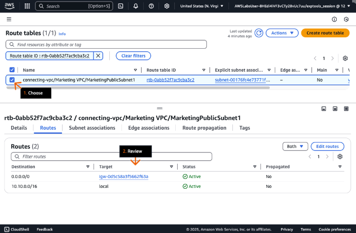
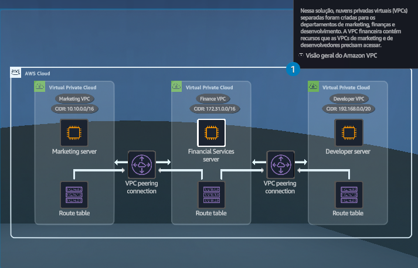

## Conectando VPCs
### Permita a comunicação entre aplicações hospedadas em diferentes VPCs usando o emparelhamento de VPC. As instâncias EC2 de marketing e desenvolvedor precisam acessar o servidor de serviços financeiros na VPC do departamento financeiro.

- Objetivos do laboratório
    - Configurar uma conexão de peering de VPC.
    - Certifique-se de que o tráfego seja roteado corretamente entre as VPCs emparelhadas.

    &nbsp;

    **Etapa 1**
    1. Analise os objetivos do laboratório prático na seção Conceito.
    2. Clique em Start Lab ou Open AWS Console para começar.
    3. Siga as instruções do laboratório cuidadosamente e use as setas para navegar entre as etapas.

    Os serviços da AWS que não são usados no ambiente de laboratório estão desativados. Além disso, os recursos dos serviços usados neste laboratório são limitados ao que ele exige.

    **Conceito**

    Neste laboratório prático, você vai:
    - Configurar uma conexão de peering de VPC.
    - Certifique-se de que o tráfego seja roteado corretamente entre as VPCs emparelhadas.

    

    &nbsp;

    **Etapa 2**
    1. Na caixa de pesquisa da barra de navegação superior, digite: vpc
    2. Nos resultados da pesquisa, em Serviços, clique em VPC.
    3. Vá para a próxima etapa.

    **Conceito**

    A Amazon Virtual Private Cloud (Amazon VPC) é um serviço que ajuda você a executar recursos da AWS em uma rede virtual isolada logicamente definida por você. Você tem controle total sobre seu ambiente de rede virtual.

    

    &nbsp;

    **Etapa 3**
    1. No painel de navegação esquerdo, clique em Suas VPCs.
    2. Na seção Suas VPCs, revise as VPCs de marketing, finanças e desenvolvedores disponíveis.
    3. Vá para a próxima etapa.

    **Conceito**

    Por padrão, as VPCs são isoladas umas das outras. Uma conexão de peering de VPC é uma conexão de redes entre duas VPCs que você pode usar para rotear o tráfego entre elas usando endereços IP privados.

    

    &nbsp;
    
    **Etapa 4**
    1. Na caixa de pesquisa da barra de navegação superior, digite: ec2
    2. Nos resultados da pesquisa, em Serviços, clique em EC2.
    3. Vá para a próxima etapa.

    

    &nbsp;
    
    **Etapa 5**
    1. No Painel do EC2, na seção Recursos, clique em Instâncias (em execução).
    2. Vá para a próxima etapa.

    

    &nbsp;

    **Etapa 6**
    1. Na seção Instâncias, escolha a caixa de seleção para selecionar a instância do FinanceServer.
    2. Abaixo dessa seção, clique na guia Rede.
    3. Verifique se nenhum endereço IPv4 público ou IPv4 DNS público está preenchido.

        > Uma instância criada em uma sub-rede privada não tem endereços públicos.

    4. Em Endereços IPv4 privados, clique no ícone de cópia para copiar o endereço IP fornecido e cole-o no editor de texto de sua escolha em seu dispositivo.

        > Você usa esse endereço em etapas posteriores.
    
    5. Em ID da sub-rede, analise a ID fornecida.
    6. Vá para a próxima etapa.

    **Conceito**

    Uma sub-rede representa um intervalo de endereços IP em uma VPC. Cada sub-rede deve estar totalmente contida em uma única zona de disponibilidade (AZ) e não pode abranger várias AZs.

    

    &nbsp;

    **Etapa 7**
    1. Na seção Instances, desmarque a caixa de seleção para desselecionar a instância FinanceServer.
    2. Escolha a instância MarketingServer.
    3. Abaixo dessa seção, na aba Networking, em VPC ID, revise a VPC à qual a instância MarketingServer pertence.
    4. No topo da seção Instances, clique em Connect.
    5. Vá para a próxima etapa.

    **Conceito**

    Você pode se conectar a uma instância do Amazon Elastic Compute Cloud (Amazon EC2) de quatro maneiras:

    - EC2 Instance Connect
    - Gerenciador de sessões
    - Cliente SSH
    - Console serial do EC2

    

    &nbsp;

    **Etapa 8**
    1. Selecione a guia Gerenciador de sessões.
    2. Clique em Conectar.

        > O terminal do Gerenciador de Sessões da instância MarketingServer é aberto em uma nova guia (ou janela) do navegador.

    3. Vá para a próxima etapa.

    **Conceito**

    O gerenciador de sessão é um recurso totalmente gerenciado do AWS Systems Manager. Com o Gerenciador de sessões, você pode gerenciar instâncias do Amazon EC2, dispositivos Edge, servidores on-premises e máquinas virtuais (VMs). Você pode usar um shell com base em navegador de um clique interativo ou a AWS Command Line Interface (AWS CLI).

    

    &nbsp;

    **Etapa 9**
    1. Na janela do terminal do Gerenciador de Sessões, substituindo o endereço IP atual pelo endereço IP do FinanceServer que você copiou em uma etapa anterior, execute (digite o comando e pressione Enter): ping 172.31.x.xx

        > Esse comando verifica a conexão com a instância do FinanceServer.

    2. Verifique se o comando está travado e se não há conexão. Não há alerta de erro.

        > Como a instância do FinanceServer usa somente um endereço IP privado, as VPCs não podem estabelecer caminhos de roteamento para destinos fora do intervalo de IP privado local.

    3. Para sair do processo em execução, no teclado, pressione Ctrl+C.
    4. Vá para a próxima etapa.

    **Conceito**

    Por padrão, as VPCs não podem se comunicar com recursos em outras VPCs usando endereços IPv4 privados ou endereços IPv6.

    

    &nbsp;

    **Etapa 10**
    1. Retorne à guia do navegador do console Amazon EC2.
    2. Revise para confirmar se a instância do MarketingServer ainda está selecionada.
    3. Na guia Rede, em ID da sub-rede, clique na ID para MarketingPublicSubnet1.
    4. Vá para a próxima etapa.

    **Conceito**

    As instâncias do EC2 residem em uma sub-rede em uma VPC.

    

    &nbsp;
    
    **Etapa 11**
    1. Na seção Sub-redes, escolha o nome da sub-rede disponível.
    2. Na guia Detalhes, em Tabela de rotas, clique no ID da rota fornecido.

        > O painel da VPC é aberto em uma nova guia (ou janela) do navegador.

    3. Vá para a próxima etapa.

    **Conceito**

    Uma propriedade importante de uma sub-rede é sua tabela de rotas. Uma tabela de rotas é uma coleção de regras de roteamento que gerencia o tráfego de qualquer sub-rede associada. Ele contém rotas específicas que determinam para onde o tráfego de rede deve ser direcionado a partir da sua sub-rede ou gateway.

    

    &nbsp;

    **Etapa 12**
    1. Na seção Tabelas de rotas, escolha a tabela de rotas de marketing disponível.
    2. Na guia Rotas, revise as regras de roteamento. 

        > Duas rotas devem ser exibidas: uma rota para o tráfego local e uma rota para o tráfego da Internet através do gateway da Internet.

    3. Vá para a próxima etapa.

    **Conceito**

    Se um gateway da Internet estiver conectado, as tabelas de rotas têm regras para tráfego local e intervalos de IP públicos. Recomendamos que você especifique um bloco CIDR dos intervalos de endereços IPv4 privados, conforme especificado na RFC 1918.

    

    &nbsp;
    
    **Etapa 13**
    1. No painel de navegação esquerdo, clique em Conexões de emparelhamento.
    2. Na seção Conexões de peering, clique em Criar conexão de peering.
    3. Vá para a próxima etapa.

    **Conceito**

    Com uma conexão de emparelhamento de VPC, as instâncias em qualquer VPC podem se comunicar entre si como se estivessem na mesma rede.

    

    &nbsp;
    
    **Etapa 14**
    1. Na seção Configurações de conexão de peering, em Nome, digite: Marketing <> Finance
    2. Para ID de VPC (solicitante), na lista suspensa, escolha a VPC de marketing. 
    3. Para CIDRs de VPC, revise para confirmar se a VPC de marketing tem 10.10.0.0/16 como seu intervalo CIDR. 
    4. Vá para a próxima etapa.

    **Conceito**

    Sua VPC solicitará que outra VPC permita acesso aos seus recursos. A VPC que faz a solicitação é chamada de solicitante. Você pode solicitar acesso às VPCs de outras contas da AWS.

    

    &nbsp;

    **Etapa 15**
    1. Para VPC ID (Accepter) (ID da VPC (Aceitador)), escolha a VPC financeira. 
    2. Para CIDRs de VPC, revise para confirmar se o VPC financeiro tem 172.31.0.0/16 como seu intervalo CIDR. 
    3. Clique em Criar conexão de peering.
    4. Vá para a próxima etapa.

    **Conceito**

    As VPCs em uma conexão de emparelhamento não podem ter blocos CIDR sobrepostos. Por exemplo, se duas VPCs tiverem o bloco CIDR 192.168.0.0/28, uma conexão de emparelhamento não poderá ser criada entre elas.

    

    &nbsp;

    **Etapa 16**
    1. No alerta de sucesso, revise a mensagem.
    2. Em Status, revise para confirmar se o status é Aceitação pendente.
    3. Clique em Ações para expandir a lista suspensa.
    4. Selecione Aceitar solicitação.
    5. Vá para a próxima etapa.
    
    **Conceito**

    Para solicitar uma conexão de emparelhamento de VPC com uma VPC em sua conta, certifique-se de ter os IDs das VPCs com as quais você está criando a conexão de emparelhamento de VPC. Você mesmo deve criar e aceitar a solicitação de conexão de peering de VPC para ativá-la. Se a conexão de peering for entre contas, ambas as contas deverão aceitar a conexão para ativá-la.

    

    &nbsp;

    **Etapa 17**
    1. Na caixa pop-up, clique em Aceitar solicitação.
    2. Vá para a próxima etapa.

    

    &nbsp;

    **Etapa 18**
    1. No alerta de sucesso, revise a mensagem.
    2. Em Status, verifique se o status é Ativo.
    3. Vá para a próxima etapa.

    

    &nbsp;

    **Etapa 19**
    1. Retorne à seção Instâncias no console do Amazon EC2 na outra guia do navegador.
    2. Escolha a instância do MarketingServer.
    3. Na guia Detalhes, role para baixo até ID da sub-rede.
    4. Clique na ID fornecida.
    5. Vá para a próxima etapa.

    **Conceito**

    Depois de estabelecer uma conexão de peering, você deve modificar a tabela de rotas associada a cada VPC. Você deve adicionar uma rota em cada tabela de rotas para permitir que o tráfego seja roteado para a VPC de peering.

    

    &nbsp;

    **Etapa 20**
    1. Na seção Sub-redes, escolha a sub-rede disponível.
    2. Na guia Detalhes, em Tabela de rotas, clique na ID fornecida.

        > O painel da VPC é aberto em uma nova guia (ou janela) do navegador.

    3. Vá para a próxima etapa.

    

    &nbsp;

    **Etapa 21**
    1. Na seção Tabelas de rotas, escolha a tabela de rotas de marketing.
    2. Na guia Rotas, clique em Editar rotas
    3. Vá para a próxima etapa.

    **Conceito**

    Depois que uma conexão de emparelhamento de VPC for criada, o tráfego não poderá fluir entre as VPCs até que as rotas sejam estabelecidas em todas as tabelas de rotas associadas.

    

    &nbsp;

    **Etapa 22**
    1. Clique em Adicionar rota.
    2. Para configurar a rota, para Destino, na nova caixa de pesquisa, digite: 172.31.0.0/16

        > Esse bloco CIDR pertence ao Finance VPC.

    3. Em Target, escolha Peering Connection.
    4. Abaixo disso, escolha o destino da conexão de peering que contém Marketing <> Finance. 
    5. Clique em Salvar alterações.
    6. Vá para a próxima etapa.

    

    &nbsp;

    **Etapa 23**
    1. No alerta de sucesso, revise a mensagem.
    2. Na guia Rotas, revise a rota recém-criada.

        > A nova rota direciona o tráfego que se origina da Marketing VPC (10.10.0.0/16) destinada à Finance VPC (172.31.0.0/16) por meio da conexão de emparelhamento.

    3. Vá para a próxima etapa.

    

    &nbsp;

    **Etapa 24**
    1. Retorne à seção Instâncias no console do Amazon EC2 na outra guia do navegador.
    2. Escolha a instância FinanceServer.

        > Talvez seja necessário desmarcar a caixa de seleção da instância do MarketingServer.

    3. Na guia Detalhes, role para baixo até ID da sub-rede.
    4. Clique na ID fornecida.
    5. Vá para a próxima etapa.

    

    &nbsp;

    **Etapa 25**
    1. Na seção Sub-redes, escolha a sub-rede disponível.
    2. Na guia Detalhes, em Tabela de rotas, clique no ID da rota fornecido.

        > O painel da VPC é aberto em uma nova guia (ou janela) do navegador.

    3. Vá para a próxima etapa.

    

    &nbsp;

    **Etapa 26**
    1. Na seção Tabelas de rotas, escolha a tabela de rotas financeiras.  
    2. Na guia Rotas, clique em Editar rotas
    3. Vá para a próxima etapa.

    **Conceito**

    O tráfego não pode fluir adequadamente entre as VPCs se apenas uma tabela de rotas da VPC estiver configurada. Para que o emparelhamento de VPCs funcione de forma eficaz, as rotas devem ser estabelecidas em todas as tabelas de rotas associadas de ambas as VPCs.

    

    &nbsp;

    **Etapa 27**
    1. Clique em Adicionar rota.
    2. Para configurar a rota, para Destino, na nova caixa de pesquisa, digite: 10.10.0.0/16

        > Esse bloco CIDR pertence ao Marketing VPC.

    3. Em Target, escolha Peering Connection.
    4. Abaixo disso, escolha o destino da conexão de peering que contém Marketing <> Finance. 
    5. Clique em Salvar alterações.
    6. Vá para a próxima etapa.

    

    &nbsp;

    **Etapa 28**
    1. No alerta de sucesso, revise a mensagem.
    2. Revise a rota recém-criada.

        > A nova rota direciona o tráfego que se origina do Finance VPC (172.31.0.0/16) destinado ao Marketing VPC (10.10.0.0/16) por meio da conexão de emparelhamento.

    3. Vá para a próxima etapa.

    

    &nbsp;

    **Etapa 29**
    1. Retorne à seção Instâncias no console do Amazon EC2.
    2. Escolha a instância do MarketingServer.

        > Talvez seja necessário desmarcar a caixa de seleção da instância FinanceServer.
        > Talvez você também queira fechar todas as outras guias abertas do navegador.

    3. Clique em Conectar.
    4. Vá para a próxima etapa.

    

    &nbsp;

    **Etapa 30**
    1. Selecione a guia Gerenciador de sessões.
    2. Clique em Conectar.

        > O terminal do Gerenciador de Sessões da instância MarketingServer é aberto em uma nova guia (ou janela) do navegador.

    3. Vá para a próxima etapa.

    

    &nbsp;

    **Etapa 31**
    1. Na janela do terminal do Gerenciador de Sessões, substituindo o endereço IP atual pelo endereço IP que você copiou em uma etapa anterior, execute: ping <172.31.x.xx>

        > Esse é o endereço IPv4 privado da instância FinanceServer.

    2. Verifique se o comando ping ainda não está funcionando,
    3. Para sair do processo em execução, no teclado, pressione Ctrl+C.
    4. Vá para a próxima etapa.

    **Conceito**

    As VPCs emparelhadas não aceitam necessariamente todos os dados entre elas. Recursos de segurança, como listas de controle de acesso à rede e grupos de segurança, ainda se aplicam.

    

    &nbsp;

    **Etapa 32**
    1. No navegador anterior, na seção Instâncias do Amazon EC2, escolha a instância FinanceServer.
    2. Clique na guia Segurança.
    3. Em Grupos de segurança, clique no nome do grupo de segurança fornecido que contém FinanceServerSecurityGroup.
    4. Vá para a próxima etapa.

    **Conceito**

    Os grupos de segurança não aceitam automaticamente dados de VPCs emparelhadas. Você deve atualizar os grupos de segurança para permitir uma VPC emparelhada como fonte de entrada.

    

    &nbsp;

    **Etapa 33**
    1. Na guia Regras de entrada, clique em Editar regras de entrada.
    2. Vá para a próxima etapa.

    **Conceito**

    Os grupos de segurança são stateful. Se você enviar uma solicitação da sua instância, o tráfego da resposta dessa solicitação terá permissão para fluir, independentemente das regras de entrada. Isso também significa que as respostas ao tráfego de entrada permitido podem fluir para fora, independentemente das regras de saída.

    

    &nbsp;

    **Etapa 34**
    1. Clique em Adicionar regra.
    2. Em Tipo, escolha ICMP personalizado - IPv4.
    3. Em Origem, na nova caixa de pesquisa, digite e escolha: 10.10.0.0/16
    4. Clique em Salvar regras.
    5. Vá para a próxima etapa.

    **Conceito**

    As regras do grupo de segurança são sempre permissivas. Você não pode criar regras que neguem o acesso. Usando regras de grupo de segurança, você pode filtrar o tráfego com base em protocolos e números de porta.

    

    &nbsp;

    **Etapa 35**
    1. Retorne à guia do navegador Systems Manager.

        > Se a linha de comando do Gerenciador de Sessões tiver expirado, você precisará se conectar novamente à instância do MarketingServer a partir da guia Gerenciador de Sessões.

    2. Na janela do terminal, substituindo o endereço IP atual pelo endereço IP que você copiou em uma etapa anterior, execute: ping <172.31.x.xx>

        > Esse endereço IPv4 privado é para a instância do FinanceServer.

    3. Analise os dados da resposta.

        > A instância do MarketingServer agora deve conseguir se comunicar com a instância do FinanceServer.

    4. Para sair do processo em execução, no teclado, pressione Ctrl+C.
    5. Vá para a próxima etapa.

    **Conceito**

    Seus serviços podem se comunicar depois que suas VPCs forem emparelhadas e os grupos de segurança permitirem o tráfego correto.

    

- DIY
    - Configure o emparelhamento de VPC entre as VPCs do desenvolvedor e do departamento financeiro.

## Saiba mais

