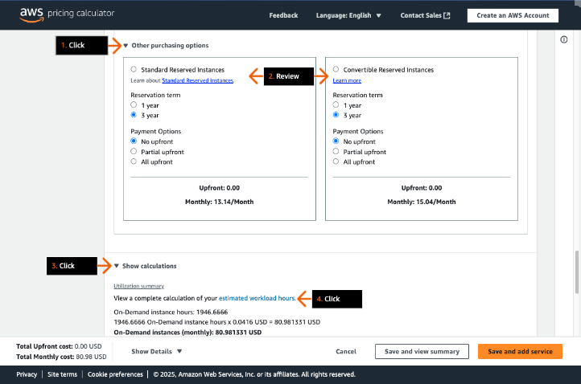
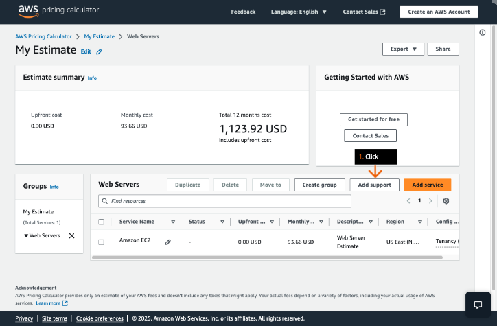
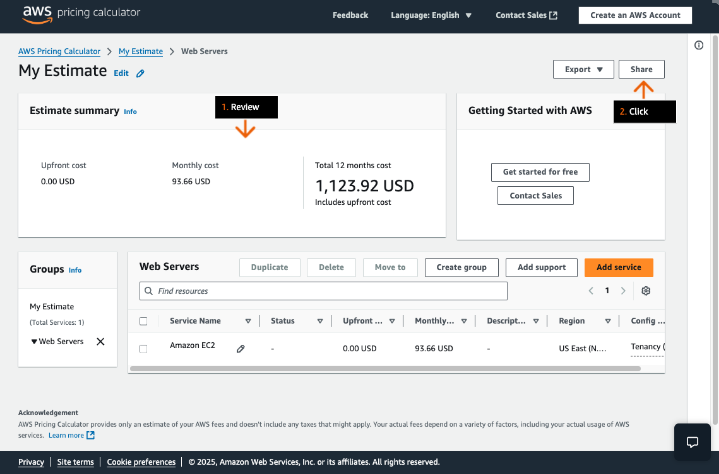

## Economias na nuvem
### Configure uma estimativa de preço para uma arquitetura que utilize uma quantidade variável de instâncias do Amazon EC2 com base no horário de pico de uso.

- Objetivos do laboratório
    - Crie grupos lógicos de preços.
    - Crie uma estimativa para o uso do Amazon EC2.

    &nbsp;

    **Etapa 1**
    1. Analise os objetivos do laboratório prático na seção Conceito.
    2. Siga as instruções do laboratório cuidadosamente e use as setas para navegar entre as etapas.

    Essa prática de laboratório não exige acesso ao console de uma conta da AWS, ela usará somente o site https://calculator.aws.

    **Conceito**

    Neste laboratório prático, você vai:    
    - Crie grupos lógicos de preços.
    - Crie uma estimativa para o uso do Amazon EC2.

    

    &nbsp;

    **Etapa 2**
    1. Em uma nova barra de endereço da guia (ou janela) do navegador (não mostrada), digite: https://calculator.aws e pressione Enter.
    2. Na página inicial da Calculadora de preços da AWS, clique em Criar estimativa. 
    3. Vá para a próxima etapa.

    **Conceito**

    Usando a Calculadora de preços da AWS, você pode explorar os serviços da AWS e criar uma estimativa do custo de seus casos de uso na AWS.

    

    &nbsp;

    **Etapa 3**
    1. No menu de navegação superior, clique em Minha estimativa.
    2. Vá para a próxima etapa.

    **Conceito**

    Recomendamos que você tenha um plano de como deseja usar a AWS antes de iniciar uma estimativa. Por exemplo, decida se você quer dividir sua estimativa por centro de custo, por produtos a serem executados na AWS ou por pilhas regionais. Em seguida, você pode usar o recurso Grupo para organizar suas estimativas.

    

    &nbsp;
    
    **Etapa 4**
    1. Na seção Minha estimativa, clique em Criar grupo.
    2. Vá para a próxima etapa.

    **Conceito**

    Um grupo pode refletir como sua empresa está organizada, fornecendo, por exemplo, estimativas para cada centro de custo, pilha de produtos, arquiteturas ou outros métodos organizacionais. Por exemplo, se você quiser definir o preço de maneiras diferentes de criar sua configuração da AWS, você pode usar grupos diferentes para cada variação de sua configuração e comparar as estimativas.

    

    &nbsp;
    
    **Etapa 5**
    1. Na caixa de diálogo, em Nome do grupo, digite: Web Servers
    2. Clique em Criar grupo.
    3. Vá para a próxima etapa.

    

    &nbsp;

    **Etapa 6**
    1. Clique em Adicionar serviço.
    2. Vá para a próxima etapa.

    **Conceito**

    A Calculadora de preços da AWS oferece suporte à definição de preço de mais de 175 serviços e opções de suporte da AWS.

    

    &nbsp;

    **Etapa 7**
    1. Na seção Serviços da AWS, em Encontrar serviço, digite: ec2
    2. No card Amazon EC2, clique em Configurar.
    3. Vá para a próxima etapa.

    

    &nbsp;

    **Etapa 8**
    1. Na etapa Adicionar serviço, em Descrição, digite: Web Server Estimate
    2. Em Escolha um tipo de local, na lista suspensa, escolha Região.
    3. Em Escolher uma região, clique em Leste dos EUA (Norte da Virgínia). 
    4. Vá para a próxima etapa.

    **Conceito**

    Os preços dos serviços podem diferir entre as regiões da AWS, portanto, escolher a região correta é importante para uma estimativa de preço precisa.

    

    &nbsp;

    **Etapa 9**
    1. Role para baixo até as especificações do EC2.
    2. Em Locação, escolha Instâncias compartilhadas.

        > Por padrão, as instâncias do EC2 são executadas em hardware de locação compartilhado. Isso significa que várias contas da AWS podem compartilhar o mesmo hardware físico. A escolha de uma opção dedicada aumenta o preço da instância.

    3. Em Sistema operacional, selecione Linux.

        > O licenciamento do sistema operacional pode afetar os preços das instâncias. Alguns sistemas operacionais e bancos de dados permitem que você traga sua própria licença (BYOL), enquanto outros têm custos de licenciamento incorporados às taxas horárias.

    4. Para cargas de trabalho, revise cada tipo de uso.

        > Para ver os detalhes do caso de uso, você pode clicar em cada tipo de uso.

    5. Vá para a próxima etapa.

    **Conceito**

    As cargas de trabalho são os padrões que correspondem ao seu uso do Amazon Elastic Compute Cloud (Amazon EC2). Escolher a carga de trabalho que mais se aproxima do seu uso otimizará seus custos de nuvem.

    

    &nbsp;

    **Etapa 10**
    1. Escolha o botão de rádio para selecionar Pique de tráfego diário.
    2. Em Dias de carga de trabalho, escolha as sete caixas de seleção para selecionar todos os dias (domingo a sábado).
    3. Vá para a próxima etapa.

    

    &nbsp;
    
    **Etapa 11**
    1. Para Baseline, digite: 2
    2. Para Pico, digite: 4
    3. Em Duração do pico, nas duas caixas de texto, digite: 8 (para horas) e 0 (para minutos)
    4. Vá para a próxima etapa.

    **Conceito**

    O uso básico se refere à quantidade mínima de servidores fora do horário de pico. Por outro lado, o pico de uso representa a quantidade de servidores necessários nos períodos de pico.

    

    &nbsp;

    **Etapa 12**
    1. Na seção Instâncias do EC2, para Qualquer família de instâncias, em vCPUs, escolha 2. 
    2. Em Memória (GiB), escolha 4 GiB.
    3. Em Desempenho de rede, escolha Qualquer desempenho de rede.
    4. Abaixo disso, em Nome da instância, escolha o botão de rádio para selecionar t3.medium.
    5. Vá para a próxima etapa.

    **Conceito**

    Ao criar estimativas, o dimensionamento correto das instâncias é importante. O dimensionamento correto é o processo de analisar os recursos da instância e identificar oportunidades para remover ou reduzir o tamanho sem comprometer a capacidade ou outros requisitos, o que resulta em custos mais baixos.

    

    &nbsp;
    
    **Etapa 13**
    1. Na seção Opções de pagamento, escolha On-Demand.

        > Usando instâncias sob demanda, você pode pagar pela capacidade computacional por hora ou segundo sem compromissos de longo prazo.

    2. Analise as duas opções do Plano de Poupança.

        > Os planos de poupança oferecem economias além das taxas sob demanda em troca do compromisso de usar uma quantidade específica de potência computacional (medida por hora) por um período de 1 ou 3 anos.

    3. Vá para a próxima etapa.

    **Conceito**

    O Amazon EC2 oferece vários modelos de preços para ajudar os clientes a otimizar seus custos de computação e suas necessidades de capacidade.

    

    &nbsp;
    
    **Etapa 14**
    1. Clique para expandir Outras opções de compra.
    2. Analise as duas opções de instâncias reservadas.

        > Uma instância reservada padrão oferece um desconto maior, mas permite modificações somente na mesma família de instâncias; por exemplo, t3.medium a t2.large. Uma instância reservada conversível oferece um desconto menor, mas permite modificações em diferentes famílias de instâncias, sistemas operacionais e configurações de locação. 

    3. Clique para expandir Mostrar cálculos.
    4. Clique em horas estimadas de carga de trabalho.
    5. Vá para a próxima etapa.

    **Conceito**

    Uma instância reservada compromete você com um período de 1 ou 3 anos, durante o qual você recebe benefícios de cobrança para cada uma das 24 horas faturáveis em um dia para parâmetros específicos da instância, como tipo de instância, região, sistema operacional e localização.

    

    &nbsp;

    **Etapa 15**
    1. Na caixa de diálogo, vá até Workload hours per month (Horas de carga de trabalho por mês).
    2. Analise como suas horas de carga de trabalho são divididas por dia.
    3. Verifique se as instâncias 3 e 4 estão sendo cobradas por apenas 8 horas por dia, enquanto as instâncias 1 e 2 estão sendo cobradas por 24 horas por dia.
    4. Em Resumo da utilização, veja o total de horas de instâncias sob demanda por mês.
    5. Clique em Fechar.
    6. Vá para a próxima etapa.

    

    &nbsp;

    **Etapa 16**
    1. Clique para expandir o Amazon Elastic Block Store (EBS).
    2. Para Storage for each EC2 instance (Armazenamento para cada instância do EC2): General Purpose SSD (gp3) (SSD de uso geral (gp3)).
    3. Para SSD de uso geral (gp3) – IOPS, digite: 30

        > Entradas/saídas por segundo (IOPS) é uma unidade de medida que representa o número de operações de entrada/saída que podem ser realizadas por segundo em um volume do EBS.

    4. Para Quantidade de armazenamento, digite: 10
    5. Em Unidade, escolha GB. 
    6. Vá para a próxima etapa.
    
    **Conceito**

    O Amazon Elastic Block Storage (Amazon EBS) oferece vários tipos de armazenamento com base em suas cargas de trabalho. Para servidores web básicos, SSDs de uso geral podem ser suficientes. No entanto, para cargas de trabalho mais especializadas, que envolvam grandes operações de transferência de dados ou de entrada e saída, outros tipos de armazenamento podem ser apropriados.

    

    &nbsp;

    **Etapa 17**
    1. Em Frequência de instantâneos, escolha Semanal.
    2. Em Quantidade alterada por snapshot, digite: 1
    3. Em Unidade, escolha GB.
    4. Clique para expandir Transferência de dados.
    5. Vá para a próxima etapa.

    **Conceito**

    Você pode fazer backup dos dados em seus volumes do Amazon EBS fazendo cópias point-in-time, conhecidas como snapshots do Amazon EBS. Um instantâneo é um backup incremental, o que significa que salvamos somente os blocos no volume que foram alterados desde o instantâneo mais recente. Isso minimiza o tempo necessário para criar o snapshot e reduz os custos de armazenamento ao não duplicar os dados.
    
    

    &nbsp;

    **Etapa 18**
    1. Para Transferência de dados de, escolha Internet (grátis).
    2. Em Inserir valor, digite: 1
    3. Para Quantidade de dados, escolha TB por mês.
    4. Em Transferência de dados para, clique para expandir o menu.
    5. Analise as opções de transferência de saída.
    6. Escolha Internet.
    7. Vá para a próxima etapa.

    **Conceito**

    Não há cobrança por todas as transferências de dados para a rede da AWS a partir da Internet externa.

    

    &nbsp;

    **Etapa 19**
    1. Em Inserir valor, digite: 100
    2. Em Data amount (Quantidade de dados), selecione GB por mês.
    3. Clique para expandir Mostrar cálculos.
    4. Vá para a próxima etapa.

    **Conceito**

    Ao transferir dados da AWS para a Internet, os custos variam de acordo com a região em que os recursos da AWS estão localizados, com estruturas de preços específicas da região. A transferência de dados entre regiões da AWS segue uma estrutura de custos específica na qual a transferência de entrada para uma região geralmente é gratuita e a transferência de saída de uma região para outra gera cobranças que dependem da região de origem.

    

    &nbsp;

    **Etapa 20**
    1. Analise para ver como suas taxas de transferência de dados são calculadas.
    2. Na parte inferior da página, clique em Salvar e adicionar serviço.
    3. Vá para a próxima etapa.

    

    &nbsp;

    **Etapa 21**
    1. Clique em Visualizar resumo.
    2. Vá para a próxima etapa.

    

    &nbsp;

    **Etapa 22**
    1. Na seção Web Servers, clique em Adicionar suporte.
    2. Vá para a próxima etapa.

    **Conceito**

    O AWS Support ajuda com problemas técnicos e orientação adicional para operar infraestruturas na nuvem da AWS.

    

    &nbsp;

    **Etapa 23**
    1. Para ver as opções de recomendação do Support, revise cada opção.

        > Para ver os detalhes, você pode escolher cada opção.

    2. Clique em Cancelar.
    3. Vá para a próxima etapa.

    **Conceito**

    Os planos de suporte foram criados para oferecer a combinação correta de ferramentas e acesso ao conhecimento. Dessa forma, você pode ter sucesso com a AWS e otimizar o desempenho, gerenciar os riscos e manter o controle sobre os custos.

    

    &nbsp;

    **Etapa 24**
    1. Revise a seção Resumo da estimativa.
    2. Clique em Compartilhar.
    3. Vá para a próxima etapa.

    **Conceito**

    Você pode criar um link público exclusivo para cada estimativa criada.

    

    &nbsp;

    **Etapa 25**
    1. Na caixa de diálogo, clique em Concordar e continuar.
    2. Vá para a próxima etapa.

    

    &nbsp;

    **Etapa 26**
    1. Clique em Copiar link público.

        > Você pode colar este link em um editor de texto para referência futura.

    2. Se o pop-up não fechar automaticamente, clique em Cancelar.
    3. Vá para o próximo passo.

    **Conceito**

    Use o link gerado para compartilhar a estimativa com as partes interessadas ou acessar a estimativa novamente mais tarde. As estimativas são salvas em servidores públicos da AWS.

    

- DIY
    - Altere o tipo de instância do EC2 para t2.micro na estimativa de preço.
    - Gere um novo URL de estimativa de preço.

    > Dicas: 
        > - A família de instâncias mudará de t3 para t2.
        > - Depois de fazer qualquer alteração, para gerar um novo URL, você precisa clicar em Compartilhar novamente.

## Saiba mais
### Amazon EC2

