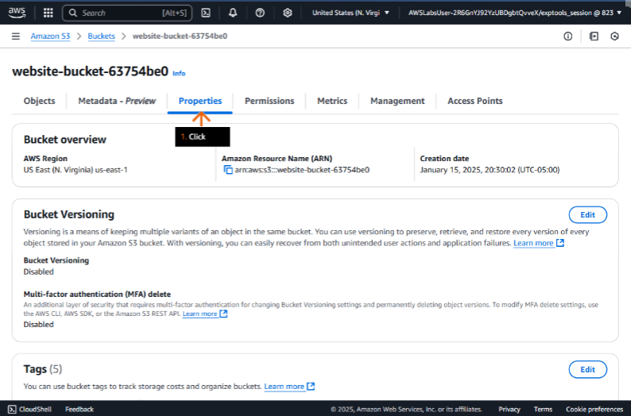
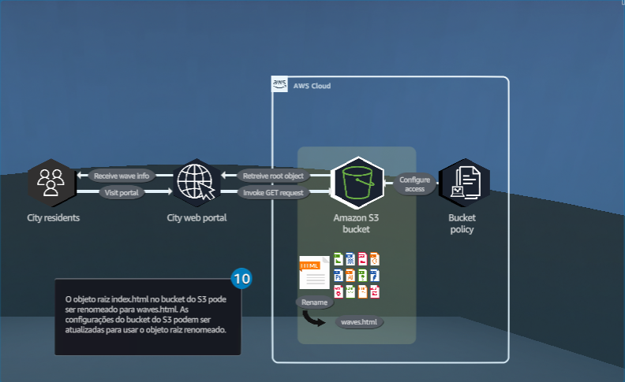

## Fundamentos da computação em nuvem
### Migre um site existente para hospedagem de site estático no Amazon S3 para melhorar a confiabilidade

- Objetivos do laboratório
    - Análise a política do bucket S3 para protegê-lo;
    - Habilite hospedagem de site estático;

    &nbsp;

    **Etapa 1**
    1. Analise os objetivos do laboratório prático na seção Conceito.
    2. Clique em Start Lab ou Open AWS Console para começar.

        > IMPORTANTE: Certifique-se de usar SOMENTE a conta de laboratório da AWS provisionada para você. Não há suporte para usar qualquer outra conta da AWS e isso pode gerar cobranças.

    3. Siga as instruções do laboratório cuidadosamente e use as setas para navegar entre as etapas.

    Os serviços da AWS que não são usados no ambiente de laboratório estão desativados. Além disso, os recursos dos serviços usados neste laboratório são limitados ao que ele exige.

    **Conceito**

    Neste laboratório prático, você irá:

    - Habilitar a hospedagem estática de sites em um bucket do Amazon S3.
    - Revisar a política do bucket para proteger o bucket de hospedagem.

    

    &nbsp;

    **Etapa 2**
        > Se o laboratório ainda não tiver sido iniciado, clique no botão Iniciar laboratório (não exibido).

    1. Revise a mensagem "pronto".

        > Todas as contas de laboratório provisionadas são temporárias e todas as tarefas que não forem concluídas antes da expiração da conta de laboratório devem ser reiniciadas desde o início. Conforme declarado na etapa anterior, NÃO use nenhuma conta que não seja a conta do laboratório que foi provisionada.

    2. Para acessar o AWS Management Console, clique em Abrir console da AWS.

        > Você é redirecionado para uma nova guia do navegador.

    3. Vá para a próxima etapa.

    

    &nbsp;

    **Etapa 3**
    1. Na caixa de pesquisa da barra de navegação superior, digite: s3
    2. Nos resultados da pesquisa, em Serviços, clique em S3.
    3. Vá para a próxima etapa.

    **Conceito**

    O AWS Management Console é uma interface web para acessar e gerenciar a ampla coleção de serviços fornecidos pela Amazon Web Services (AWS).

    

    &nbsp;
    
    **Etapa 4**
    1.  Na guia Buckets de uso geral, clique no nome do bucket que começa com website-bucket-.

        > O nome do bucket que começa com website-bucket- contém o código necessário para este laboratório.

    2. Vá para a próxima etapa.

    **Conceito**

    O Amazon Simple Storage Service (Amazon S3) é um serviço de armazenamento de objetos que oferece escalabilidade, disponibilidade de dados, segurança e performance. Clientes de todos os tamanhos e indústrias podem usar o Amazon S3 para armazenar e proteger qualquer quantidade de dados para uma variedade de casos de uso, como data lakes, sites, aplicativos mobile, backup e restauração, arquivamento, aplicativos corporativos, dispositivos de IoT e análise de big data.

    

    &nbsp;
    
    **Etapa 5**
    1. Na parte superior da página, selecione (destaque) e copie o nome do bucket e cole-o no editor de texto de sua escolha em seu dispositivo.

        > Você deve usar esse nome de bucket posteriormente na seção DIY desta solução.

    2. Na aba Objetos, revise os objetos no bucket.

        > Devem ser exibidos cinco arquivos .
        > Esses arquivos possuem o conteúdo da página web estática.
        > Arquivos locais podem ser carregados neste bucket S3 usando o botão Carregar.

    3. Escolha a caixa de seleção para selecionar `text.html`.
    4. Clique em Ações para expandir o menu suspenso.
    5. Escolha Renomear objeto.
    6. Vá para a próxima etapa.

    **Conceito**

    Um bucket é um contêiner para objetos armazenados no Amazon S3. Cada objeto está contido em um bucket. O Amazon S3 oferece uma variedade de classes de armazenamento para os objetos que você armazena. Você escolhe uma classe dependendo do cenário do seu caso de uso e dos requisitos de acesso de performance. O Amazon S3 fornece classes de armazenamento para objetos de acesso frequente, infrequente e arquivados.

    

    &nbsp;

    **Etapa 6**
    1. Em Novo nome de objeto, digite: `error.html`

        > Esse arquivo contém o código da página de erro, que é aberta sempre que algo dá errado.

    2. Clique em Salvar alterações.
    3. Vá para a próxima etapa.

    **Conceito**

    Você pode escolher a região geográfica da AWS onde o Amazon S3 armazena os buckets que você cria. Você pode escolher uma região para otimizar a latência, minimizar os custos ou atender aos requisitos regulatórios. Os objetos armazenados em uma região da AWS nunca saem da região, a menos que você os transfira ou replique explicitamente para outra região.

    

    &nbsp;

    **Etapa 7**

    1. No alerta de sucesso, revise a mensagem.
    2. Clique na aba Permissões.
    3. Vá para a próxima etapa.

    **Conceito**

    Com o Amazon S3, você pode fazer upload de objetos de até 5 GB com uma única operação PUT. Para objetos maiores, de até 5 TB, use a API de multipart upload.

    

    &nbsp;

    **Etapa 8**
    1. Na seção Bloquear acesso público (configurações do bucket), verifique se a opção Bloquear todo o acesso público está definido como Desativado.

        > A desativação de “Bloquear todo o acesso público” é necessária para hospedagem de um site estático no bucket do S3.

    2. Desça a página até a política de bucket.
    3. Vá para a próxima etapa.

    **Conceito**

    Por padrão, todos os recursos do Amazon S3 (buckets, objetos e sub-recursos relacionados) são privados. Apenas o proprietário do recurso pode acessá-lo. Esse proprietário pode, opcionalmente, conceder permissões de acesso a outros, criando uma política de acesso.

    

    &nbsp;

    **Etapa 9**
    1. Na janela do editor de políticas do Bucket, revise a política.

        > Essa política de bucket do S3 permite acesso público somente para leitura (GetObject) a qualquer pessoa para todos os objetos dentro do bucket especificado. No entanto, para ambientes de produção, é recomendável implementar permissões mais rígidas para evitar a exposição não intencional de dados.

    2. Role até o topo da página.
    3. Vá para a próxima etapa.

    **Conceito**

    Você pode conceder permissões aos seus recursos do Amazon S3 por meio de políticas de bucket e de usuário. Ambas as opções utilizam a linguagem de políticas de acesso baseada em JSON. Cada recurso na AWS possui um Amazon Resource Name (ARN) único.

    

    &nbsp;

    **Etapa 10**
    1. Clique na guia Propriedades.
    2. Vá para a próxima etapa.

    **Conceito**

    Para hospedar um site estático no Amazon S3, configure seu bucket para hospedagem de site estático, defina permissões e adicione um documento de índice. As opções disponíveis incluem redirecionamentos, registros e documentos de erro.

    

    &nbsp;
    
    **Etapa 11**
    1. Role para baixo até Criptografia padrão.
    2. Revise as configurações de criptografia.
    3. Vá para a próxima etapa.

    **Conceito**

    A criptografia do lado do servidor é a criptografia dos dados em seu destino pela aplicação ou serviço que os recebe. O Amazon S3 criptografa seus dados no nível do objeto à medida que os grava em discos nos datacenters da AWS e os descriptografa para você quando você os acessa.

    

    &nbsp;

    **Etapa 12**
    1. Desça até Hospedagem de site estático.
    2. Clique em Editar.
    3. Vá para a próxima etapa.

    **Conceito**

    Em um site estático, páginas da Web individuais incluem conteúdo estático (inalterado). Eles também podem conter scripts do lado do cliente.

    

    &nbsp;
    
    **Etapa 13**
    1. Em Hospedagem de site estático, selecione Ativar.
    2. Para Tipo de hospedagem, escolha Hospedar um site estático.
    3. Em Documento de índice, digite: `index.html`
    4. Em Documento de erro, digite: `error.html`
    5. Vá para a próxima etapa.
    **Conceito**

    O Amazon S3 é compatível com o acesso a URLs de estilo de hospedagem virtual e no estilo de caminho.

    Os URLs no estilo de hospedado virtual têm o seguinte formato:
    [https://bucket-name.s3.Region.amazonaws.com/key-name](https://www.google.com/search?q=https://bucket-name.s3.Region.amazonaws.com/key-name)

    Os URLs no estilo de caminho usam o seguinte formato:
    [https://s3.Region.amazonaws.com/bucket-name/key-name](https://www.google.com/search?q=https://s3.Region.amazonaws.com/bucket-name/key-name)

    

    &nbsp;
    
    **Etapa 14**
    1. Navegue até o final da página.
    2. Clique em Salvar alterações.
    3. Vá para a próxima etapa.

    

    &nbsp;

    **Etapa 15**
    1. Role para baixo até Hospedagem de site estático.
    2. Revise para garantir que o tipo de hospedagem esteja definido como hospedagem de bucket.
    3. No endpoint do bucket S3, clique no ícone de cópia para copiar o endpoint fornecido.
    4. Vá para a próxima etapa.

    

    &nbsp;

    **Etapa 16**
    1. Para carregar a página da web Beach Wave Conditions, em uma nova barra de endereço da guia (ou janela) do navegador, cole o endpoint do site do bucket que você acabou de copiar e pressione Enter.
    2. Vá para a próxima etapa.
    
    

- DIY
    - Renomeie o arquivo `index.html` para `waves.html`;

    > Dica: Use o menu suspenso Ações para renomear `index.html` para `waves.html`

## Conceitos

### AWS
- Visão geral da infraestrutura global da AWS

- Benefícios da infraestrutura global da AWS

### AWS Well-Architected
- Visão geral do AWS Well-Architected

### Amazon S3
- Visão geral do Amazon S3

- Mais recursos do Amazon S3

- Gerenciamento de acesso ao Amazon S3

## Saiba mais
### Amazon S3

