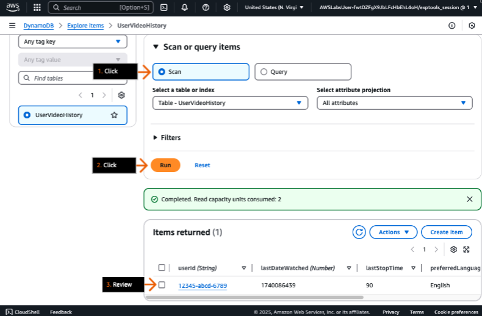
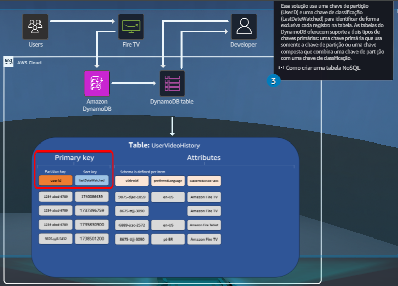

## Primeiro banco de dados NoSQL
### Use o Amazon DynamoDB para criar um banco de dados NoSQL que ajuda a rastrear dados de visualização do cliente, como filmes assistidos e tipo de dispositivo, a partir de metadados.

- Objetivos do laboratório
    - Crie um banco de dados NoSQL como uma tabela do Amazon DynamoDB.
    - Adicione registros, com esquema dinâmico, à tabela do DynamoDB.
    - Consulte a tabela do DynamoDB.

    &nbsp;

    **Etapa 1**
    1. Analise os objetivos do laboratório prático na seção Conceito.
    2. Clique em Iniciar laboratório para provisionar seu ambiente e, em seguida, clique em Abrir console da AWS para começar.
    3. Siga as instruções do laboratório cuidadosamente e use as setas abaixo para navegar entre as etapas.

    Os serviços da AWS que não forem usados no ambiente de laboratório serão desativados. Além disso, os recursos dos serviços usados neste laboratório são limitados ao que ele exige.

    **Conceito**

    Neste laboratório prático, você vai:
    - Criar um banco de dados NoSQL como uma tabela do Amazon DynamoDB.
    - Adicionar registros, com esquema dinâmico, à tabela do DynamoDB.
    - Consultar a tabela do DynamoDB.

    

    &nbsp;

    **Etapa 2**
    1. Na caixa de pesquisa da barra de navegação superior, digite: dynamodb

    2. Nos resultados da pesquisa, em Serviços, clique em DynamoDB.
    3. Vá para a próxima etapa.

    **Conceito**

    O Amazon DynamoDB é um serviço de banco de dados NoSQL sem servidor que você pode usar para desenvolver aplicativos modernos em qualquer escala. Como um banco de dados sem servidor, você paga apenas pelo que usa. O DynamoDB é escalável até zero, não tem partidas a frio, nem atualizações de versão, nem janelas de manutenção, nem aplicação de patches, nem manutenção em tempo de inatividade.

    

    &nbsp;

    **Etapa 3**
    1. No painel de navegação à esquerda, clique em Tabelas.
    2. Clique em Criar tabela.
    3. Vá para a próxima etapa.

    **Conceito**

    O DynamoDB é compatível com modelos de dados de chave-valor e documentos. Como banco de dados NoSQL, o DynamoDB tem um esquema flexível, então cada item pode ter muitos atributos diferentes. Usando um esquema flexível, você pode se adaptar rapidamente à medida que seus requisitos de negócios mudam, sem o ônus de ter que redefinir o esquema da tabela, como faria em bancos de dados relacionais.

    

    &nbsp;
    
    **Etapa 4**
    1. Na seção Detalhes da tabela, em Nome da tabela, digite: UserVideoHistory
    2. Para Chave de partição, na caixa de texto à esquerda, digite: userId

        > Você deve digitar a chave de partição exatamente como mostrada — ID de usuário com I maiúsculo — porque as chaves diferenciam maiúsculas de minúsculas.

    3. Na lista suspensa à direita, escolha String.

        > String é o tipo de dados.

    4. Em Chave de classificação, na caixa de texto à esquerda, digite: lastDateWatched
    5. Na lista suspensa à direita, escolha Número.
    6. Na seção Configurações da tabela, escolha Configurações padrão. 
    7. Role até a parte inferior da página e clique em Criar tabela (não exibida).
    8. Vá para a próxima etapa.

    **Conceito**

    Ao criar uma tabela, além do nome dela, você deve especificar a chave primária da tabela. A chave primária identifica exclusivamente cada item na tabela, de modo que nenhum item pode ter a mesma chave. Se a sua tabela tiver uma chave primária simples (somente uma chave de partição), o DynamoDB armazenará e recuperará cada item com base em seu valor de chave de partição.

    

    &nbsp;
    
    **Etapa 5**
    1. Na seção Tabelas, em Status, revise o status da tabela.

        > Aguarde até que o status mude para Ativo.

    2. Quando ativo, clique no nome da tabela.
    3. Vá para a próxima etapa.

    **Conceito**

    O DynamoDB armazena dados em partições. Uma partição é uma alocação de armazenamento para uma tabela, com suporte de unidades de estado sólido (SSDs) e automaticamente replicada em várias zonas de disponibilidade em uma região da AWS.

    

    &nbsp;

    **Etapa 6**
    1. Clique em Ações para expandir a lista suspensa.
    2. Selecione Criar item.
    3. Vá para a próxima etapa.

    **Conceito**

    Uma tabela do DynamoDB contém vários itens, em que cada item representa um grupo de atributos que é identificável de forma exclusiva entre todos os outros itens na tabela. Os itens são semelhantes a linhas, registros ou tuplas em sistemas de banco de dados relacionais.

    

    &nbsp;

    **Etapa 7**
    1. Para ID de usuário, em Valor, digite: 12345-abcd-6789
    2. Para LastDateWatched, em Valor, digite: 1740086439

        > Este é um carimbo de data/hora do UNIX.

    3. Vá para a próxima etapa.

    **Conceito**

    Para gravar um item na tabela, o DynamoDB usa o valor da chave de partição como entrada para uma função hash interna. O valor de saída da função hash determina a partição na qual o item será armazenado.

    

    &nbsp;

    **Etapa 8**
    1. Para adicionar outro atributo, clique em Adicionar novo atributo para expandir o menu.
    2. Escolha String.
    3. Vá para a próxima etapa.

    **Conceito**

    Cada item em uma tabela do DynamoDB é composto por um ou mais atributos, que são semelhantes aos campos ou colunas em outros sistemas de gerenciamento de banco de dados.

    

    &nbsp;

    **Etapa 9**
    1. Para o novo atributo, em Nome do atributo, digite: videoId

        > Certifique-se de digitar o atributo exatamente, com “I” maiúsculo em Id.

    2. Em Valor, digite: 9875-djac-1859
    3. Vá para a próxima etapa.

    

    &nbsp;

    **Etapa 10**
    1. Clique em Adicionar novo atributo.
    2. Escolha String.
    3. Vá para a próxima etapa.

    **Conceito**

    O DynamoDB oferece suporte a muitos tipos de dados diferentes para atributos em uma tabela. Eles podem ser categorizados da seguinte forma:

    - Tipos escalares — Um tipo escalar pode representar exatamente um valor. Os tipos escalares são número, string, binário, booleano e nulo.

    - Tipos de documentos — Um tipo de documento pode representar uma estrutura complexa com atributos aninhados, como o que você encontraria em um documento JSON. Os tipos de documento são lista e mapa.

    - Tipos de conjunto — Um tipo de conjunto pode representar vários valores escalares. Os tipos de conjuntos são strings, conjunto de números e conjunto binário.

    

    &nbsp;
    
    **Etapa 11**
    1. Para o novo atributo, em Nome do atributo, digite: preferredLanguage
    2. Em Valor, digite: en-US
    3. Vá para a próxima etapa.

    

    &nbsp;

    **Etapa 12**
    1. Clique em Adicionar novo atributo.
    2. Escolha Lista.
    3. Vá para a próxima etapa.

    **Conceito**

    Um atributo do tipo de lista pode ser armazenado como uma coleção ordenada de valores. Não há restrições sobre os tipos de dados que podem ser armazenados em um elemento de lista, e os elementos em um elemento de lista não precisam ser do mesmo tipo.

    

    &nbsp;

    **Etapa 13**
    1. Para o novo atributo, em Nome do atributo, digite: supportedDeviceTypes
    2. Vá para a próxima etapa.

    

    &nbsp;
    
    **Etapa 14**
    1. Em Valor, clique em Inserir um campo para expandir o menu.
    2. Escolha String.
    3. Vá para a próxima etapa.

    

    &nbsp;

    **Etapa 15**
    1. Na nova caixa de texto, digite: Amazon Fire TV
    2. Clique em Inserir um campo.
    3. Escolha String.
    4. Vá para a próxima etapa.

    

    &nbsp;

    **Etapa 16**
    1. Na nova caixa de texto, digite: Amazon Fire Tablet
    2. Clique em Create item.
    3. Vá para a próxima etapa.

    

    &nbsp;

    **Etapa 17**
    1. Na seção Itens devolvidos, em userId, clique em 12345-abcd-6789.

        > Agora você pode editar o registro novamente.

    2. Vá para a próxima etapa.

    **Conceito**

    Depois de criar um registro, você ainda pode editá-lo, incluindo o conteúdo do registro e seus atributos.

    

    &nbsp;

    **Etapa 18**
    1. Clique em Adicionar novo atributo.
    2. Escolha Número.
    3. Vá para a próxima etapa.

    **Conceito**

    O DynamoDB não tem esquema, então você pode adicionar atributos à tabela para qualquer registro novo ou existente.

    

    &nbsp;

    **Etapa 19**
    1. Para o novo atributo, em Nome do atributo, digite: lastStopTime
    2. Em Valor, digite: 90

        > O atributo lastStopTime com um tipo de dados Number armazena o tempo total em segundos para visualização do vídeo. Esses dados podem ser usados para um recurso de retomar em sua aplicação.

    3. Clique em Salvar e fechar.
    4. Vá para a próxima etapa.

    

    &nbsp;

    **Etapa 20**
    1. Clique para expandir Digitalizar ou consultar itens.
    2. Escolha Consulta.
    3. Para ID userId (chave de partição), digite: 12345-abcd-6789
    4. Para LastDateWatched (Sort Key), na lista suspensa à esquerda, escolha Maior que.
    5. Na caixa de texto à direita, digite: 1740086438    
    6. Clique em Executar.
    7. Vá para a próxima etapa.

    **Conceito**

    A operação Consulta no DynamoDB encontra itens com base em chave-valor primários. Você deve fornecer o nome do atributo da chave de partição e um valor único para esse atributo. A consulta retorna todos os itens com esse valor de chave de partição. Opcionalmente, você pode fornecer um atributo de chave de classificação e utilizar um operador de comparação para refinar os resultados da pesquisa.

    

    &nbsp;

    **Etapa 21**
    1. Na seção Itens devolvidos, revise o registro devolvido.
    2. Vá para a próxima etapa.

    

    &nbsp;

    **Etapa 22**
    1. Para alterar os critérios de consulta, em userId, digite: abd5-zxcg-12385
    2. Clique em Executar.
    3. Na seção Itens devolvidos, analise os resultados. 

        > Nada é retornado porque nenhum registro corresponde à chave de partição.

    4. Vá para a próxima etapa.

    **Conceito**

    Ao executar uma operação de consulta a tabela procura uma correspondência exata para a chave de partição e usa a chave de classificação (se fornecida) como forma de limitar ainda mais os resultados.

    

    &nbsp;

    **Etapa 23**
    1. Em Digitalizar ou consultar itens, escolha Digitalizar.
    2. Clique em Executar.
    3. Na seção Itens devolvidos, analise os resultados. 

        > Todos os itens em sua tabela do DynamoDB estão listados.

    4. Vá para a próxima etapa.

    **Conceito**

    A operação Scan retorna um ou mais itens e atributos de item acessando cada item em uma tabela ou um índice secundário. Se o número total de itens de scan exceder o limite máximo de tamanho do conjunto de dados de 1 MB, o escaneamento será interrompido e os resultados serão retornados ao usuário como um valor de LastEvaluatedKey para continuar o scan em uma operação subsequente. Os resultados também incluem o número de itens que excedem o limite. Um scan pode fazer com que os dados da tabela não atendam aos critérios do filtro.

    

- DIY
    - Crie um novo item na tabela UserVideoHistory com um valor de UserID exclusivo.
    - Adicione um novo atributo chamado "rating" com um tipo de dados Number ao novo registro.

    > Dicas:  
        > - O nome da tabela “UserVideoHistory” e o nome do atributo “rating” diferenciam maiúsculas de minúsculas.  
        > - O valor de UserID para o novo item da tabela pode ter qualquer valor de texto.

## Saiba mais

