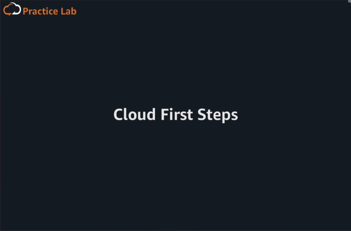
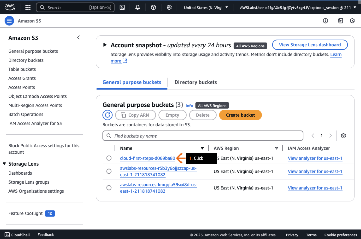
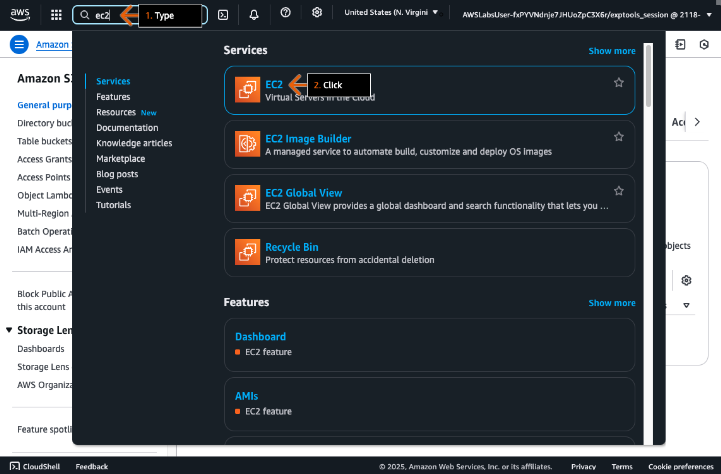
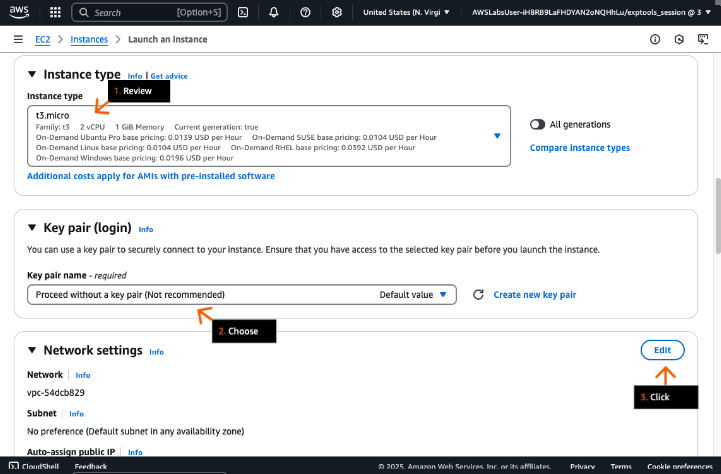

## Primeiros passos na nuvem
### Crie instâncias do Amazon EC2 para executar os módulos computacionais do sistema de estabilização da ilha, colocando cada instância em uma zona de disponibilidade diferente da mesma região da AWS.

- Objetivos do laboratório
    - Executar uma instância do Amazon EC2;
    - Configure um script de dados do usuário para exibir os detalhes da instância em um navegador.

    &nbsp;

    **Etapa 1**
    1. Analise os objetivos do laboratório prático na seção Conceito.
    2. Clique em Start Lab ou Open AWS Console para começar.
    3. Siga as instruções do laboratório cuidadosamente e use as setas para navegar entre as etapas.

    Os serviços da AWS que não são usados no ambiente de laboratório estão desativados. Além disso, os recursos dos serviços usados neste laboratório são limitados ao que ele exige.

    **Conceito**

    Neste laboratório prático, você vai:

    - Lançar uma instância do Amazon EC2.
    - Configurar um script de dados do usuário para exibir os detalhes da instância em um navegador.

    

    &nbsp;

    **Etapa 2**
    1. Na barra de navegação superior, revise o seletor de região para confirmar se a região está definida como N. Virginia (us-east-1).
    2. Na caixa de pesquisa Serviços, digite: s3
    3. Nos resultados da pesquisa, em Serviços, clique em S3.
    4. Vá para a próxima etapa.

    **Conceito**
    A AWS tem o conceito de região, que é um local físico em todo o mundo onde agrupamos data centers. Chamamos cada grupo de data centers lógicos de Zona de Disponibilidade. Cada região da AWS consiste em no mínimo três AZs isoladas e fisicamente separadas dentro de uma área geográfica.

    

    &nbsp;

    **Etapa 3**
    1. Na guia Buckets de uso geral, clique no nome do bucket que começa com cloud-first-steps-.
    2. Vá para a próxima etapa.

    **Conceito**

    O Amazon Simple Storage Service (Amazon S3) armazena dados como objetos dentro de buckets. Um objeto é um arquivo e todos os metadados opcionais que descrevem o arquivo. Bucket é um contêiner para objetos. Para armazenar seus dados no Amazon S3, primeiro você cria um bucket e especifica um nome de bucket e uma região da AWS. Em seguida, você carrega seus dados para esse bucket como objetos no Amazon S3. Cada objeto tem uma chave (ou nome da chave), que é o identificador exclusivo do objeto dentro do bucket.

    

    &nbsp;
    
    **Etapa 4**
    1. Na guia Objetos, escolha a caixa de seleção para selecionar o arquivo `user-data.txt`.
    2.  Clique em Open (Abrir).

        > O arquivo `user-data.txt` é aberto em uma nova guia (ou janela) do navegador.

    3. Vá para a próxima etapa.

    

    &nbsp;
    
    **Etapa 5**
    1. Na nova guia do navegador, revise o conteúdo do arquivo.

        > Esse script de dados do usuário instala e inicia um servidor web, usando a porta 80, para exibir informações internas sobre a instância.
        > Observe que o bloco de código em seu arquivo é maior do que o exibido no exemplo da captura de tela.

    2. Vá para a próxima etapa.

    **Conceito**

    Ao iniciar uma instância do Amazon Elastic Compute Cloud (Amazon EC2), você pode passar dados do usuário para a instância que é usada para realizar tarefas de configuração automatizadas ou para executar scripts após o início da instância.

    

    &nbsp;

    **Etapa 6**
    1. Retorne ao console do Amazon S3 na outra guia do navegador.
    2. Na guia Objetos, para salvar o arquivo user-data.txt em seu dispositivo, clique em Baixar.
    3. Vá para a próxima etapa.

    

    &nbsp;

    **Etapa 7**
    1. Na caixa de pesquisa da barra de navegação superior, digite: ec2
    2. Nos resultados da pesquisa, em Serviços, clique em EC2.
    3. Vá para a próxima etapa.

    **Conceito**

    O Amazon EC2 fornece capacidade de computação escalável e sob demanda na nuvem da AWS. O uso do Amazon EC2 reduz os custos de hardware, para que você possa desenvolver e implantar aplicativos mais rapidamente. Você pode usar o Amazon EC2 para iniciar quantos servidores virtuais forem necessários, configurar a segurança e as redes e gerenciar o armazenamento.

    

    &nbsp;

    **Etapa 8**
    1. Na seção Launch instance, clique em Launch instance.
    2. Vá para a próxima etapa.

    **Conceito**

    Uma instância do EC2 é um servidor virtual na nuvem.

    

    &nbsp;

    **Etapa 9**
    1. Na seção Nome e tags, em Nome, digite um nome que você goste, como: webserver01.
    2. Na seção Application and OS Images (Imagens da aplicação e do SO), em Início rápido, selecione Amazon Linux.
    3. Vá para a próxima etapa.

    **Conceito**

    Uma imagem de máquina da Amazon (AMI) fornece as informações, como configurações do sistema operacional e do software, necessárias para iniciar uma instância. Você deve especificar uma AMI ao iniciar uma Instância. Você pode iniciar várias instâncias a partir de uma única AMI quando precisar de várias instâncias com a mesma configuração. Você pode usar diferentes AMIs para iniciar instâncias quando precisar de configurações diferentes.

    

    &nbsp;

    **Etapa 10**
    1. Para Amazon Machine Image (AMI), na lista suspensa, escolha ou mantenha Amazon Linux 2023 AMI.
    2. Em Tipo de instância, clique em Comparar tipos de instância.
    3. Vá para a próxima etapa.

    **Conceito**

    Quando você executa uma instância, o tipo de instância especificado determina o hardware do computador host usado para sua instância. Cada tipo de instância oferece uma memória de computação diferente e os recursos de armazenamento são agrupados em famílias de instâncias de acordo com esses recursos.

    

    &nbsp;
    
    **Etapa 11**
    1. Na seção Tipos de instância, revise as instâncias disponíveis e seus recursos associados.
    2. Selecione t3.micro.
    3. Clique em Obter conselhos.
    4. Vá para a próxima etapa.

    **Conceito**

    O Amazon EC2 fornece uma ampla seleção de tipos de instância otimizados para se adequarem a diferentes casos de uso. Os tipos de instâncias consistem em várias combinações de CPU, memória, armazenamento e capacidade de redes, oferecendo flexibilidade de escolha da composição adequada de recursos para os seus aplicativos. Cada tipo de instância inclui um ou mais tamanhos de instância, para que você possa escalar os recursos conforme os requisitos do workload de destino.

    

    &nbsp;

    **Etapa 12**
    1. Na caixa pop-up, para ver as recomendações de tipo e família de instâncias para várias cargas de trabalho, analise os diferentes requisitos de tipo de instância.

        > Você pode usar as listas suspensas para experimentar diferentes requisitos, clicando em Obter conselhos sobre o tipo de instância para cada novo requisito.

    2. Ao terminar, clique em Fechar (não exibido).
    3. Clique em Selecionar tipo de instância.
    4. Vá para a próxima etapa.

    

    &nbsp;
    
    **Etapa 13**
    1. Revise o tipo de instância para confirmar se t3.micro está selecionado.
    2. Em Nome do par de chaves, selecione Continuar sem um par de chaves. 
    3. Na seção Configurações de rede, clique em Editar.
    4. Vá para a próxima etapa.

    **Conceito**

    O Amazon EC2 usa criptografia de chave pública para criptografar e descriptografar as informações de login. A criptografia de chave pública usa uma chave pública para criptografar uma parte dos dados e, em seguida, o destinatário usa a chave privada para descriptografar os dados. As chaves pública e privada são conhecidas como key pair.

    

    &nbsp;
    
    **Etapa 14**
    1. Para VPC, escolha cloud-first-steps/LabVPC.

        > Sua solução falhará se você não escolher essa VPC.

    2. Em Sub-rede, escolha a sub-rede na Zona de Disponibilidade us-east-1a.

        > Observe as opções de AZ na lista suspensa. Na próxima seção DIY desta solução, você deve escolher a sub-rede na outra AZ.

    3. Vá para a próxima etapa.

    **Conceito**

    O Virtual Private Cloud (VPC) é uma nuvem privada virtual dedicada à sua conta AWS. Embora uma VPC resida em uma região da AWS, uma sub-rede deve residir em uma única AZ.

    

    &nbsp;

    **Etapa 15**
    1. Em Nome do grupo de segurança, digite: Lab-SG
    2. Em Descrição, digite: HTTP Security Group
    3. Em Tipo, selecione HTTP.
    4. No alerta de informações, revise o aviso de regras.

        > O aviso mostra que a porta 80 (HTTP) está aberta para toda a internet. Embora os servidores web geralmente precisem permitir o acesso ao público, recomendamos que as regras do grupo de segurança permitam a menor quantidade de acesso possível.

    5. Vá para a próxima etapa.

    **Conceito**

    Um security group atua como um firewall virtual que controla o tráfego para uma ou mais instâncias. Ao lançar uma instância, você pode especificar um ou mais grupos de segurança. Caso contrário, usaremos o grupo de segurança-padrão. Você pode adicionar regras a cada security group para permitir tráfego de entrada ou de saída nas instâncias associadas.

    

    &nbsp;

    **Etapa 16**
    1. Na seção Configurar armazenamento, revise a opção padrão de um volume gp3 de 8 GiB. 
    2. Clique para expandir os detalhes avançados.
    3. Vá para a próxima etapa.
    
    **Conceito**

    Ao iniciar uma instância, o volume dispositivo-raiz contém a imagem usada para inicializar a instância. Os volumes de SSD de uso geral (gp2 e gp3) são suportados por unidades de estado sólido (SSDs). Eles equilibram preço e desempenho para uma grande variedade de cargas de trabalho transacionais.

    

    &nbsp;

    **Etapa 17**
    1. Para Dados do usuário, clique em Escolher arquivo.
    2. Na caixa pop-up (não exibida), escolha o arquivo user-data.txt que você baixou em uma etapa anterior.
    3. Na caixa de texto, revise o conteúdo do arquivo.
    4. Vá para a próxima etapa.
    
    

    &nbsp;

    **Etapa 18**
    1. Leia a seção Resumo.

        > Esta seção, quando seu navegador está totalmente expandido, flutua no lado direito. 

    2. Clique em Executar instância.
    3. Vá para a próxima etapa.

    **Conceito**

    É sempre uma boa ideia revisar os detalhes de execução da instância que você configurou antes de realizar o deploy da instância.

    

    &nbsp;

    **Etapa 19**
    1. No alerta de sucesso, revise a mensagem.
    2. Vá para a próxima etapa.

    

    &nbsp;

    **Etapa 20**
    1. Na parte inferior da página, clique em Exibir todas as instâncias.
    2. Vá para a próxima etapa.

    

    &nbsp;

    **Etapa 21**
    1. Na seção Instâncias, marque a caixa de seleção para selecionar sua instância do EC2.
    2. Depois de 2 a 3 minutos, clique no ícone de atualização da seção.
    3. Em Estado da instância, revise para confirmar se o estado mudou para Em execução.

        > A mudança para Running pode levar alguns minutos e talvez seja necessário atualizar várias vezes.

    4. Depois que o estado da instância estiver em execução, na guia Detalhes, em DNS IPv4 público, clique no ícone de cópia para copiar o endereço fornecido.

        > Não clique no link “abrir endereço”.

    5. Vá para a próxima etapa.

    **Conceito**

    Uma instância entra no estado pendente quando é lançada pela primeira vez. Ele muda para um estado de execução quando está pronto para uso.

    

    &nbsp;

    **Etapa 22**
    1. Em uma nova barra de endereço da guia do navegador, digite: http://
    2. Ao lado de http://, cole o endereço DNS que você acabou de copiar e pressione Enter.
    3. Na página, revise os detalhes sobre sua instância.

        > Se você vir uma mensagem de tempo limite de conexão ao abrir a página da web, verifique se o endereço começa com http e não https.
        > O DNS público e o grupo de segurança são usados para acessar os detalhes da instância que aparecem na página da web. O registro DNS público traduz um nome de domínio em um endereço IP. O registro informa ao navegador a qual servidor se conectar.

    4. Vá para a próxima etapa.

    **Conceito**

    O DNS pode ser configurado e personalizado usando o Amazon Route 53. O Route 53 foi projetado para oferecer aos desenvolvedores e empresas uma maneira extremamente confiável e econômica de direcionar usuários finais para aplicativos da Internet, traduzindo nomes, como example.com, em endereços IP numéricos, como 192.0.2.1, que os computadores usam para se conectarem uns aos outros.

    

- DIY
    - Inicie uma segunda instância do EC2 em uma zona de disponibilidade diferente da mesma região da AWS.

    > Dica: Não altere a região na lista suspensa. O DIY falhará se a região não estiver definida como Norte da Virgínia.

## Saiba mais

