## Sistemas de arquivos na nuvem
### Implante e mantenha uma infraestrutura de sistema de arquivos acessível a partir de vários servidores.

- Objetivos do laboratório
    - Execute e configure um file system do Amazon EFS.
    - Monte o file system em uma instância do Amazon EC2.
    - Conecte uma segunda instância do EC2 ao mesmo file system.
    - Compartilhe arquivos entre as duas instâncias do EC2.

    &nbsp;

    **Etapa 1**
    1. Analise os objetivos do laboratório prático na seção Conceito.
    2. Clique em Start Lab ou Open AWS Console para começar.
    3. Siga as instruções do laboratório cuidadosamente e use as setas para navegar entre as etapas.

    Os serviços da AWS que não são usados no ambiente de laboratório estão desativados. Além disso, os recursos dos serviços usados neste laboratório são limitados ao que ele exige.

    **Conceito**

    Neste laboratório prático, você vai:
    - Executar e configurar um sistema de arquivos do Amazon EFS.
    - Montar o sistema de arquivos em uma instância do Amazon EC2.
    - Conectar uma segunda instância do EC2 ao mesmo sistema de arquivos.
    - Compartilhar arquivos entre as duas instâncias do EC2.

    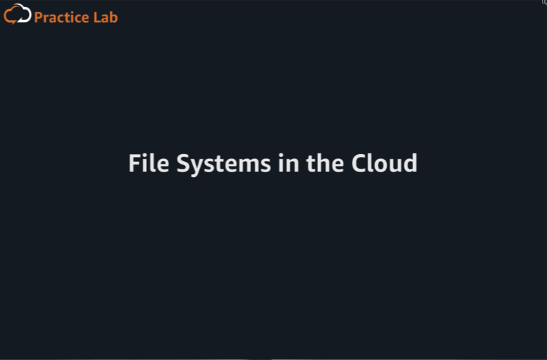

    &nbsp;

    **Etapa 2**
    1. Na caixa de pesquisa da barra de navegação superior, digite: ec2
    2. Nos resultados da pesquisa, em Serviços, clique em EC2.
    3. Vá para a próxima etapa.

    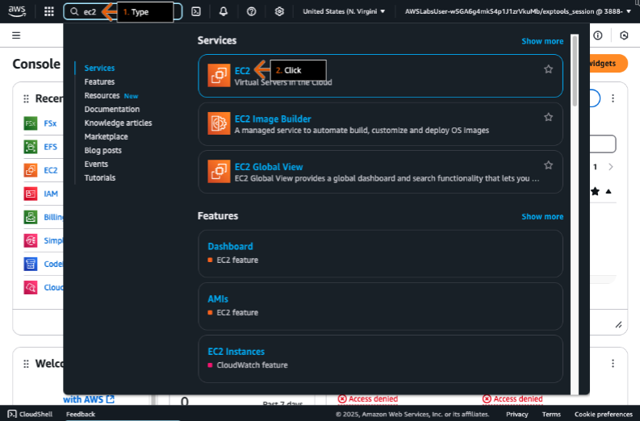

    &nbsp;

    **Etapa 3**
    1. No painel de navegação esquerdo, clique em Instâncias.
    2. Na seção Instâncias, revise os nomes das três instâncias existentes.
    3. Para revisar todos os detalhes, role para a direita.
    4. Vá para a próxima etapa.

    **Conceito**

    O Amazon Elastic Compute Cloud (Amazon EC2) fornece capacidade de computação dimensionável e sob demanda na nuvem da AWS. O uso do Amazon Elastic Compute Cloud reduz os custos de hardware para que você possa desenvolver e implantar aplicativos mais rapidamente. Você pode usar o Amazon Elastic Compute Cloud para iniciar quantos servidores virtuais precisar, configurar a segurança e as redes e gerenciar o armazenamento.

    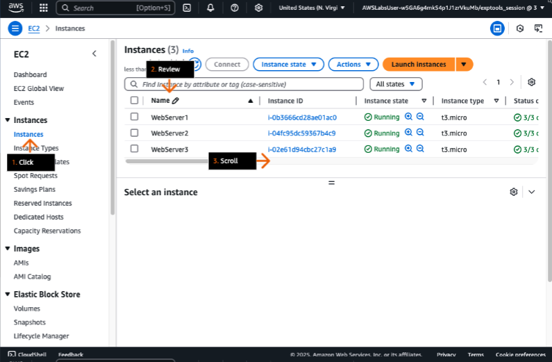

    &nbsp;
    
    **Etapa 4**
    1. Em Zona de Disponibilidade, revise o AZ para cada instância.
    2. No painel de navegação esquerdo, em Rede e Segurança, clique em Grupos de Segurança.
    3. Vá para a próxima etapa.

    **Conceito**

    As zonas de disponibilidade (AZs) são identificadas por um identificador de letra após o código da região (por exemplo, us-east-1a). As AZs são conectadas por meio de redes de fibra de baixa latência na mesma região.

    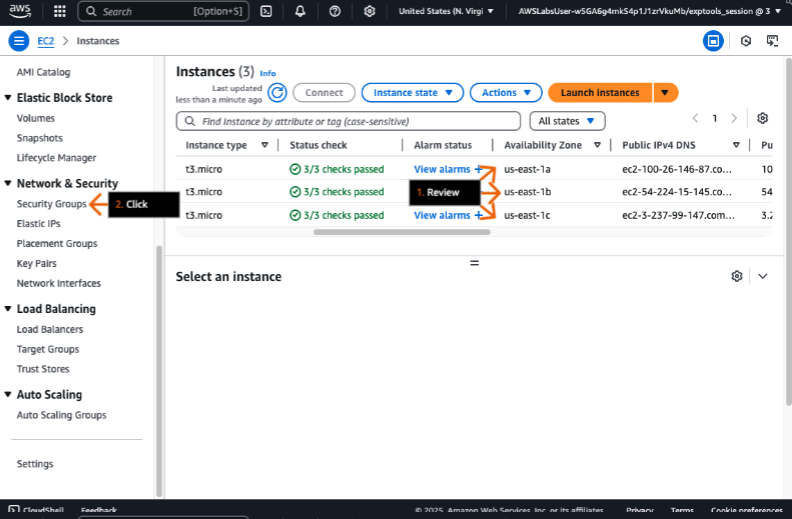

    &nbsp;
    
    **Etapa 5**
    1. Na seção Grupos de segurança, revise o grupo de segurança Web_server_SG.

        > O grupo de segurança do servidor web já está vinculado aos servidores web.

    2. Clique em Criar grupo de segurança.
    3. Vá para a próxima etapa.

    **Conceito**

    Cada instância do EC2 deve pertencer a pelo menos um grupo de segurança, e a política do grupo de segurança controla o tráfego para instâncias dentro desse grupo.

    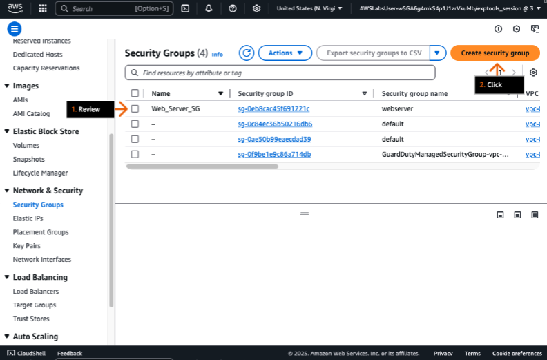

    &nbsp;

    **Etapa 6**
    1. Em Nome do grupo de segurança, digite: PetModels-EFS-1-SG
    2. Em Descrição, digite: Restrict access to web servers only.
    3. Para VPC, na lista suspensa, escolha a VPC PetModels.

        > Talvez seja necessário remover a VPC existente clicando em X.

    4. Na seção Regras de entrada, clique em Adicionar regra.
    5. Vá para a próxima etapa.

    **Conceito**

    Os grupos de segurança estão vinculados a uma única nuvem privada virtual (VPC). Você pode atribuir um grupo de segurança a uma ou mais instâncias do Elastic Compute Cloud, mas cada instância deve estar na mesma VPC do grupo de segurança.

    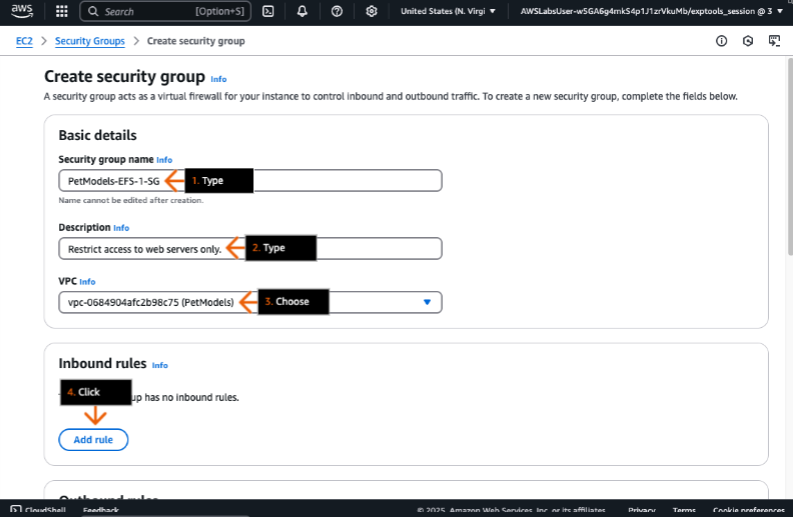

    &nbsp;

    **Etapa 7**
    1. Para configurar a nova regra, em Tipo, escolha NFS.
    2. Em Fonte, clique para expandir a lista suspensa.
    3. Escolha o grupo de segurança do servidor web.
    4. Role até a parte inferior da página e clique em Criar grupo de segurança.
    5. Vá para a próxima etapa.

    **Conceito**

    Os sistemas de arquivos Amazon Elastic File System (Amazon EFS) requerem uma regra NFS de entrada. Ao selecionar um grupo de segurança como origem de entrada, qualquer instância do EC2 Compute Cloud vinculada ao grupo de segurança selecionado terá acesso do cliente NFS ao sistema de arquivos.

    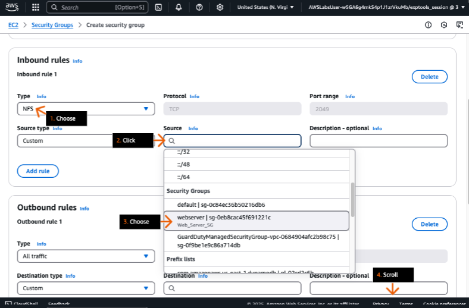

    &nbsp;

    **Etapa 8**
    1. Em Nome do grupo de segurança, revise o nome.
    2. Na guia Regras de entrada, revise a regra recém-criada.
    3. Vá para a próxima etapa.

    **Conceito**

    As alterações nas regras do grupo de segurança entram em vigor imediatamente e são stateful, ou seja, se o tráfego de entrada for permitido, o tráfego de saída correspondente será automaticamente permitido.

    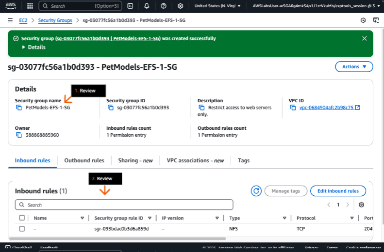

    &nbsp;

    **Etapa 9**
    1. Na caixa de pesquisa da barra de navegação superior, digite: fsx
    2. Nos resultados da pesquisa, em Serviços, clique em FSx.
    3. Vá para a próxima etapa.

    **Conceito**

    O Amazon FSx é um serviço totalmente gerenciado que fornece sistemas de arquivos de terceiros na nuvem AWS, eliminando a necessidade de gerenciar servidores e armazenamento de arquivos.

    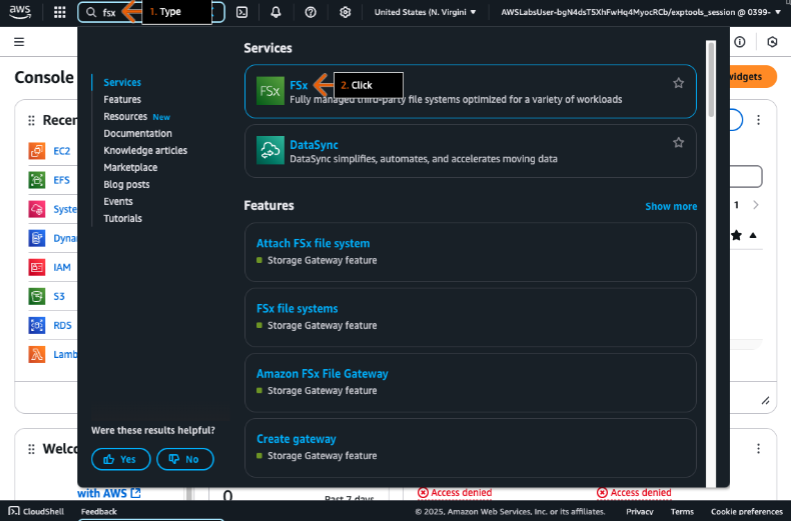

    &nbsp;

    **Etapa 10**
    1. Na página inicial do console Amazon FSx, revise as informações e as descrições.
    2. Vá para a próxima etapa.

    **Conceito**

    Os sistemas de arquivos Amazon FSx oferecem suporte a protocolos padrão do setor que oferecem conectividade a usuários e aplicativos Linux, Windows e macOS. O Amazon FSx também oferece latências inferiores a um milissegundo e alto throughput para atender às necessidades de desempenho de suas cargas de trabalho mais exigentes.

    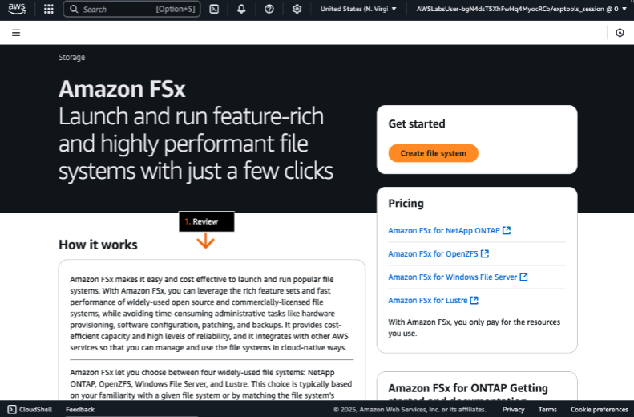

    &nbsp;
    
    **Etapa 11**
    1. Na caixa de pesquisa da barra de navegação superior, digite: efs
    2. Nos resultados da pesquisa, em Serviços, clique em EFS.
    3. Vá para a próxima etapa.

    **Conceito**

    O Amazon EFS fornece um sistema de arquivos elástico sem servidor, que pode ser configurado e esquecido, que você pode usar para compartilhar dados de arquivos sem provisionar ou gerenciar o armazenamento. O Amazon EFS foi criado para escalar sob demanda, até petabytes de capacidade de armazenamento, sem interromper os aplicativos. Usando o Amazon EFS, você pode aumentar e reduzir seus sistemas de arquivos automaticamente à medida que adiciona e remove arquivos, eliminando a necessidade de provisionar e gerenciar a capacidade para acomodar o crescimento.

    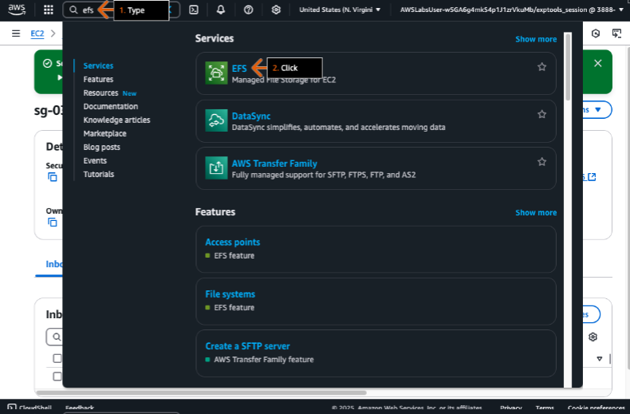

    &nbsp;

    **Etapa 12**
    1. Na página inicial do console Amazon EFS, clique em Criar sistema de arquivos.
    2. Vá para a próxima etapa.

    **Conceito**

    O Amazon EFS cria um sistema de arquivos de armazenamento compartilhado que está disponível simultaneamente para várias instâncias no Amazon Elastic Compute Cloud.

    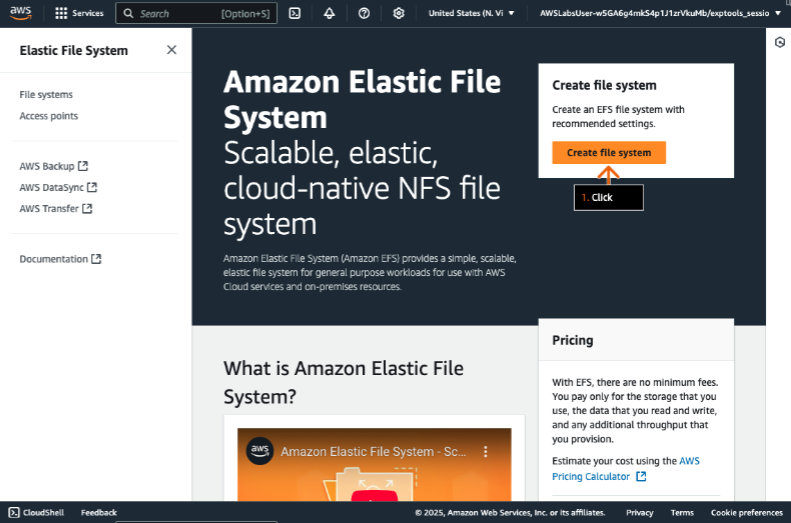

    &nbsp;
    
    **Etapa 13**
    1. Na caixa pop-up, em Nome, digite: PetModels-EFS-1
    2. Para VPC, escolha PetModels VPC.
    3. Clique em Personalizar.
    4. Vá para a próxima etapa.

    **Conceito**

    Por padrão, as instâncias do EC2 Compute Cloud devem estar na mesma VPC do sistema de arquivos EFS.

    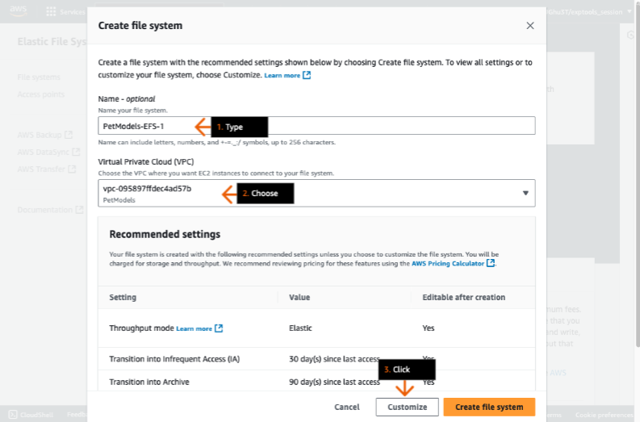

    &nbsp;
    
    **Etapa 14**
    1. Na etapa Configurações do sistema de arquivos, em Tipo de sistema de arquivos, revise os tipos.
    2. Desmarque a caixa de seleção para desmarcar Ativar backups automáticos.
    3. Vá para a próxima etapa.

    **Conceito**

    Você pode escolher usar as classes de storage Regional ou One Zone IA no Amazon EFS. A classe regional armazena dados dentro e entre várias zonas de disponibilidade. A classe One Zone IA armazena dados de forma redundante em uma única AZ, por um preço menor do que a regional, para cargas de trabalho que não exigem resiliência Multi-AZ.

    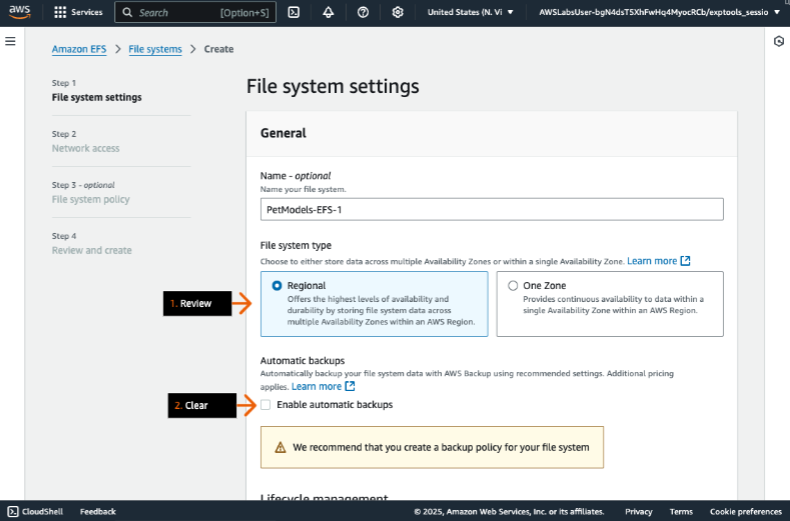

    &nbsp;

    **Etapa 15**
    1. Em Gerenciamento do ciclo de vida, para Transição para acesso ocasional (IA), escolha Nenhum.

        > A classe de armazenamento Infrequent Access foi projetada para armazenar arquivos de longa duração e acessados com pouca frequência de maneira econômica.

    2. Em Transição para arquivamento, escolha Nenhum.

        > A classe de armazenamento Archive foi projetada para dados que são acessados com pouca frequência — apenas algumas vezes por ano ou menos.

    3. Para o modo de taxa de transferência, escolha Bursting.
    4. Role até a parte inferior da página e clique em Avançar (não mostrado).
    5. Vá para a próxima etapa.

    **Conceito**

    Você pode gerenciar seus sistemas de arquivos para que eles tenham um armazenamento econômico durante todo o ciclo de vida. Use o gerenciamento do ciclo de vida para fazer a transição automática de dados entre classes de storage de acordo com a configuração do ciclo de vida do sistema de arquivos.

    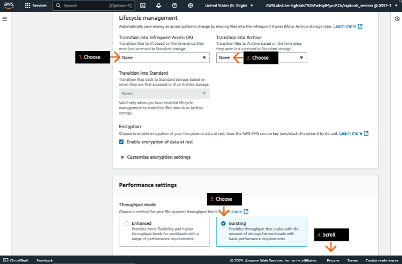

    &nbsp;

    **Etapa 16**
    1. Na etapa Acesso à rede, para remover a sub-rede, em Montar destinos, para AZ us-east-1c, clique em Remover.
    2. Para AZ us-east-1b, clique em Remover.
    3. Para remover o grupo de segurança, para AZ us-east-1a, em Grupos de segurança, clique no X no grupo de segurança exibido.
    4. Vá para a próxima etapa.
    
    **Conceito**

    Depois de criar o sistema de arquivos EFS, você cria destinos de montagem em cada sub-rede. O destino de montagem permite a comunicação de instâncias do Elastic Compute Cloud na sub-rede. O Amazon EFS usa o protocolo Network File System (NFSv4). As instâncias do Elastic Compute Cloud que se conectam ao sistema de arquivos são clientes NFS.

    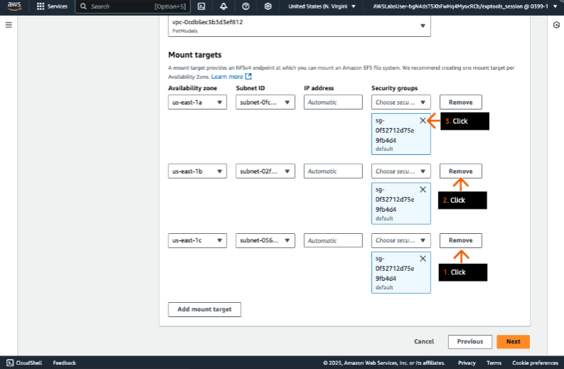

    &nbsp;

    **Etapa 17**
    1. Para AZ us-east-1a, em Security groups, escolha o security group PetModels-EFS-1-SG.
    2. Clique em Avançar.
    3. Vá para a próxima etapa.

    **Conceito**

    Ao anexar seu security group personalizado ao ponto de montagem, você controla a origem do tráfego de entrada no sistema de arquivos.
    
    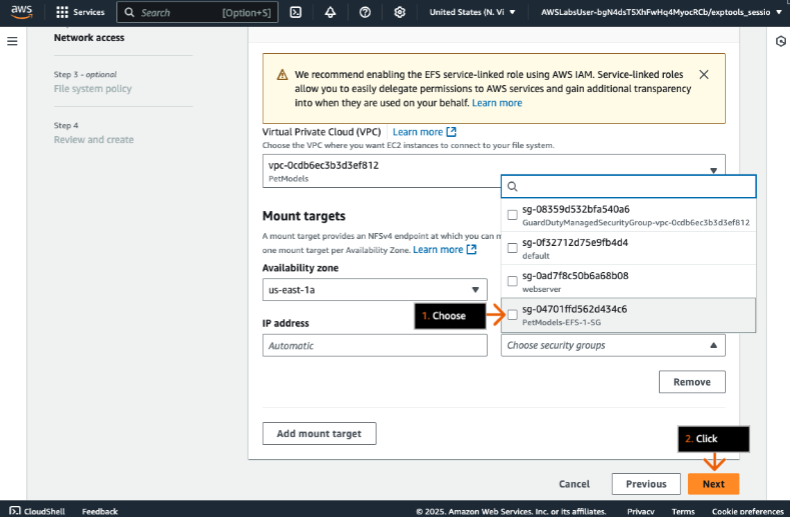

    &nbsp;

    **Etapa 18**
    1. Na etapa Política do sistema de arquivos, clique em Avançar.
    2. Vá para a próxima etapa.

    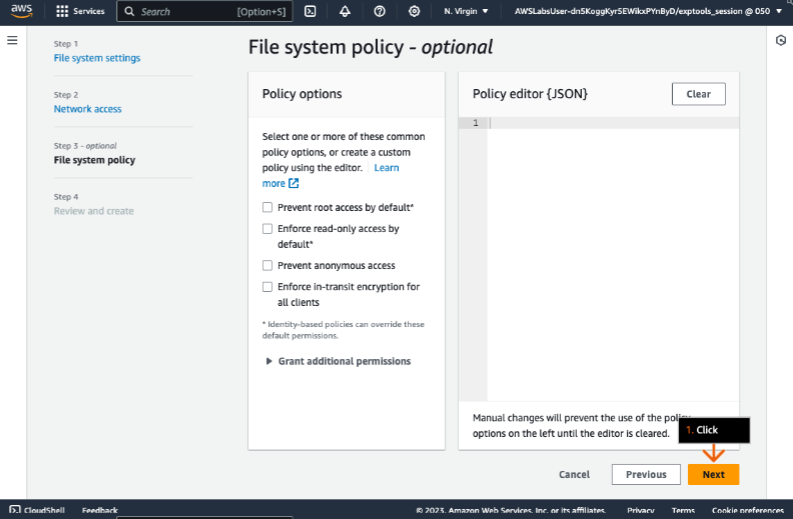

    &nbsp;

    **Etapa 19**
    1. Na etapa Revisar e criar, na parte inferior da página, clique em Criar.
    2. Vá para a próxima etapa.

    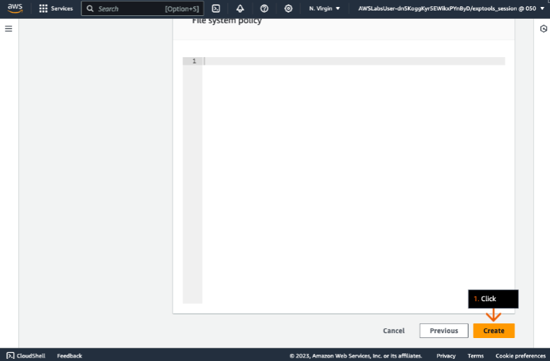

    &nbsp;

    **Etapa 20**
    1. No alerta de sucesso, revise a mensagem.

        > Se um alerta de erro iam:CreateServiceLinkedRole for exibido, você poderá ignorá-lo com segurança.

    2. Em ID do sistema de arquivos, revise a ID fornecida.

        > Você deve usar esse ID na seção DIY posterior desta solução.

    3. Clique em PetModels-EFS-1.
    4. Vá para a próxima etapa.

    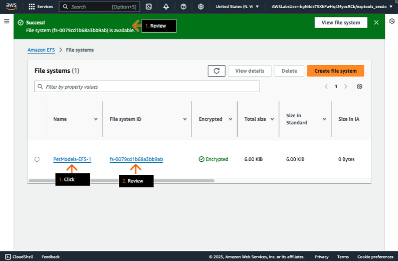

    &nbsp;

    **Etapa 21**
    1. Clique em Anexar.
    2. Vá para a próxima etapa.

    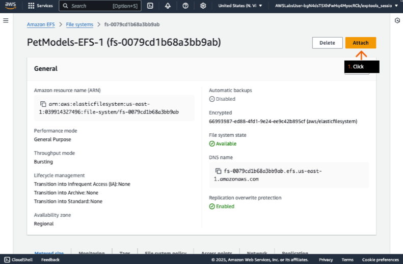

    &nbsp;

    **Etapa 22**
    1. Na caixa pop-up, mantenha a opção padrão de Montar via DNS. 
    2. Em Usando o auxiliar de montagem do EFS, clique no ícone de cópia para copiar o comando de montagem e, em seguida, cole-o no editor de texto de sua escolha em seu dispositivo.

        > Você usa esse comando em etapas posteriores.

    3. Clique em Fechar.
    4. Vá para a próxima etapa.

    **Conceito**

    Para configurar uma montagem do EFS em um sistema Amazon Linux, instale o auxiliar de montagem do EFS e, em seguida, execute o comando mount.

    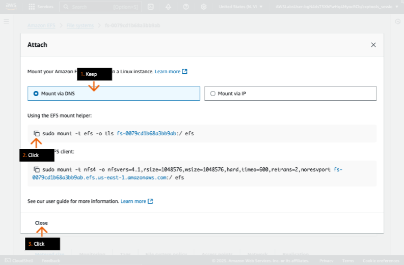

    &nbsp;

    **Etapa 23**
    1. Navegue até o console do Amazon Elastic Compute Cloud.

        > Lembre-se de que, na barra de navegação superior, você pode usar a caixa de pesquisa Serviços (ou clicar em Serviços) para navegar até um console de serviço diferente.

    2. No painel de navegação esquerdo, clique em Instâncias.
    3. Na seção Instâncias, escolha a caixa de seleção para selecionar WebServer1.
    4. Clique em Conectar.
    5. Vá para a próxima etapa.

    **Conceito**

    Para se conectar a uma instância, o Amazon EC2 Compute Cloud suporta SSH, Session Manager (um recurso do AWS Systems Manager) ou Amazon EC2 Instance Connect.

    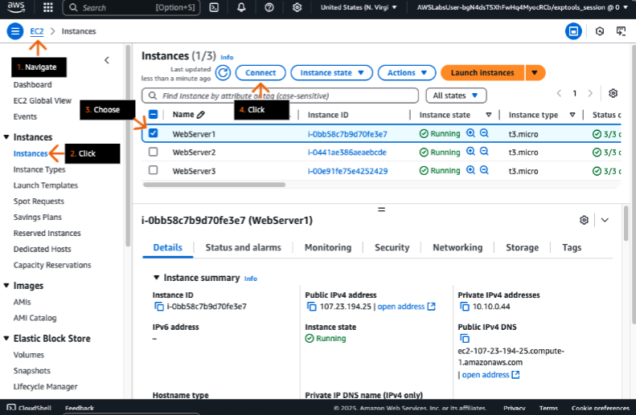

    &nbsp;

    **Etapa 24**
    1. Clique na guia Gerenciador de sessões.
    2. Clique em Conectar.

        > O terminal do Gerenciador de Sessões é aberto em uma nova guia (ou janela) do navegador. Mantenha a guia atual do navegador aberta.

    3. Vá para a próxima etapa.

    **Conceito**

    O Session Manager fornece gerenciamento de nó seguro e auditável sem a necessidade de abrir portas de entrada, manter bastion hosts ou gerenciar chaves SSH. Usando o Session Manager, você também cumpre as políticas corporativas que exigem acesso controlado aos nós gerenciados, práticas rígidas de segurança e registros totalmente auditáveis com detalhes de acesso aos nós, ao mesmo tempo em que fornece aos usuários finais acesso multiplataforma aos seus nós gerenciados com um clique.

    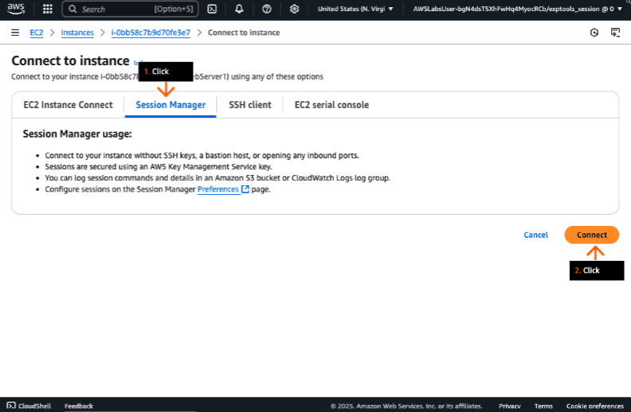

    &nbsp;

    **Etapa 25**
    1. No terminal, no prompt de comando, execute (digite o comando e pressione Enter): sudo -i
    2. No terminal, execute: sudo yum install -y amazon-efs-utils

        > Você também pode copiar e colar esse texto. Se você receber um valor indefinido ao colar isso, tente novamente.

    3. Vá para a próxima etapa.

    **Conceito**

    O software cliente Amazon EFS (amazon-efs-utils) é uma coleção de código aberto de ferramentas do Amazon EFS e é usado para anexar e acessar o sistema de arquivos. Esse pacote está disponível nos repositórios de pacotes Amazon Linux e pode ser construído e instalado em outras distribuições Linux.

    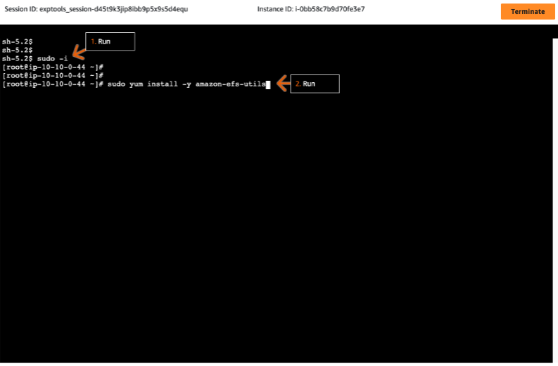

    &nbsp;

    **Etapa 26**
    1. Revise os pacotes instalados a partir do comando yum anterior.
    2. Vá para a próxima etapa.

    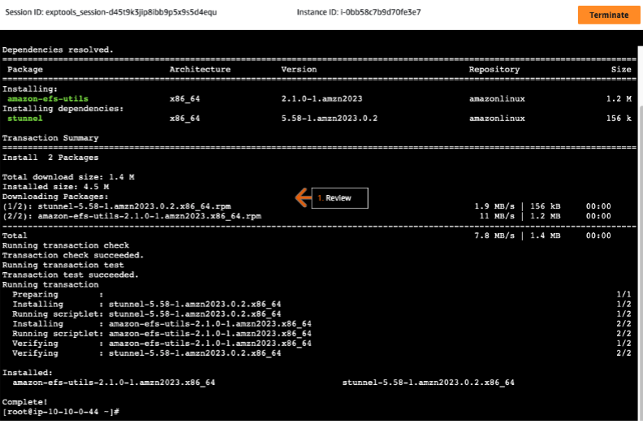

    &nbsp;

    **Etapa 27**
    > Nesta etapa, você usa comandos do Linux para criar um diretório de dados. Em seguida, você monta o sistema de arquivos EFS recém-criado nesse diretório. Você cria um arquivo de log e acrescenta informações a ele. O arquivo de log e seu conteúdo são visíveis em outras instâncias que têm o mesmo sistema de arquivos montado.

    1. No terminal, execute: mkdir data

        > Se você receber um alerta de permissão negada, execute o seguinte comando e repita o comando anterior: cd ~/

    2. No terminal, cole o comando sudo mount que você copiou do console do Amazon EFS em uma etapa anterior. 
    3. No final do comando colado, substitua o nome da pasta “efs” por “data” (sem aspas) e pressione Enter.

        > O comando deve ser semelhante ao exibido no exemplo da captura de tela.

    4. No terminal, execute: cd data
    5. Para criar um arquivo de log, execute: sudo bash -c "cat >> efs-1-setup.log"

        > Nenhuma saída é exibida. Em vez disso, o cursor se move para uma nova linha e espera pela próxima entrada.

    6. No terminal, digite: efs-1 mounted in site A
    7. Para finalizar a sessão do gato, no teclado, pressione Ctrl+C.
    8. Para visualizar o conteúdo do arquivo de log, execute: cat efs-1-setup.log
    9. Vá para a próxima etapa.

    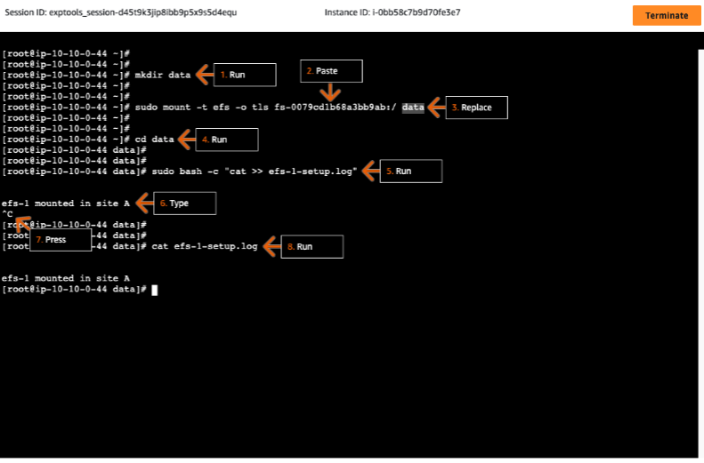

    &nbsp;

    **Etapa 28**
    1. Na outra guia do navegador, navegue até o console do Amazon EFS.
    2. Na seção Sistemas de arquivos, clique em PetModels-EFS-1.
    3. Vá para a próxima etapa.

    **Conceito**

    Os sistemas de arquivos podem ser montados em recursos de computação, como Amazon EC2, Amazon Elastic Container Service (Amazon ECS) e AWS Lambda.

    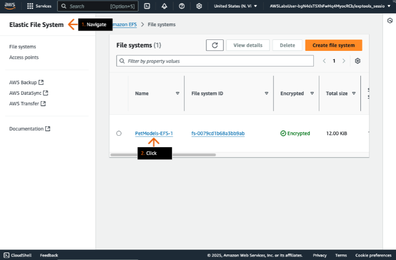

    &nbsp;

    **Etapa 29**
    1. Clique na guia Rede.
    2. Clique em Gerenciar.
    3. Vá para a próxima etapa.
    
    **Conceito**

    O acesso ao sistema de arquivos é fornecido por meio do protocolo NFS.

    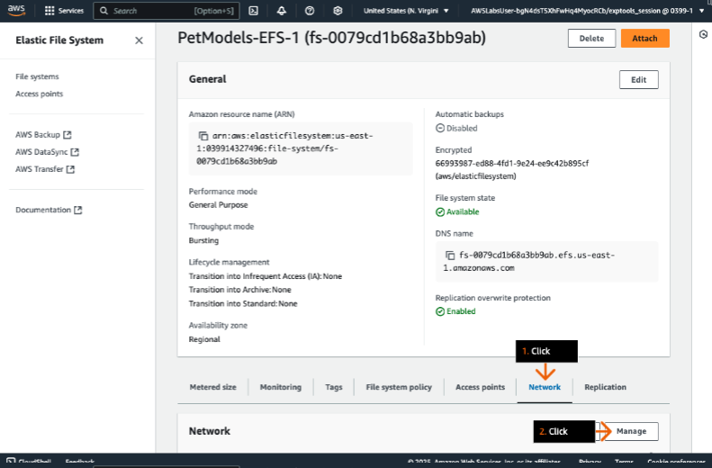

    &nbsp;

    **Etapa 30**
    1. Em Pontos de montagem, clique em Adicionar ponto de montagem.
    2. Vá para a próxima etapa.

    **Conceito**

    Um destino de montagem serve como um endpoint em uma VPC que permite o acesso ao sistema de arquivos EFS.

    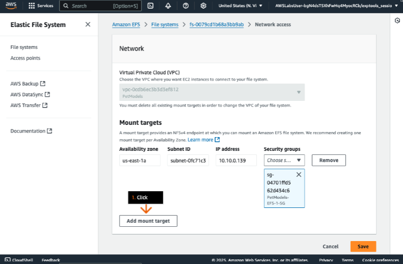

    &nbsp;

    **Etapa 31**
    1. Para Zona de disponibilidade, revise para confirmar se us-east-1b está selecionado.
    2. Para ID de sub-rede, escolha PetModels-subnet2.
    3. Vá para a próxima etapa.

    **Conceito**

    Você pode criar destinos de montagem para um sistema de arquivos usando o Console de Gerenciamento da AWS, a Interface de Linha de Comando da AWS (AWS CLI) ou usando programaticamente os SDKs da AWS. Ao usar o console, você pode criar destinos de montagem ao criar um sistema de arquivos pela primeira vez ou após a criação do sistema de arquivos.

    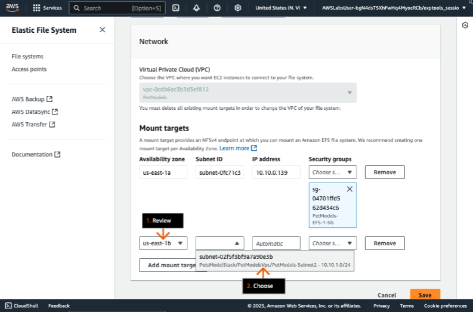

    &nbsp;

    **Etapa 32**
    1. Para grupos de segurança, escolha PetModels-EFS-1-SG.
    2. Clique em Salvar.

        > Se o alerta de erro “O usuário não está autorizado a realizar essa ação no recurso especificado” for exibido, você poderá ignorá-lo com segurança.

    3. Vá para a próxima etapa.

    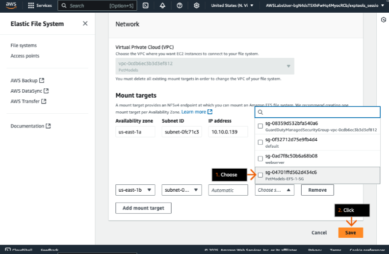

    &nbsp;

    **Etapa 33**
    1. Depois de alguns minutos, na guia Rede, clique no ícone de atualização.
    2. Para o novo alvo de montagem, em Estado de destino de montagem, revise para confirmar se o estado está disponível.

        > Espere que o estado mude antes de continuar.

    3. Vá para a próxima etapa.

    **Conceito**

    Cada ponto de montagem instala uma interface de rede elástica (ENI) na sub-rede escolhida. Uma ENI é um componente lógico da rede em uma VPC que representa uma placa de rede virtual. A ENI recebe automaticamente um endereço IP da VPC.

    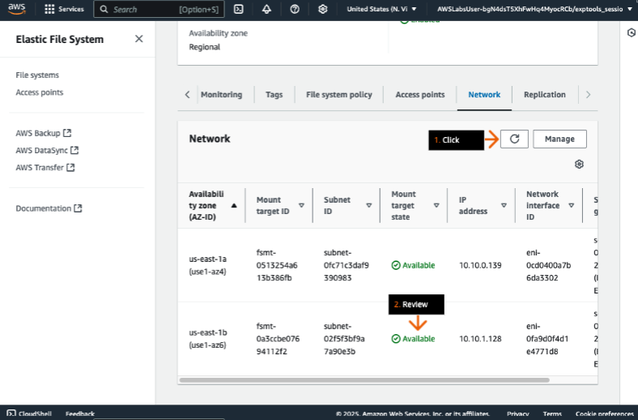

    &nbsp;

    **Etapa 34**
    1. Navegue até o console do Amazon Elastic Compute Cloud.
    2. No painel de navegação esquerdo, clique em Instâncias.
    3. Na seção Instâncias, escolha a caixa de seleção para selecionar WebServer2.
    4. Clique em Conectar.
    5. Vá para a próxima etapa.

    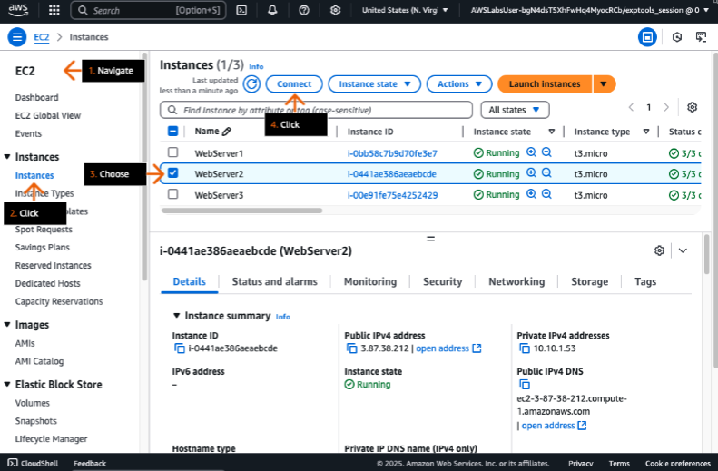

    &nbsp;

    **Etapa 35**
    1. Clique na guia Session Manager.
    2. Clique em Conectar.
    3. Vá para a próxima etapa.

    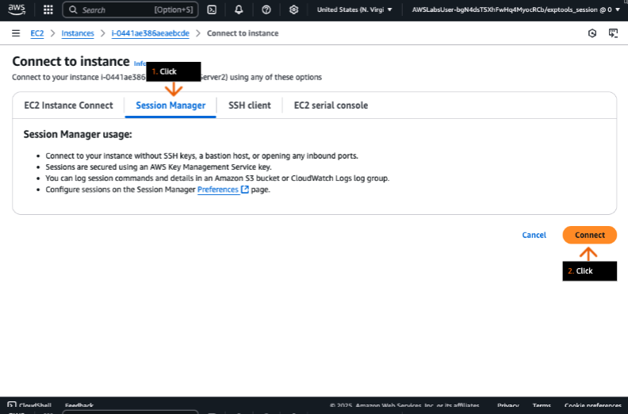

    &nbsp;

    **Etapa 36**
    1. No terminal, execute: sudo -i
    2. No terminal, execute: sudo yum install -y amazon-efs-utils
    3. Vá para a próxima etapa.

    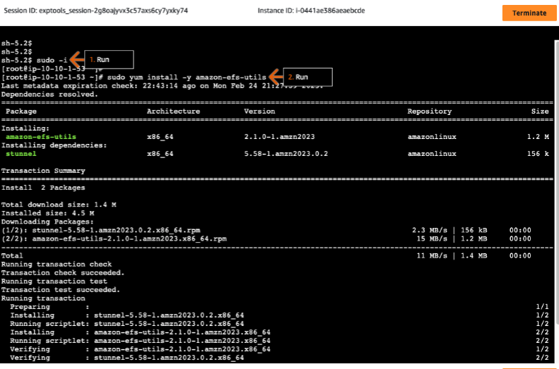

    &nbsp;

    **Etapa 37**
    
    > Nesta etapa, você cria um diretório de dados, monta seu sistema de arquivos EFS no diretório de dados e adiciona entradas ao arquivo de log existente.

    1. No terminal, execute: mkdir data

        > Se você receber um alerta de permissão negada, execute o seguinte comando e repita o comando anterior: cd ~/

    2. No terminal, cole o comando sudo mount que você copiou do console do Amazon EFS em uma etapa anterior. 
    3. No final do comando colado, substitua o nome da pasta “efs” por “data” (sem aspas) e pressione Enter.

        > O comando deve ser semelhante ao exibido no exemplo da captura de tela.

    4. No terminal, execute: cd data
    5. Para criar um arquivo de log, execute: sudo bash -c "cat >> efs-1-setup.log"

        > Novamente, nenhuma saída é exibida. O cursor se move para uma nova linha e aguarda sua próxima entrada.

    6. No terminal, digite: efs-1 mounted in site B
    7. Para finalizar a sessão do gato, no teclado, pressione Ctrl+C.
    8. Vá para a próxima etapa.

    **Conceito**

    Você pode usar os dados do usuário do Amazon EC2 Compute Cloud para bootstrap de sistemas de arquivos EFS em novas instâncias quando elas forem iniciadas.

    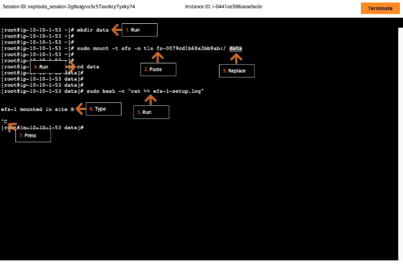

    &nbsp;

    **Etapa 38**
    1. Para visualizar o conteúdo do arquivo de log, execute: cat efs-1-setup.log

    2. Revise as duas entradas de log.

        > As alterações feitas no WebServer1 e no WebServer2 estão no arquivo efs-1-setup.log.

    3. Vá para a próxima etapa.

    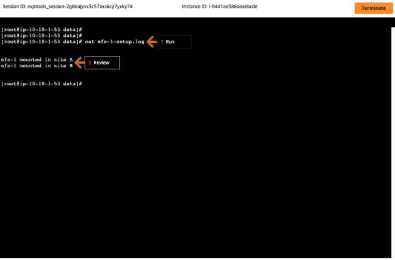

- DIY
    - Monte um endpoint EFS em uma terceira instância do EC2.
    - Teste se os arquivos podem ser acessados por meio da instância do EC2.

    > Dica: O terceiro alvo de montagem do EFS está em us-east-1c.

## Saiba mais
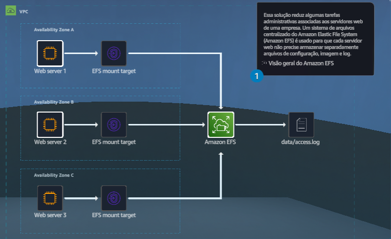
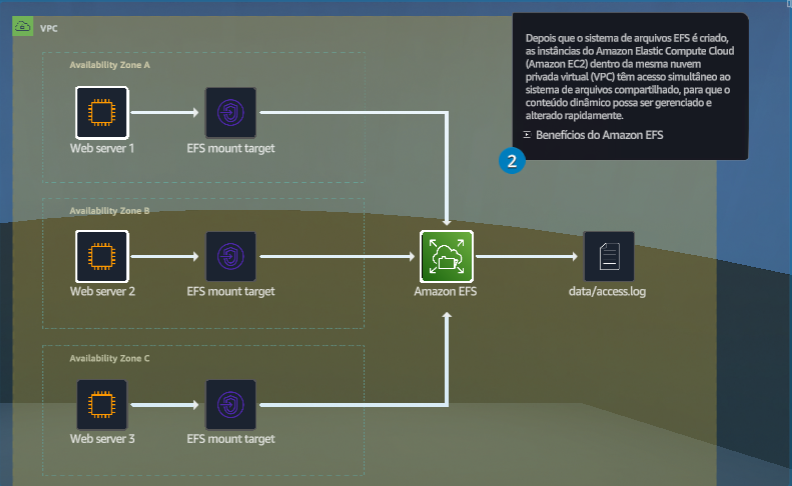
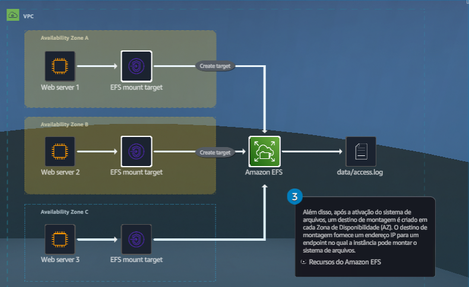
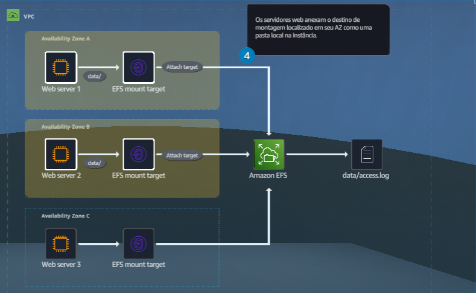
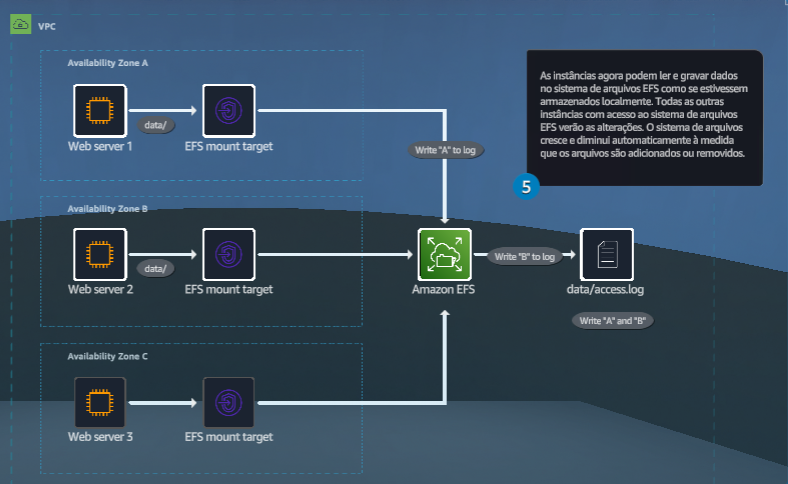
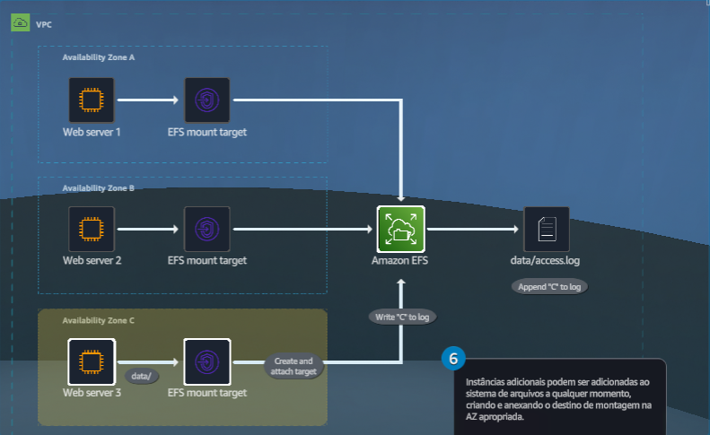