## Soluções de computação
### Aumente o tamanho de uma instância do Amazon EC2 para oferecer melhor desempenho da aplicação.

- Objetivos do laboratório
    - Explore os tipos de instância do Amazon EC2.
    - Filtre as instâncias do EC2 com base em seus atributos.
    - Conecte-se a uma instância do EC2 usando o Gerenciador de Sessões.
    - Visualize os metadados da instância EC2 usando o endereço IP público da instância.
    - Inicie e interrompa uma instância do EC2 usando o console do Amazon EC2.

    &nbsp;

    **Etapa 1**
    1. Analise os objetivos do laboratório prático na seção Conceito.
    2. Clique em Start Lab ou Open AWS Console para começar.
    3. Siga as instruções do laboratório cuidadosamente e use as setas para navegar entre as etapas.

    Os serviços da AWS que não são usados no ambiente de laboratório estão desativados. Além disso, os recursos dos serviços usados neste laboratório são limitados ao que ele exige.

    **Conceito**

    Neste laboratório prático, você irá:
    - Explorar os tipos de instâncias do Amazon EC2.
    - Filtrar instâncias EC2 com base em seus atributos.
    - Conectar-se a uma instância EC2 usando o EC2 Instance Connect.
    - Visualizar metadados da instância EC2 usando o endereço IP público da instância.
    - Iniciar e parar uma instância EC2 usando o console do Amazon EC2.

    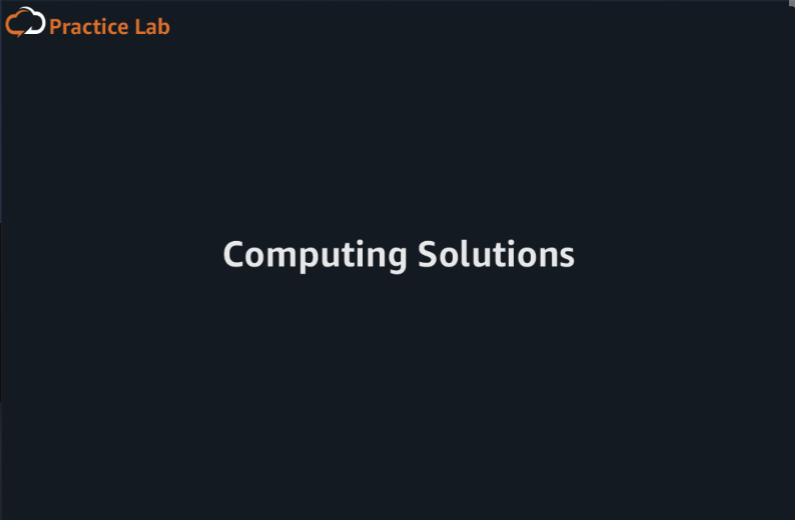

    &nbsp;

    **Etapa 2**
    1. Na barra de navegação superior, verifique o seletor de Região para confirmar que a Região está definida como United States (N. Virginia).
    2. Na caixa de pesquisa Services, digite: ec2
    3. Nos resultados da pesquisa, em Services, clique em EC2.
    4. Vá para o próximo passo.

    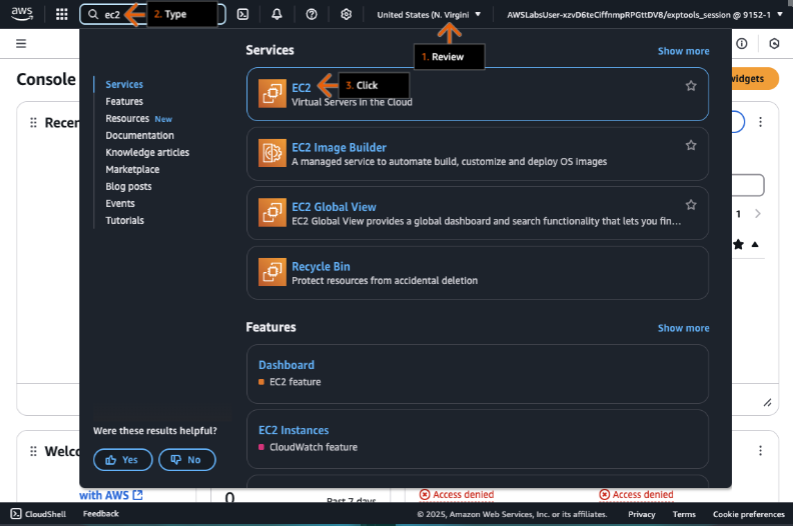

    &nbsp;

    **Etapa 3**
    1. No painel de navegação à esquerda, clique em Instâncias.
    2. Vá para a próxima etapa.

    **Conceito**

    As instâncias do Amazon Elastic Compute Cloud (Amazon EC2) fornecem capacidade computacional virtual na nuvem. Com opções de processador, armazenamento, rede, sistema operacional e modelo de compra, o serviço oferece uma solução ampla e profunda.

    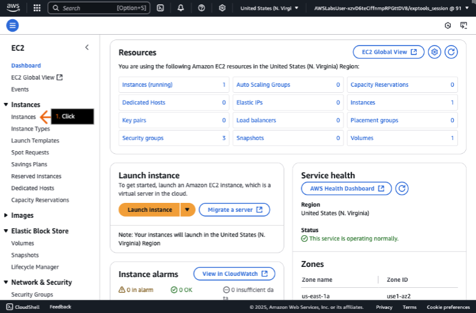

    &nbsp;
    
    **Etapa 4**
    1. Na seção Instâncias, escolha a caixa de seleção para selecionar a instância de soluções de computação da AWS.
    2. Na guia Detalhes, revise os detalhes da instância.
    3. Vá para a próxima etapa.

    **Conceito**

    Ao selecionar uma instância do EC2, as informações sobre a instância (como IP público, IP privado e DNS público) são exibidas na guia Detalhes.

    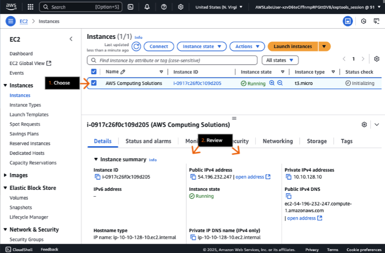

    &nbsp;
    
    **Etapa 5**
    1. No painel de navegação esquerdo, clique em Tipos de instância.
    2. Vá para a próxima etapa.

    **Conceito**

    O Amazon EC2 fornece uma ampla seleção de tipos de instâncias que pertencem a famílias de instâncias otimizadas para atender a diferentes casos de uso.

    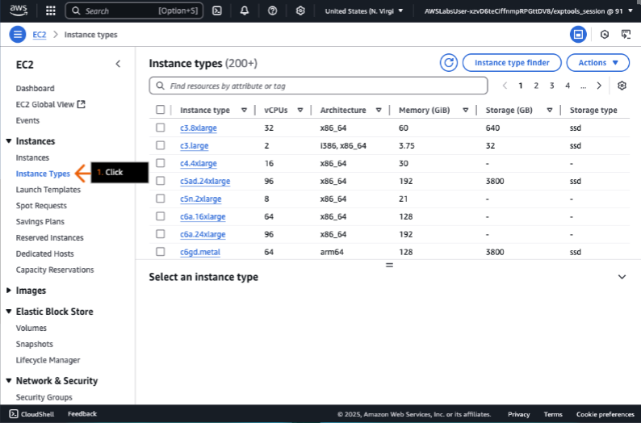

    &nbsp;

    **Etapa 6**
    1. Na caixa de pesquisa Tipos de instância, digite o seguinte e pressione Enter após cada uma delas:
        - t3.large
        - c5.large
        - r5.large                
    2. Escolha a caixa de seleção superior para selecionar todos os três tipos de instância filtrada.
    3. Abaixo disso, revise os detalhes do tipo de instância.
    4. Role para baixo para revisar os detalhes de computação, rede e armazenamento (não mostrados).
    5. Vá para a próxima etapa.

    **Conceito**

    Cada tipo de instância inclui um ou mais tamanhos de instância, para que você possa dimensionar seus recursos para os requisitos da carga de trabalho de destino.

    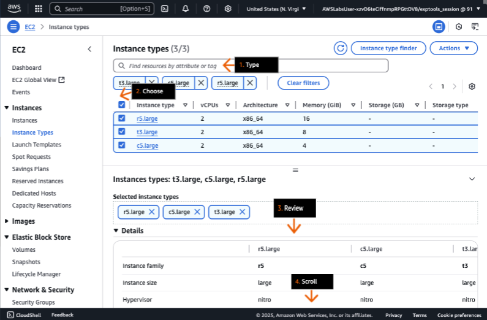

    &nbsp;

    **Etapa 7**
    1. Role para baixo e revise os detalhes de preços.

        > Os preços variam com base em vCPUs, memória, desempenho da rede e outros recursos. Os preços também variam de acordo com os sistemas operacionais e suas taxas de licença.

    2. Vá para a próxima etapa.

    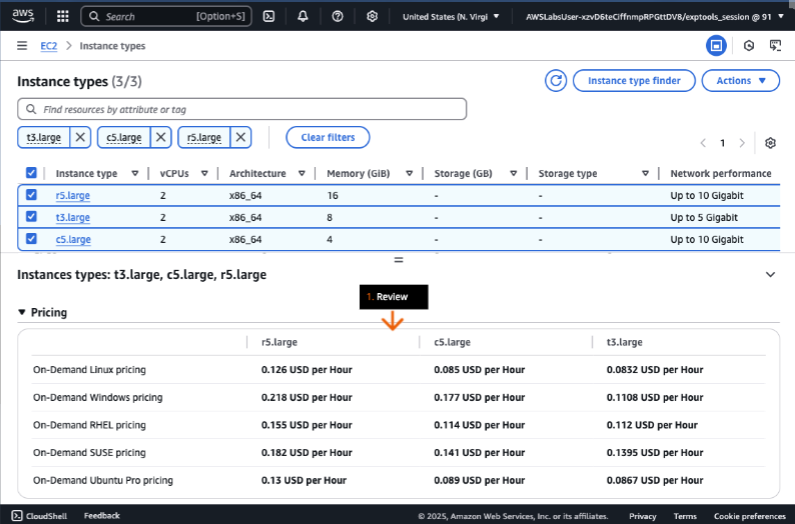

    &nbsp;

    **Etapa 8**
    1. Na barra de navegação à esquerda, clique em Instâncias.
    2. Na seção Instâncias, escolha a caixa de seleção para selecionar a instância de soluções de computação da AWS.
    3. Na guia de Detalhes, em Endereço IPv4 público, clique no ícone de cópia para copiar o endereço fornecido.

        > Não clique no link “abrir endereço”.

    4. Vá para a próxima etapa.

    **Conceito**

    Os metadados da instância são dados sobre a instância que você pode usar para configurar ou gerenciar a instância em execução. Os metadados da instância são divididos em categorias, como nome do host, eventos e grupos de segurança.

    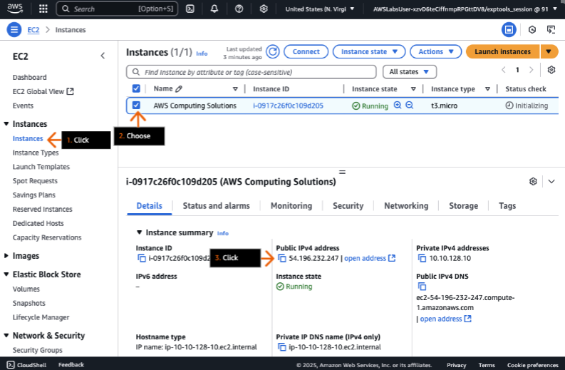

    &nbsp;

    **Etapa 9**
    1. Em uma nova barra de endereço da guia (ou janela) do navegador, cole o endereço IP que você acabou de copiar e pressione Enter (não exibido).

        > Certifique-se de usar http://, não https://.

    2. Analise os detalhes da instância.
    3. Vá para a próxima etapa.

    **Conceito**

    Ao criar uma nova instância, você pode ativar o serviço de metadados da instância (IMDS) por meio da seção Detalhes avançados. Assim, você pode exibir detalhes do atributo usando o IP público da instância.

    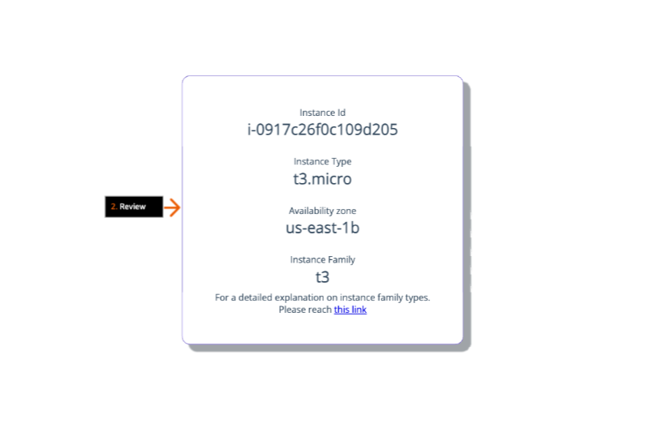

    &nbsp;

    **Etapa 10**
    1. Retorne à guia do navegador do console Amazon EC2.
    2. Na seção Instâncias, clique em Conectar.
    3. Vá para a próxima etapa.

    **Conceito**

    Você tem a flexibilidade de se conectar a uma instância do EC2 usando o Amazon EC2 Instance Connect, o Session Manager (um recurso do AWS Systems Manager) ou um cliente SSH.

    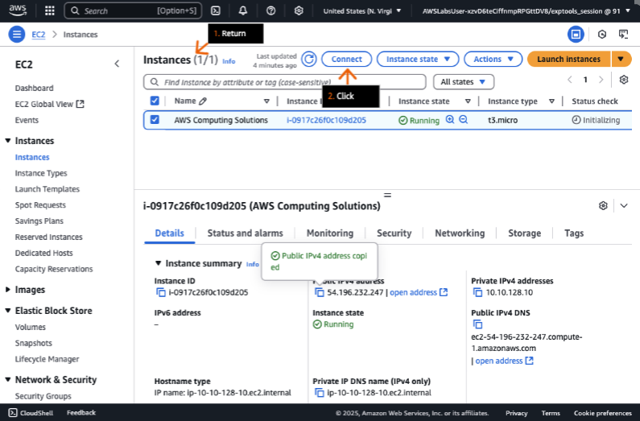

    &nbsp;
    
    **Etapa 11**
    1. Clique na guia SSH client.
    2. Revise os requisitos para conectar via SSH.
    3. No alerta de aviso, revise a mensagem sobre o par de chaves.

        > Como nenhum par de chaves SSH foi criado para esta instância, a conexão via SSH não é possível.

    4. Clique na guia EC2 Instance Connect.
    5. Vá para o próximo passo.

    **Conceito**

    Você pode se conectar à sua instância usando um cliente SSH em seu dispositivo local por meio do par de chaves da instância. Seu dispositivo pode ter um cliente SSH por padrão ou talvez você precise instalar um cliente SSH.

    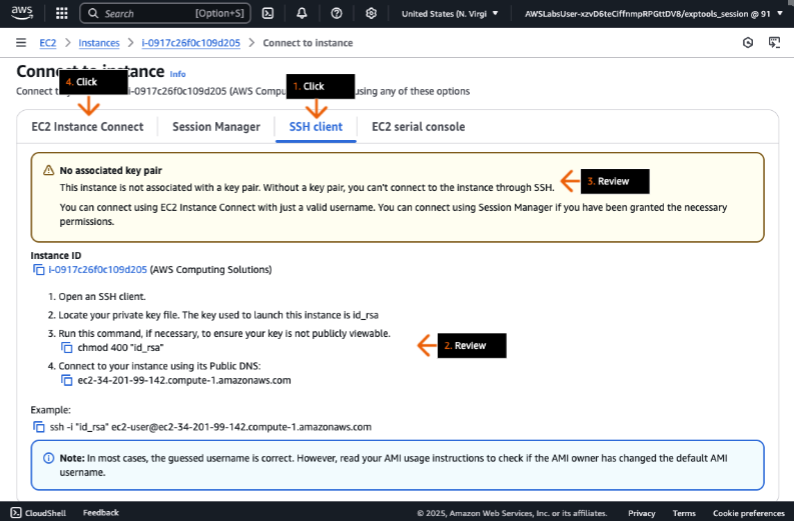

    &nbsp;

    **Etapa 12**
    1. Mantenha a opção de conexão padrão, Conectar usando um IP público.
    2. Clique em Conectar.

        > A Conexão de Instância EC2, contendo o shell de linha de comando, é aberta em uma nova aba (ou janela) do navegador.

    3. Vá para a próxima etapa.

    **Conceito**

    O EC2 Instance Connect oferece um modo eficiente e seguro de se conectar às suas instâncias Linux. O EC2 Instance Connect usa políticas e princípios do AWS Identity and Access Management (IAM) para controlar o acesso SSH às suas instâncias, eliminando a necessidade de compartilhar e gerenciar chaves SSH.

    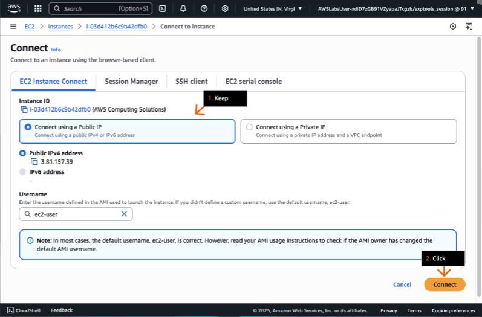

    &nbsp;
    
    **Etapa 13**
    1. Para mudar para o diretório da aplicação, execute: `cd sample_app`

        > Uma aplicação de exemplo reside nesta instância. 

    2. Para visualizar os arquivos no diretório sample_app, execute: `ls`
    3. Para verificar o log da instância, execute: `tail -lf aws_compute_solutions.log`
    4. Vá para a próxima etapa.

    **Conceito**

    Quando conectado à instância, você pode controlá-la usando os comandos Linux e da AWS Command Line Interface (AWS CLI). O AWS CLI é uma ferramenta de código aberto que ajuda você a interagir com os serviços da AWS usando comandos em seu shell de linha de comando. Embora o console web da AWS seja uma interface gráfica de usuário para gerenciar recursos da AWS, a CLI da AWS gerencia esses recursos usando comandos baseados em texto.

    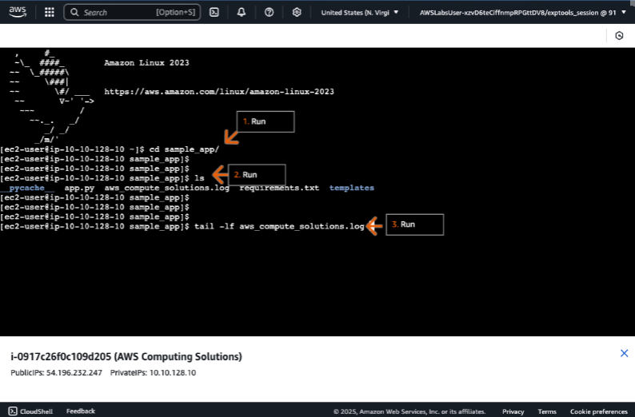

    &nbsp;
    
    **Etapa 14**
    1. Analise os detalhes do registro.

        > Para sair, pressione Ctrl+C no teclado.

    2. Feche essa guia do navegador para retornar à página Instâncias no console do Amazon EC2 (não mostrado).
    3. Vá para a próxima etapa.

    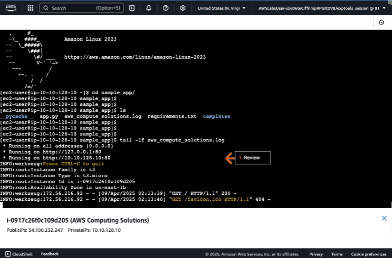

    &nbsp;

    **Etapa 15**
    1. Clique em Ações para expandir a lista suspensa.
    2. Escolha Configurações de instância.
    3. Escolha Editar dados do usuário.
    4. Vá para a próxima etapa.

    **Conceito**

    Você pode usar o menu Ações para controlar o estado da instância e modificar os atributos da instância.

    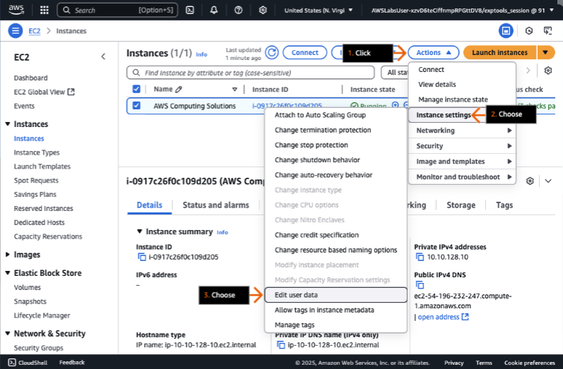

    &nbsp;

    **Etapa 16**
    1. Em Dados atuais do usuário, revise os comandos.
    2. Clique em Cancelar.
    3. Vá para a próxima etapa.
    
    **Conceito**

    Você também pode usar metadados da instância para acessar os dados do usuário que você especificou ao iniciar sua instância.

    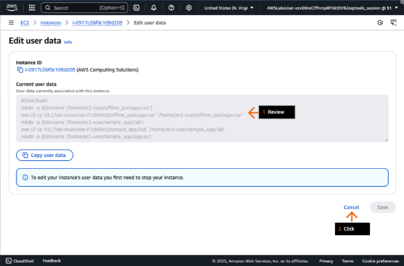

    &nbsp;

    **Etapa 17**
    1. No painel de navegação à esquerda, clique em Instâncias.
    2. Na seção Instâncias, clique em Estado da instância para expandir a lista suspensa.
    3. Escolha Parar instância.

        > Se a opção Stop instance não estiver disponível, certifique-se de que a instância da AWS Computing Solutions esteja selecionada.

    4. Vá para a próxima etapa.

    **Conceito**

    Usando o menu Estado da instância, você pode colocar uma instância em diferentes estados de atividade. Você poderá iniciar e interromper uma instância se ela tiver um volume do Amazon Elastic Block Store (Amazon EBS) como dispositivo-raiz.
    
    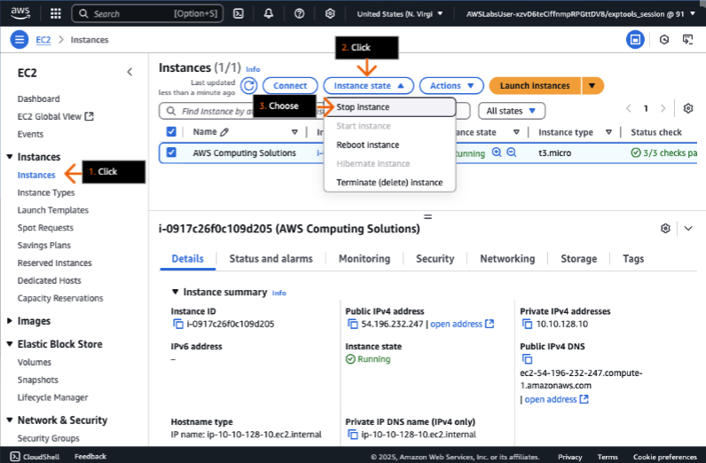

    &nbsp;

    **Etapa 18**
    1. Na caixa pop-up, clique em Parar.
    2. Vá para a próxima etapa.

    **Conceito**

    Depois que uma instância é interrompida, as cobranças de uso da CPU e transferência de dados cessam, mas as cobranças de armazenamento de volumes anexados do Amazon EBS continuam.

    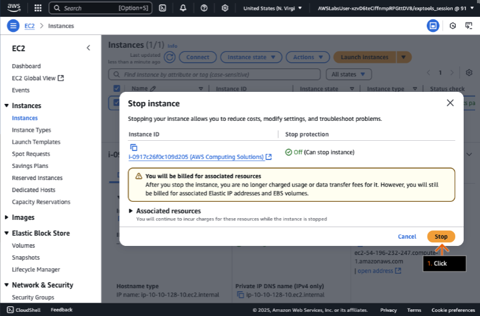

    &nbsp;

    **Etapa 19**
    1. No alerta de sucesso, revise a mensagem.
    2. Depois que o estado da instância mudar para Interrompido, na guia Detalhes, revise o endereço IPv4 público e o DNS IPv4 público.

        > Ambos devem estar vazios. Talvez seja necessário esperar de 1 a 2 minutos e clicar no ícone de atualização da seção Instâncias. 

    3. Vá para a próxima etapa.

    **Conceito**

    Cada vez que você inicia uma instância parada, a AWS cobra no mínimo um minuto pelo uso de instâncias de cobrança por segundo. Depois de um minuto, a AWS cobra somente pelos segundos que você usa.

    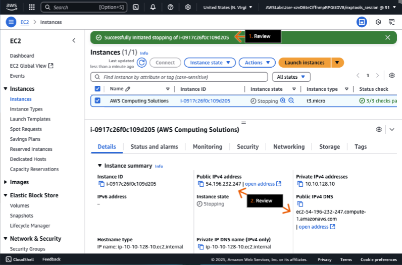

    &nbsp;

    **Etapa 20**
    1. Clique em Ações para expandir a lista suspensa.
    2. Escolha Configurações de instância.
    3. Examine as opções disponíveis.

        > Você pode alterar sua instância com opções diferentes, como tipo, proteção de encerramento e comportamento de desligamento.

    4. Vá para a próxima etapa.

    **Conceito**

    Você deve interromper sua instância baseada no Amazon EBS antes de alterar o tipo de instância. Planeje o tempo de inatividade enquanto sua instância estiver parada. Parar a instância e alterar seu tipo de instância pode levar alguns minutos, e reiniciar sua instância pode levar um tempo variável, dependendo dos scripts de inicialização da sua aplicação.

    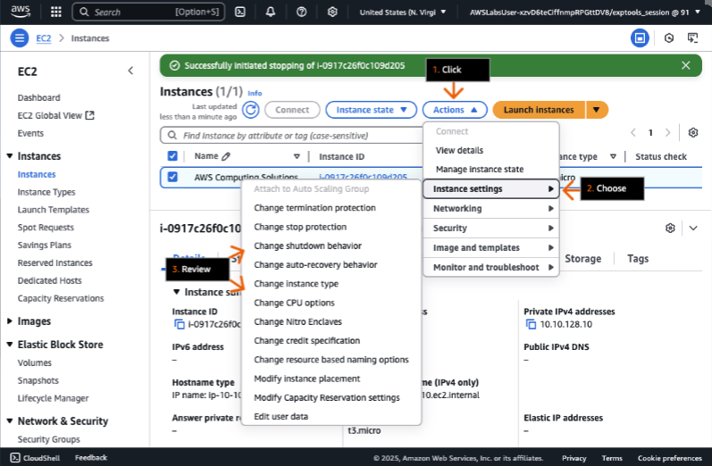

    &nbsp;

    **Etapa 21**
    1. Clique em Estado da instância para expandir a lista suspensa.
    2. Escolha Iniciar instância.
    3. Vá para a próxima etapa.

    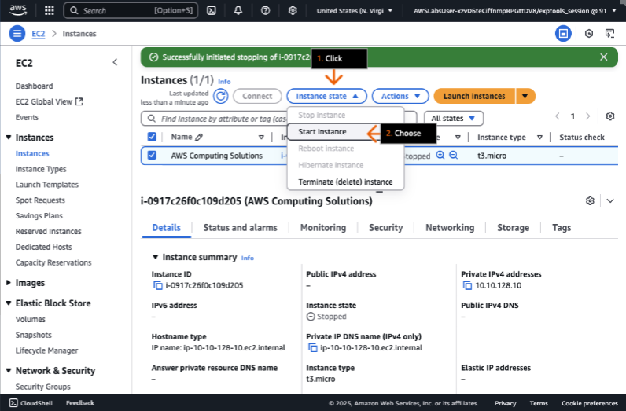

    &nbsp;

    **Etapa 22**
    1. Depois que o estado da instância mudar para Em execução, na guia Detalhes, revise os detalhes da instância. 

        > Observe que o endereço IPv4 público e o DNS agora estão preenchidos.

    2. Vá para a próxima etapa.

    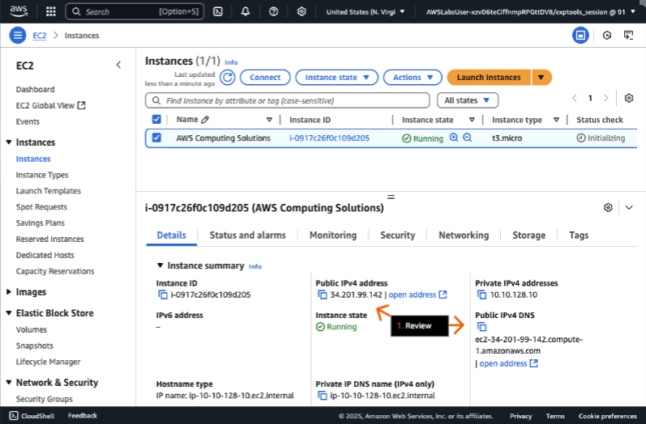

- DIY
    - Altere o tipo de instância do Amazon EC2 para uma instância de uso geral maior (m4.large).

    > Dica: A tarefa DIY é configurar somente a alteração do tipo de instância. Você não tem permissão para iniciar o tipo de instância m4.large.

## Saiba mais
### Amazon EC2
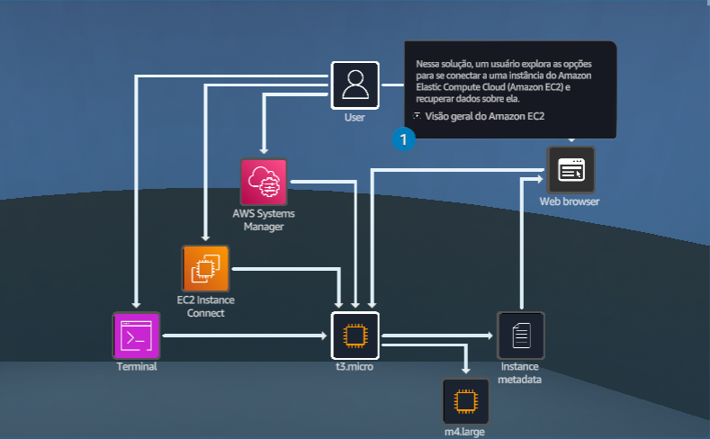
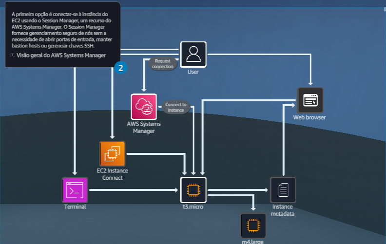
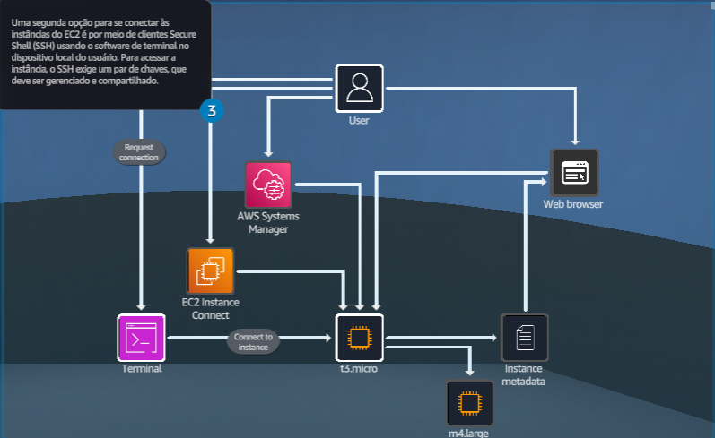
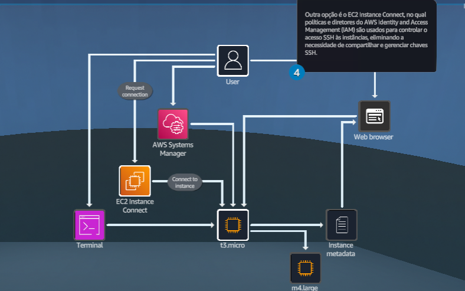
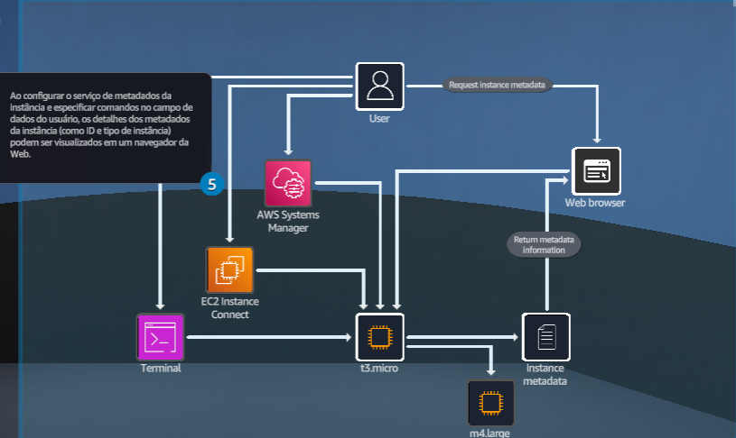
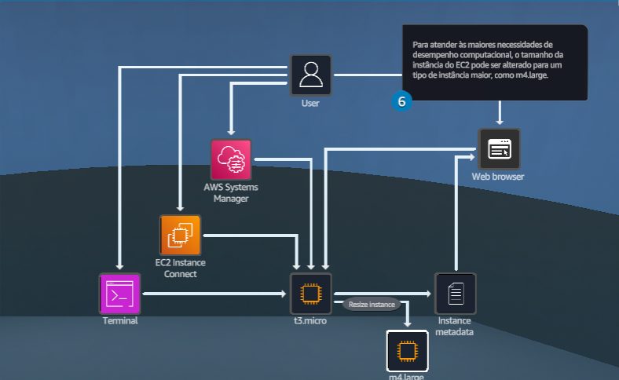